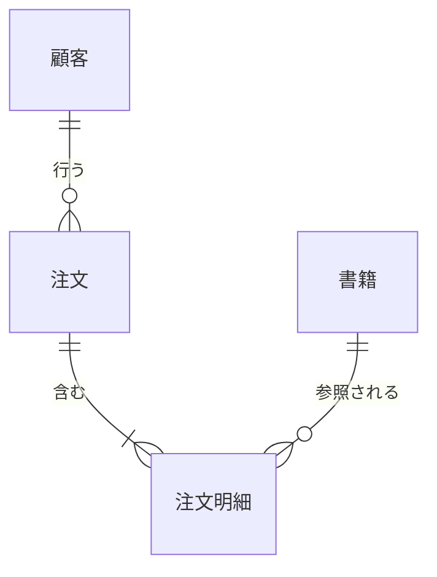

# 第1章 データモデリングの全体像

データベースに新しいテーブルを作るとき、開発者は CREATE TABLE 文を書く。
しかしその一文の背後には、業務のどの情報を記録するか、それをどんな構造で持つか、どの製品の上でどう実装するかという、段階の異なる決定が積み重なっている。
この一連の決定を組み立てる活動が**データモデリング**であり、その成果物が**データモデル**である。

本章では、データモデルを整理するための二つの軸を扱う。
一つは抽象度の軸で、モデルを概念モデルと論理モデルと物理モデルの三つのレベルに分ける。
もう一つは用途の軸で、データベースへのワークロードを OLTP と OLAP に分ける。
以降の章で学ぶ技法は、この二軸の上に位置づけて整理できる。

## 概念の解説

### 三つの抽象レベル

同じ業務を対象にしても、データモデルは読み手と目的に応じて抽象度を変えて描く。
慣例として、抽象度の高い順に概念モデル、論理モデル、物理モデルの三つのレベルに分ける[^three-schema]。

**概念モデル**は、業務上の関心事（エンティティ）とそれらの関係を、実装から独立に表したモデルである。
「顧客が注文を行う」「注文は複数の明細を含む」といった業務の言葉だけで書かれ、データ型やキーは持たない。
読み手には業務側の関係者を含むため、図一枚で業務の構造について合意することが目的になる。

**論理モデル**は、概念モデルを特定のデータモデル体系（本ドキュメント群では主にリレーショナルモデル）に写し、属性、主キー、外部キー、正規化の度合いまで決めたモデルである。
リレーショナルモデルという体系には従うが、特定の DBMS には依存しない。
テーブル構造に関する設計判断の大半は、このレベルで下される。

**物理モデル**は、論理モデルを特定の DBMS 上の実装として表現したモデルである。
データ型の選択、インデックス、パーティション分割、ストレージ形式など、性能とコストに関わる決定をここで行う。
成果物は実行可能な DDL になる。

三つに分ける理由は、変わる速度と変わる理由がレベルごとに違うからである。
業務の構造（顧客が注文を行う、という事実）は製品の乗り換えでは変わらないが、物理的な実装は DBMS の変更やデータ量の増加で作り直しになる。
レベルを分けておけば、たとえば DWH を別製品へ移行するときも、概念モデルと論理モデルはそのまま持ち越し、物理モデルだけを設計し直せる。

### OLTP と OLAP

テーブル構造の善し悪しは、構造単体では決まらず、どんな読み書きが届くかで決まる。
データベースへのワークロードは、大きく二つに分けられる。

**OLTP**（Online Transaction Processing）は、業務処理そのものを支えるワークロードである。
注文の登録や在庫の引き当てのように、少数の行を特定して読み書きする処理が高い頻度で届き、応答は即時でなければならない。
同じ事実を二か所に持つと、片方だけ更新される事故（更新異常）が起きるため、OLTP のモデルは正規化して冗長を排除する方向に設計する。

**OLAP**（Online Analytical Processing）は、蓄積したデータを分析するワークロードである。
月次の売上集計のように、大量の行を読み込んで集約する処理が中心で、書き込みはバッチでまとめて行われることが多い。
問い合わせのたびに結合するコストを避けるため、OLAP のモデルはあえて冗長を許し、非正規化する方向に設計する。

| 観点 | OLTP | OLAP |
| --- | --- | --- |
| 主な処理 | 少数行の読み書き | 大量行の集計 |
| 主な利用者 | 業務アプリケーション | 分析者、BI ツール |
| データの範囲 | 現在の状態 | 履歴を含む長期間 |
| 設計の方向 | 正規化 | 非正規化 |
| 代表的な製品 | PostgreSQL、MySQL | BigQuery、Snowflake |

データエンジニアの仕事は、この二つの世界をつなぐ位置にある。
OLTP システムに蓄積されたデータを抽出し、OLAP に適した構造へ写し替えて DWH に置く。
以降の章で学ぶ技法の多くは、正規化の理論（第 3 章）が OLTP 側の設計を、ディメンショナルモデリング（第 4 章）や One Big Table（第 8 章）が OLAP 側の設計を支える、という形でこの対比の上に載っている。

## 具体例

書籍のオンラインストアの注文業務を題材に、三つのレベルそれぞれの成果物と、OLTP と OLAP で物理モデルがどう変わるかを順に示す。

### 概念モデル

顧客が書籍を注文する、という業務は、四つのエンティティで表せる。



この図には型もキーもない。
「一つの注文は一人の顧客に属する」「注文は少なくとも一つの明細を含む」という業務上の事実だけを表しており、業務側の関係者とレビューして合意できる。

### 論理モデル

概念モデルをリレーショナルモデルに写すと、エンティティはテーブルに、関係は外部キーになる。

- **customers**：customer_id（主キー）、name、email
- **orders**：order_id（主キー）、customer_id（外部キー）、ordered_at
- **order_items**：order_id と line_no の複合主キー、book_id（外部キー）、quantity、unit_price
- **books**：book_id（主キー）、title、list_price

このレベルで下す設計判断の例が、unit_price の置き場所である。
書籍の定価は books にあるのだから、明細にも単価を持つのは一見冗長に見える。
しかし定価は改定されるため、注文時点の販売価格を明細の側に記録しておかなければ、過去の注文金額を再現できなくなる。
これは DBMS の都合ではなく業務の要請であり、だから物理モデルではなく論理モデルの段階で決める。

### OLTP 側の物理モデル

論理モデルを DDL に落とす。
customers と books は同様なので、orders と order_items だけを示す。

```sql
CREATE TABLE orders (
    order_id     BIGINT    NOT NULL,
    customer_id  BIGINT    NOT NULL,
    ordered_at   TIMESTAMP NOT NULL,
    PRIMARY KEY (order_id),
    FOREIGN KEY (customer_id) REFERENCES customers (customer_id)
);

CREATE TABLE order_items (
    order_id    BIGINT         NOT NULL,
    line_no     INT            NOT NULL,
    book_id     BIGINT         NOT NULL,
    quantity    INT            NOT NULL,
    unit_price  NUMERIC(10, 2) NOT NULL,
    PRIMARY KEY (order_id, line_no),
    FOREIGN KEY (order_id) REFERENCES orders (order_id),
    FOREIGN KEY (book_id) REFERENCES books (book_id)
);
```

OLTP の典型的な問い合わせは、特定の注文一件の内容確認である。

```sql
SELECT
    o.order_id,
    o.ordered_at,
    i.line_no,
    b.title,
    i.quantity,
    i.unit_price
FROM orders AS o
JOIN order_items AS i ON i.order_id = o.order_id
JOIN books AS b ON b.book_id = i.book_id
WHERE o.order_id = 12345;
```

主キーで 1 行に絞ってから結合するため、テーブルがどれだけ大きくても応答時間はほぼ一定に保てる。
正規化された構造は、この種のアクセスと相性がよい。

### OLAP 側の物理モデル

同じ業務データでも、分析用の DWH では別の物理モデルを選ぶ。
月次の売上をタイトル別に集計する分析が毎日走るなら、問い合わせのたびに 3 テーブルを結合するのではなく、結合済みのテーブルをあらかじめ作っておく。
dbt では、OLTP 側から取り込んだテーブルを参照するモデルとして書ける。

```sql
-- models/marts/fct_order_items.sql
SELECT
    i.order_id,
    i.line_no,
    CAST(o.ordered_at AS DATE) AS ordered_date,
    o.customer_id,
    b.book_id,
    b.title,
    i.quantity,
    i.unit_price,
    i.quantity * i.unit_price AS amount
FROM {{ ref('stg_order_items') }} AS i
JOIN {{ ref('stg_orders') }} AS o ON o.order_id = i.order_id
JOIN {{ ref('stg_books') }} AS b ON b.book_id = i.book_id
```

分析の問い合わせは、このテーブル一つへの集計になる。

```sql
SELECT
    EXTRACT(YEAR FROM ordered_date)  AS order_year,
    EXTRACT(MONTH FROM ordered_date) AS order_month,
    title,
    SUM(amount) AS total_amount
FROM fct_order_items
GROUP BY order_year, order_month, title
ORDER BY order_year, order_month, total_amount DESC;
```

title を明細ごとに複製して持つのは、OLTP なら更新異常のもとになる冗長である。
しかし DWH ではこのテーブルを直接書き換えず、元データから定期的に作り直すため、複製に起因する矛盾は起きにくい。
また、列指向ストレージの DWH は問い合わせに必要な列だけを読むので、列を複製して増やしても集計のコストはほとんど増えない。
同じ概念モデルから出発しても、ワークロードが違えば論理モデル以下の正解は変わる。
この非正規化の設計技法は第 4 章と第 8 章で扱う。

## 参考文献

- Steve Hoberman, *Data Modeling Made Simple*, 2nd Edition, Technics Publications, 2009.（概念モデルから物理モデルまでの三分と、実務での進め方の入門）
- Ralph Kimball, Margy Ross, *The Data Warehouse Toolkit*, 3rd Edition, Wiley, 2013.（OLAP 側のモデリングの定番。第 4 章と第 5 章の主要な参考文献でもある）
- Ramez Elmasri, Shamkant B. Navathe, *Fundamentals of Database Systems*, 7th Edition, Pearson, 2015.（三層スキーマアーキテクチャを含むデータベース理論の教科書）
- ミック『達人に学ぶDB設計 徹底指南書』翔泳社、2012 年。（論理設計と物理設計を日本語で学べる入門書）

[^three-schema]: この三分は、データベースの内部構造と利用者の視点を分離した ANSI/SPARC の三層スキーマアーキテクチャ（1975 年）に由来する。ただし ANSI/SPARC の三層（外部スキーマ、概念スキーマ、内部スキーマ）と実務で使う概念、論理、物理の三分は、一対一には対応しない。
