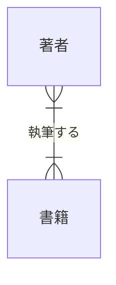
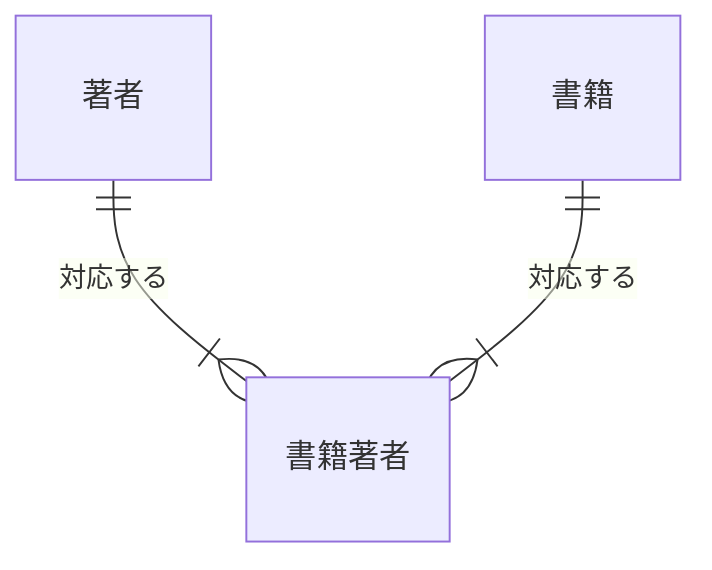

# 第2章 リレーショナルモデルの基礎

第1章では、論理モデルとは概念モデルを特定のデータモデル体系に写したものだと述べ、その体系として主にリレーショナルモデルを使うとした。
本章では、このリレーショナルモデルの側を扱う。
業務をエンティティと関係の形で捉える ER モデリング、行を一意に特定するためのキー設計、データに構造の約束を守らせる制約の三つである。

これらはいずれも OLTP 側のデータベース設計の技法として発展してきた。
しかしデータエンジニアにとっては、ソースシステムから届くデータを読み解くための語彙でもある。
取り込んだテーブルのどの列が主キーで、どのテーブルと外部キーで結ばれているかが分からなければ、結合も重複排除も設計できない。
さらに DWH 側には制約が強制されないという事情があり、OLTP では DBMS に任せられた整合性の保証を、パイプラインの設計者が自前で組み込むことになる。
この事情は本章の後半で扱う。

## 概念の解説

### リレーショナルモデル

テーブル、行、列という言葉は日常的に使うが、その背後には数学に基づく理論がある。
リレーショナルモデルは 1970 年に E. F. Codd が提案したデータモデル体系で、すべてのデータを**リレーション**と呼ばれる構造だけで表す。
リレーションは属性値の組（タプル）の集合であり、SQL の世界では、リレーションがテーブルに、タプルが行に、属性が列にほぼ対応する[^sql-gap]。

理論の細部よりも、集合であるという性質の帰結が実務に効く。
集合の要素に順序はないから、行の並び順に意味を持たせるわけにはいかない。
集合は同じ要素を二つ含まないから、行は値によって互いに区別できなければならない。
つまり「この行はどれか」を特定する手段は行の中の値しかなく、それを保証する仕組みとしてキーが必要になる。

テーブルどうしの関連も、ポインタや位置ではなく値で表す。
あるテーブルの列の値が、別のテーブルのキーの値と一致することが、行から行への参照になる。
外部キーとは、この値の一致による参照である。

### ER モデリング

リレーショナルモデルが写した後の構造を定めるのに対して、業務を写す前に捉える方法を与えるのが **ER モデリング**である。
1976 年に Peter Chen が定式化した手法で、業務を三つの部品で記述する[^notation]。

- **エンティティ**：業務で識別して管理したい対象。顧客、書籍、注文など。
- **属性**：エンティティが持つ値。顧客の氏名やメールアドレスなど。
- **リレーションシップ**：エンティティ間の業務上の関連。「顧客が注文を行う」など。

リレーションシップには**カーディナリティ**を定める。
一方のエンティティ 1 件に対して他方が何件対応するかであり、1 対 1、1 対多、多対多の三種類に分かれる。
あわせて、対応が 0 件の場合を許すかどうか（オプショナリティ）も記す。
第1章の ER 図に込めた「一つの注文は一人の顧客に属する」「注文は少なくとも一つの明細を含む」という事実は、カーディナリティとオプショナリティの表現である。

このうち多対多だけは、リレーショナルモデルへそのまま写せない。
外部キーの列は 1 行につき一つの値しか持てず、リレーショナルモデルは列に値の集合を入れることを認めないからである（この原則は第 3 章の第 1 正規形につながる）。
多対多のリレーションシップは、両側への外部キーを持つ**連関エンティティ**（交差テーブルとも呼ぶ）を挟んで、二つの 1 対多に分解する。
具体例の節で、著者と書籍を題材にこの分解を示す。

### キー設計

リレーショナルモデルの節で、行を特定する手段は値しかないと述べた。
どの列（の組）に行の特定を担わせるかを決めるのがキー設計である。
まず用語を整理する。

- **候補キー**：行を一意に特定できる、それ以上列を減らせない列の組。
- **主キー**：候補キーの中から代表として選んだ一つ。
- **代替キー**：主キーに選ばれなかった候補キー。一意性制約で守る。
- **複合キー**：複数の列からなるキー。

主キーの選定で繰り返し現れる論点が、自然キーとサロゲートキーの選択である。
**自然キー**は、業務の世界にもともと存在する識別子である。
ISBN、社員番号、メールアドレスなどが該当する。
**サロゲートキー**は、行の識別のためだけにシステムが採番する値で、業務上の意味を持たない。

主キーに向くのは、値が変わらず、NULL にならず、確実に一意である列である。
自然キーはこの条件を満たさないことが多い。
業務上の識別子は業務の都合で値が変わるし（メールアドレスの変更、組織再編に伴う社員番号の振り直し）、業務ルールには例外がつきものだからである（識別子が付与されない対象や、重複の混入）。
そのため実務では、主キーにはサロゲートキーを使い、自然キーは代替キーとして一意性制約で守る設計が広く採られる。
ただし連関エンティティのように、親のキーの組で自然に識別できるテーブルを複合主キーのままにする選択も普通である。
サロゲートキーは DWH 側でも、履歴管理のためにソースの自然キーとは別のキーを振るという別の役割で登場する。第 4 章と第 5 章で扱う。

### 制約

キーや参照の定義は、それだけでは設計図の上の約束にすぎない。
実際のデータにその約束を守らせる仕組みが**制約**であり、DDL で宣言しておくと、以後は DBMS が違反する書き込みを拒否する。
主要な制約は五つある。

- **主キー制約**：指定した列（の組）が一意で、NULL を含まないことを保証する。
- **一意性制約**：指定した列（の組）の値が重複しないことを保証する。代替キーを守る。
- **NOT NULL 制約**：列に必ず値が入ることを保証する。
- **外部キー制約**：参照先の行が存在することを保証する。参照整合性とも呼ぶ。
- **CHECK 制約**：行の値が条件式を満たすことを保証する。数量が正である、など。

制約の価値は、守れる経路の広さにある。
アプリケーションのコードで検証しても、別のアプリケーション、管理者の手作業、移行スクリプトなど、データベースへ書き込む経路はほかにもある。
制約は DBMS 自身が検査するため、どの経路からの書き込みにも同じ検査が適用され、不正なデータの混入を書き込みの時点で止められる。

ただし、データエンジニアが主戦場とするクラウド DWH では、この前提が崩れる。
BigQuery や Snowflake は主キーや外部キーの宣言を受け付けるが、既定ではそれを強制しない[^dwh-constraints]。
行単位の検査は大量データのロードを遅くするため、検査を省いて取り込みを速くするという設計判断である。
したがって DWH では、一意性や参照整合性を「書き込み時に拒否する」のではなく「ロード後の検査で検出する」形で担保することになる。
具体例の節の最後で、この検査を dbt のテストとして書く。

## 具体例

第1章と同じ書籍オンラインストアを題材にする。
前章の 4 エンティティ（顧客、注文、注文明細、書籍）では、関係はすべて 1 対多で、キーの選定にも迷う余地がなかった。
本章の論点である多対多の分解と自然キーの採否が現れるように、書籍のまわりに著者を加えて広げる。

### 著者と書籍の多対多

書籍と著者の関係を業務の言葉で確かめる。
一冊の書籍は、共著であれば複数の著者を持つ。
一人の著者は複数の書籍を書く。
つまり多対多であり、概念モデルではそのまま描いてよい。



論理モデルへ写す段階で、この多対多を連関エンティティに分解する。



テーブルとしては次の形になる。

- **authors**：author_id（主キー）、name
- **book_authors**：book_id と author_id の複合主キー、position（著者の表示順）
- **books**：book_id（主キー）、isbn、title、list_price

連関エンティティは関係を表すためだけの存在に見えるが、関係そのものの属性を持てる場所でもある。
著者の表示順は、書籍にも著者にも属さず「この書籍とこの著者の対応」に属する情報であり、book_authors に置くほかない。

### 書籍の主キーの選定

books には ISBN という有力な自然キーがある。
出版流通で世界的に使われる識別子で、一冊に一つ付与される建前だから、一意で不変に見える。
主キーを ISBN にすれば、サロゲートキーの採番も要らなくなる。

しかし、主キーの条件（不変、非 NULL、一意）に照らすと、ISBN は三つとも満たさない場合がある。
まず、自費出版物や非売品には ISBN が付与されないことがあり、これらを扱うなら isbn 列は NULL を許す必要がある。
また、ISBN は 2007 年に 10 桁から 13 桁へ移行しており、値が世界規模で振り直された歴史を持つ。
さらに、規格上は禁止されているものの、絶版書の ISBN が別の書籍に再利用された事例も知られている。

こうした例外は業務ルールの側で生まれるため、テーブル設計の側では防げない。
そこで books の主キーはサロゲートキーの book_id とし、ISBN は代替キーとして一意性制約で守る。
一方 authors には、同姓同名を区別できる自然キーがそもそも存在しないから、サロゲートキーの author_id が最初から唯一の選択肢になる。
book_authors は、親二つのキーの組（book_id, author_id）が候補キーそのものなので、複合主キーのままとする。

### 制約付きの DDL

キー設計の決定を、制約として DDL に落とす。

```sql
CREATE TABLE authors (
    author_id  BIGINT       NOT NULL,
    name       VARCHAR(200) NOT NULL,
    PRIMARY KEY (author_id)
);

CREATE TABLE books (
    book_id    BIGINT         NOT NULL,
    isbn       CHAR(13),
    title      VARCHAR(500)   NOT NULL,
    list_price NUMERIC(10, 2) NOT NULL,
    PRIMARY KEY (book_id),
    UNIQUE (isbn),
    CHECK (list_price >= 0)
);

CREATE TABLE book_authors (
    book_id    BIGINT NOT NULL,
    author_id  BIGINT NOT NULL,
    position   INT    NOT NULL,
    PRIMARY KEY (book_id, author_id),
    UNIQUE (book_id, position),
    FOREIGN KEY (book_id)   REFERENCES books (book_id),
    FOREIGN KEY (author_id) REFERENCES authors (author_id),
    CHECK (position >= 1)
);
```

それぞれの制約が、どんな不正データを止めるかを対応づけておく。
isbn の一意性制約は、同じ ISBN の二重登録を止める（標準 SQL の一意性制約は NULL を比較の対象にしないため、ISBN のない書籍が何冊あっても違反にならない）。
book_authors の複合主キーは、同じ書籍に同じ著者を二度対応づけることを止める。
(book_id, position) の一意性制約は、一冊の中で表示順が衝突することを止める。
外部キー制約は、存在しない書籍や著者への対応づけと、対応が残っている書籍や著者の削除を止める。
CHECK 制約は、負の定価や 0 以下の表示順のような、データ型だけでは防げない値を止める。

なお、「書籍は少なくとも一人の著者を持つ」というカーディナリティの下限は、この DDL では表現できていない。
ここまでの制約はいずれも書き込まれる行とその参照先を検査するものであり、「books の各行に対して book_authors の行が存在する」という逆向きの存在検査を宣言する標準的な手段はないからである。
この種のルールは、アプリケーション側の検証か、次に述べるロード後の検査で担保する。

### DWH 側での整合性の担保

このデータが DWH に取り込まれた後を考える。
概念の解説で述べたとおり、クラウド DWH は主キーや外部キーを強制しないため、同じ整合性をロード後の検査として書き直すことになる。
dbt では、モデルに対する宣言的なテストとして記述できる。

```yaml
# models/staging/_stg_books.yml
models:
  - name: stg_books
    columns:
      - name: book_id
        tests:
          - unique
          - not_null
      - name: isbn
        tests:
          - unique

  - name: stg_book_authors
    columns:
      - name: book_id
        tests:
          - not_null
          - relationships:
              to: ref('stg_books')
              field: book_id
      - name: author_id
        tests:
          - not_null
          - relationships:
              to: ref('stg_authors')
              field: author_id
```

unique と not_null の組が主キー制約に、relationships が外部キー制約に相当する。
dbt はこの宣言を違反行を数える SQL に変換して実行し、違反があればテストの失敗として報告する。

制約とテストは、同じルールを検査するが、働くタイミングが違う。
制約は書き込みの時点で拒否するため、不正データはそもそも入らない。
テストはロードの後に検出するため、不正データは一度入ってから見つかる。
DWH では後者しか選べない以上、テストをパイプラインに組み込み、違反を検出したら下流への反映を止める運用までがセットになる。
なお dbt のテストは任意の SQL でも書けるため、DDL では表現できなかった「著者のいない書籍が存在しない」という検査もここでなら担保できる。

## 参考文献

- E. F. Codd, "A Relational Model of Data for Large Shared Data Banks", *Communications of the ACM*, Vol. 13, No. 6, 1970.（リレーショナルモデルの原論文）
- Peter Pin-Shan Chen, "The Entity-Relationship Model—Toward a Unified View of Data", *ACM Transactions on Database Systems*, Vol. 1, No. 1, 1976.（ER モデルの原論文）
- C. J. Date, *An Introduction to Database Systems*, 8th Edition, Pearson, 2003.（リレーショナル理論を体系的に学べる教科書）
- Ramez Elmasri, Shamkant B. Navathe, *Fundamentals of Database Systems*, 7th Edition, Pearson, 2015.（ER モデリングと制約を含むデータベース理論の教科書）
- ミック『達人に学ぶDB設計 徹底指南書』翔泳社、2012 年。（キー設計と制約の実務的な判断を日本語で学べる入門書）

[^sql-gap]: 現実の SQL データベースは理論から外れる部分を持つ。たとえば主キーも一意性制約も付けないテーブルは重複行を許す。本文で述べる「重複しない」は理論上のリレーションの性質である。

[^notation]: ER 図の記法には、関係をひし形で描く Chen の原記法のほか、カーディナリティを線の端の記号で表す IE 記法（カラスの足記法）などがある。本ドキュメント群の ER 図は、IE 記法に近い mermaid の erDiagram で描く。

[^dwh-constraints]: Snowflake が強制するのは NOT NULL 制約だけで、主キー、一意性、外部キーの各制約は宣言してもメタデータとして保持されるのみである。BigQuery は主キーと外部キーを NOT ENFORCED 付きでのみ宣言できる。強制されない宣言にも、結合の最適化に使われるほか、構造を読み手に伝えるドキュメントとしての価値はある。
