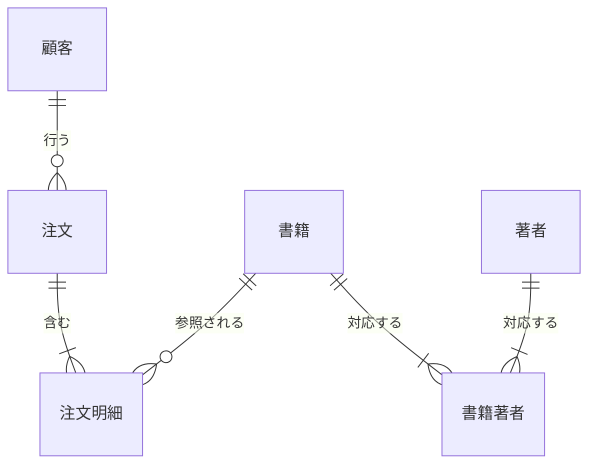

# 第3章 正規化

第2章では、キーと制約によって不正な書き込みを止める仕組みを扱った。
しかし制約が検査できるのは、書き込まれる行とその参照先である。
テーブルの構造が同じ事実を複数の行に重複して記録させる場合、「重複した記録どうしが一致し続ける」というルールを宣言する標準的な制約はなく、矛盾の混入を構造の外からは止められない。

であれば、重複を生まない構造をはじめから選べばよい。
どの属性をどのテーブルに置けば重複が生じないか、その判定基準を与える理論が**正規化**であり、基準の系列が第1正規形から第5正規形と BCNF である。

一方、第1章では OLAP 側の設計は非正規化の方向に進むと述べた。
正規化の理論は、崩す側にとっても無関係ではない。
何をどう崩すと何が壊れるかは、正規形の言葉でしか正確に言えないからである。
本章の前半で正規形の系列を、後半で非正規化の判断基準を扱う。

## 概念の解説

### 更新異常

正規化が防ごうとする事故から始める。
テーブルの構造が同じ事実を複数の行に記録させるとき、次の三種の異常が起きる。

- **修正異常**：事実が変わったとき、重複したすべての行を更新しなければならず、一部だけが更新されると矛盾が残る。
- **挿入異常**：記録したい事実が単独では行の形にならず、別の事実がそろうまで挿入できない。
- **削除異常**：ある事実を消すための行の削除が、残しておきたい別の事実まで一緒に消してしまう。

三つをまとめて**更新異常**と呼ぶ。
第1章で「同じ事実を二か所に持つと片方だけ更新される事故が起きる」と述べたのは、このうちの修正異常である。

異常の原因は、行の単位と事実の単位のずれにある。
一つの行が種類の違う複数の事実（この顧客の連絡先、この注文の日時、この書籍の題名）を運んでいると、事実ごとに発生と変更と消滅のタイミングが違うため、重複と欠落が避けられない。
正規化は、一つの事実が一箇所にだけ記録されるようにテーブルを分解し、このずれをなくす技法である。

### 関数従属

分解の判断には、どの属性がどの属性によって決まるかを書き出す道具が要る。
属性の組 X の値が決まれば属性 Y の値がただ一つに決まるとき、Y は X に**関数従属**するといい、X → Y と書く。
books の行は book_id が決まれば title が決まるから、book_id → title である。

関数従属は、手元のデータを眺めて見つけるものではなく、業務ルールの写しである。
いまのデータでたまたま重複がないことと、業務ルールとして常に成り立つことは別であり、正規化の根拠になるのは後者だけである。

キーも関数従属の言葉で言い直せる。
候補キーとは、テーブルのすべての属性を関数従属させる、それ以上列を減らせない属性の組である。
正規形の判定には、従属の形をさらに二つ区別する。
以下では、どの候補キーにも含まれない属性を非キー属性と呼ぶ。

- **部分関数従属**：複合の候補キーの一部分だけに従属すること。
- **推移的関数従属**：キー X → 非キー属性 Y → 非キー属性 Z の連鎖を通じて、Z が X に従属すること。

### 第1正規形

正規形の系列の出発点として、**第1正規形**は、すべての属性の値がそれ以上分解して扱わない単位（原子的な値）であり、繰り返しの構造を持たないことを求める。
複数の値をカンマ区切りで詰めた列や、phone1、phone2、phone3 のような繰り返し列が違反の典型である。

違反が問題になるのは、値の中身に SQL の機能が届かなくなるからである。
カンマ区切りの著者名から特定の著者を探すには文字列処理が要り、著者に対する一意性制約も外部キーも宣言できない。

第2章で「リレーショナルモデルは列に値の集合を入れることを認めない」と述べたのは、この要請である。
第1正規形はリレーショナルモデルの定義そのものに含まれており、多対多の関係を連関エンティティに分解したのも、この形を守るためだった[^nested]。

### 第2正規形と第3正規形

第2・第3正規形は、非キー属性が持つ余計な関数従属を外していく段階である。

- **第2正規形**：第1正規形であり、非キー属性が候補キーに部分関数従属しないこと。
- **第3正規形**：第2正規形であり、非キー属性が候補キーに推移的関数従属しないこと。

主キーが単一列のテーブルでは部分従属は起きようがないから、第2正規形が問題になるのは複合キーのテーブルだけである。

どちらの違反も、キー全体以外の何かで決まる事実が行に紛れ込んでいることを意味する。
部分従属ならキーの一部についての事実、推移従属なら非キー属性についての事実であり、いずれもその決定項（矢印の左辺）を主キーとする別のテーブルへ移せば解消する。
標語では、非キー属性は「キーに、キーの全体に、キーだけに」従属せよとまとめられる[^kent-slogan]。

### ボイス・コッド正規形

第3正規形の定義には、見逃しが残っている。
禁じたのは非キー属性の従属だけで、候補キーを構成する属性への従属は対象外だからである。
**ボイス・コッド正規形**（BCNF）はこの穴を塞ぎ、自明でない（Y が X に含まれない）すべての関数従属 X → Y について、X がいずれかの候補キーを丸ごと含むことを求める[^bcnf]。

もっとも、第3正規形を満たして BCNF を満たさない形は、複数の複合候補キーが属性を共有する場合にしか現れない。
大半のテーブルでは両者は一致し、差が問題になるのは割り当てのルールを扱う一部のテーブルである。

BCNF への分解には代償もある。
違反する従属を別テーブルに移すと、元のテーブルにあった候補キーが分解後のどのテーブルにも収まらず、その一意性を制約として宣言できなくなる場合がある（従属性の保存が破れる）。
このため、違反を承知で第3正規形にとどめ、あるいは分解した上で失った制約の代わりに検査を置く、という判断が要る。
具体例の節でこの形を示す。

### 第4正規形と第5正規形

ここまでの正規形は関数従属だけを扱った。
関数従属がすべてキーに揃っていても、まだ残る冗長がある。
あるエンティティについて、互いに独立に複数の値を持つ事実が二つ、一つのテーブルに同居する場合である。

二つの多値の事実を同じテーブルの行で表すには、両者の値の全組合せを並べるほかない。
すると片方に値を一つ追加するだけで、もう片方の値の数だけ行を挿入することになり、事実一つの変更が複数行の更新になるという、更新異常と同型の問題が生じる。
この「X が決まれば Y の値の集合が決まり、それが残りの属性と独立である」という関係を**多値従属**と呼び、X →→ Y と書く。
**第4正規形**は、自明でない多値従属の決定項が候補キーを含むことを求める。
実務の指針としては、独立した多値の事実はテーブルを分けて持つ、で違反のほとんどを防げる。
具体例の節で、書籍の販売条件を題材にこの形を示す。

**第5正規形**はさらに先の形として、二分割では元に戻せず、三つ以上のテーブルへの分解によってのみ無損失で復元できる場合（結合従属）を扱う。
これが現れるのは、出版社と取次と書店の三者取引で「二者ずつの取引関係がすべて成立しているなら、三者の組合せでも取引できる」といった、組合せに関する業務ルールがある場合に限られる。
このルール自体がまれであり、実務で意識する場面は少ない。

### 非正規化の判断基準

正規形を満たすテーブルは更新に安全だが、読み出しには結合が要る。
**非正規化**は、冗長の再導入と引き換えに結合を減らす設計判断である。
引き換えに戻ってくるのは更新異常のリスクだから、そのリスクを管理できる条件がそろっているかどうかで判断する。

- 書き込みの経路が一つに制御されているか。派生テーブルとして元データから定期的に作り直されるなら、混入した矛盾は次の再生成で消え、修正異常は蓄積しない。
- 読み取りが支配的か。冗長な列は書き込みのたびに複製のコストを生むから、書き込みの回数が読み取りに比べて十分少ないことが前提になる。
- 矛盾を検出する検査を置けるか。崩した正規形が分かっていれば、破れうる従属も分かり、それを検査に翻訳できる。

OLTP のテーブルは、複数の画面や API が直接書き込むため一つ目の条件を満たしにくい。
DWH の変換パイプラインが作るテーブルは、書き込み経路が変換処理ただ一つで、毎回作り直され、読み取り専用で使われるから、三つの条件を典型的に満たす。
第1章で述べた「OLTP は正規化、OLAP は非正規化」という設計方向の対比は、この条件の差の現れである。

順序も判断のうちに入る。
正規化された論理モデルを先に理解し、そこから意図して崩すのでなければ、どこに冗長があるかを列挙できず、検査の設計もできない。
正規化を知らずに生まれた冗長と、判断して導入した冗長は、形が同じでも管理のしやすさが違う。

## 具体例

これまでの章では、書籍オンラインストアの設計を整った形で組み上げてきた。
本章では逆向きに、崩れた形から出発する。
ストアの立ち上げ初期に、注文フォームの入力内容をそのまま 1 行ずつ保存していた、という状況を仮定する。
この種の全部入りテーブルは作為的な悪例に見えるかもしれないが、スプレッドシートでの台帳運用をそのままデータベースに移した場合や、外部システムからのエクスポートを未加工で取り込んだ場合に、同じ形をよく見かけるだろう。

### 全部入りの注文明細

問題のテーブル order_lines は、注文明細 1 件を 1 行とし、関係する情報をすべて列に持つ。
主キーは (order_id, line_no) である。

| order_id | line_no | ordered_at | customer_id | customer_name | book_id | title | author_names | quantity | unit_price |
| --- | --- | --- | --- | --- | --- | --- | --- | --- | --- |
| 1001 | 1 | 2026-04-01 10:00 | 42 | 佐藤 | 7 | データ基盤入門 | 田中, 鈴木 | 1 | 3200 |
| 1001 | 2 | 2026-04-01 10:00 | 42 | 佐藤 | 12 | SQL 実践 | 高橋 | 2 | 2800 |
| 1002 | 1 | 2026-04-02 09:30 | 42 | 佐藤 | 7 | データ基盤入門 | 田中, 鈴木 | 1 | 3200 |

このほかに customer_email、isbn、list_price の列もあるとする（幅の都合で表からは省く）。

この構造で、概念の解説で挙げた三種の異常がすべて起きることを確かめる。
顧客 42 が氏名を変更すると、3 行すべての customer_name を更新しなければならず、1002 の行だけ更新すれば矛盾が残る（修正異常）。
新しい顧客を会員登録だけで記録するすべはなく、最初の注文が発生するまで顧客はどこにも存在しない（挿入異常）。
書籍 12 の唯一の明細である 1001 の 2 行目を注文キャンセルで削除すると、「SQL 実践」という書籍の記録そのものが消える（削除異常）。
さらに author_names はカンマ区切りの複数値であり、第1正規形にも違反している。

### 関数従属の洗い出し

分解の前に、このテーブルの関数従属を業務ルールから書き出す。

- (order_id, line_no) → book_id, quantity, unit_price
- order_id → ordered_at, customer_id
- customer_id → customer_name, customer_email
- book_id → isbn, title, list_price, author_names

ここで unit_price の位置に注意したい。
第1章で、明細に単価を持つのは注文時点の販売価格を残すためだと述べた。
その判断は関数従属の言葉では「unit_price は book_id ではなく (order_id, line_no) に従属する」と言い直せる。
同じ「単価」でも、定価 list_price は書籍の事実として book_id に従属し、販売価格 unit_price は明細の事実としてキー全体に従属する。
矢印の引き方が業務ルールそのものであることが、この一列によく現れている。

### 繰り返し値の分解（第1正規形）

まず author_names のカンマ区切りをほどく。
著者は注文についての事実ではなく書籍についての事実だから、明細の行に開くのではなく、書籍の側に移す。
移した先で書籍と著者は多対多になり、第2章で行った authors と book_authors への分解がそのまま適用できる。
あの分解は、多対多を写す技法であると同時に、第1正規形への正規化でもあった。
order_lines からは author_names の列を落とし、book_id → author_names の従属は book_authors のテーブル構造に置き換わる。

### 部分従属の分離（第2正規形）

次に、候補キー (order_id, line_no) の一部分にだけ従属する属性を外す。
洗い出した従属のうち order_id → ordered_at, customer_id が部分従属である。
注文日時と注文者は明細ごとの事実ではなく注文の事実であり、明細の行に置くかぎり、注文日時の訂正は明細の数だけの更新になる。

決定項 order_id を主キーとするテーブル orders を立て、そこへ移す。
customer_id に従属する customer_name と customer_email も、customer_id と一緒に orders 側へ移る。

- **orders**：order_id（主キー）、ordered_at、customer_id、customer_name、customer_email
- **order_items**：order_id と line_no の複合主キー、book_id、isbn、title、list_price、quantity、unit_price

### 推移従属の分離（第3正規形）

第2正規形になった二つのテーブルには、まだ推移的関数従属が残っている。
orders では order_id → customer_id → customer_name, customer_email、order_items では (order_id, line_no) → book_id → isbn, title, list_price の連鎖である。
顧客の連絡先は顧客の事実、書籍の題名と定価は書籍の事実であり、注文の行に置く理由がない。

それぞれの決定項を主キーとするテーブルへ移すと、次の形に落ち着く。

- **customers**：customer_id（主キー）、name、email
- **orders**：order_id（主キー）、customer_id（外部キー）、ordered_at
- **order_items**：order_id と line_no の複合主キー、book_id（外部キー）、quantity、unit_price
- **books**：book_id（主キー）、isbn、title、list_price
- **authors**：author_id（主キー）、name
- **book_authors**：book_id と author_id の複合主キー、position



これは第1章と第2章で組み上げた設計と同じである。
偶然の一致ではない。
ER モデリングでエンティティごとにテーブルを立て、属性をそれが表す対象のエンティティに置いていくと、事実の単位と行の単位が揃うため、結果はおおむね第3正規形に落ちる。
正規化理論は、モデリングの手順とは独立に同じ答えへ到達する検算の道具であり、出来上がった設計に紛れた従属の見落としを見つけるために使える。

### 候補キーが重なる場合（BCNF）

第3正規形と BCNF の差が現れる形を、ストアの新サービスで示す。
好みのジャンルについて相談できる、ジャンル別の案内担当を顧客に付けるとする。
業務ルールは二つで、顧客は一つのジャンルにつき一人の担当者を持ち、担当者は一つのジャンルだけを受け持つ。
担当の割り当てをそのまま一つのテーブル genre_advisors (customer_id, genre, staff_id) にすると、関数従属は次のようになる。

- (customer_id, genre) → staff_id（顧客とジャンルが決まれば担当者が決まる）
- staff_id → genre（担当者が決まればジャンルが決まる）

候補キーは (customer_id, genre) と (customer_id, staff_id) の二つで、三つの属性はすべてどちらかの候補キーに属する。
非キー属性が存在しないから、第2・第3正規形は自動的に満たす。
しかし staff_id → genre の決定項 staff_id はどの候補キーも含まないから、BCNF には違反する。
実際に冗長は残っており、担当者のジャンルはその担当者が受け持つ顧客の数だけ重複して記録され、担当者のジャンル替えは修正異常の温床になる。

BCNF へ分解するなら、違反する従属 staff_id → genre を独立させて二つのテーブルにする。

- **staff_genres**：staff_id（主キー）、genre
- **customer_advisors**：customer_id と staff_id の複合主キー

ジャンルの重複はなくなったが、代わりに元の候補キー (customer_id, genre) がどちらのテーブルにも収まらなくなった。
「同じ顧客の同じジャンルに担当者は一人」というルールは、もはや一意性制約として宣言できず、同じ顧客の同じジャンルに二人目の担当者を割り当てても、どちらのテーブルの制約にも違反しない。
これが概念の解説で述べた従属性の保存の破れである。

どちらを選ぶかは、どちらの事故が起きやすく、どちらを補いやすいかの比較になる。
担当者のジャンル替えが実際に起きる業務なら、BCNF に分解した上で、失ったルールは二つのテーブルを結合して重複を数える検査で補う。
ジャンル替えがない業務なら、元の形にとどまり、staff_id → genre の破れを検査で監視する。
なお、この例は教科書の演習のように見えるかもしれないが、「担当者は一つの領域だけを受け持つ」という形の割り当てルールは、営業担当と地域、講師と科目のように、割り当てを扱う業務で珍しくないだろう。

### 独立した多値の事実（第4正規形）

第4正規形の違反は、書籍の販売条件を一つのテーブルにまとめようとすると現れる。
書籍ごとに販売地域が複数あり、販売フォーマットも複数あり、両者は独立に決まるとする。
これを book_offerings (book_id, region, format) に入れると、全組合せの行を並べることになる。

| book_id | region | format |
| --- | --- | --- |
| 7 | JP | paper |
| 7 | JP | ebook |
| 7 | US | paper |
| 7 | US | ebook |

書籍 7 にオーディオブックを追加すると、地域の数だけ行を挿入しなければならず、JP の行だけ挿入すれば「US ではオーディオブックがない」という意図しない主張が生まれる。
多値従属 book_id →→ region と book_id →→ format の決定項が候補キー（このテーブルでは全属性の組）を含まないから、第4正規形違反である。
分解は事実ごとにテーブルを分けるだけでよい。

- **book_regions**：book_id と region の複合主キー
- **book_formats**：book_id と format の複合主キー

ただし、この分解が正しいのは地域とフォーマットが独立な場合だけである。
「US では電子版しか販売しない」のように地域ごとにフォーマットが決まる業務ルールなら、両者は独立でなく多値従属は成立しないから、3 列のテーブルこそが正しい。
関数従属と同じく、多値従属も業務ルールの写しであり、分解の可否はデータの形ではなく業務ルールで決まる。

### 非正規化されたテーブルの検査

最後に、崩す側を扱う。
第1章の具体例で、分析用に結合済みのテーブル fct_order_items を dbt で作った。
title を明細ごとに複製するこの構造は、本章の言葉では book_id → title の推移従属を意図的に再導入した第3正規形違反である。

概念の解説で挙げた判断基準に照らすと、このテーブルは三つの条件を満たす。
書き込むのは dbt の変換処理だけで、実行のたびに元データから作り直される。
利用は月次集計のような読み取りに限られる。
そして、崩した従属が book_id → title だと分かっているから、その破れを検査に翻訳できる。
dbt では、違反行を返す SQL をテストとして置ける。

```sql
-- tests/assert_title_depends_on_book_id.sql
SELECT book_id
FROM {{ ref('fct_order_items') }}
GROUP BY book_id
HAVING COUNT(DISTINCT title) > 1
```

このクエリは、book_id → title が破れている（同じ book_id に複数の title が付いている）book_id を返し、dbt は行が返ればテストの失敗として報告する。
変換ロジックの誤りで矛盾した複製が生まれても、下流に届く前に検出できる。
正規形の知識は、守るときには分解の判定基準として、崩すときには検査すべき従属の一覧として働く。

## 参考文献

- E. F. Codd, "A Relational Model of Data for Large Shared Data Banks", *Communications of the ACM*, Vol. 13, No. 6, 1970.（第1正規形の出発点となった原論文）
- E. F. Codd, "Further Normalization of the Data Base Relational Model", in *Data Base Systems, Courant Computer Science Symposia Series 6*, Prentice-Hall, 1972.（第2・第3正規形を定義した論文）
- William Kent, "A Simple Guide to Five Normal Forms in Relational Database Theory", *Communications of the ACM*, Vol. 26, No. 2, 1983.（五つの正規形の平易で短い解説。本章の標語の出典）
- C. J. Date, *An Introduction to Database Systems*, 8th Edition, Pearson, 2003.（BCNF 以降を含む正規化理論の教科書）
- Ralph Kimball, Margy Ross, *The Data Warehouse Toolkit*, 3rd Edition, Wiley, 2013.（非正規化する側の設計の定番。第4章で主要な参考文献として扱う）
- ミック『達人に学ぶDB設計 徹底指南書』翔泳社、2012 年。（正規化と非正規化の実務判断を日本語で学べる入門書）

[^nested]: 現代のクラウド DWH はこの原則から意図的に逸脱している。BigQuery や Snowflake は ARRAY や STRUCT の型で列にネストした値を持てるし、第8章で扱う One Big Table はそれを設計の道具として使う。逸脱が成り立つ条件は本章後半の非正規化の判断基準と同じである。

[^kent-slogan]: この標語は、Kent の 1983 年の解説論文（参考文献に挙げる）にある「非キー属性は、キーについての、キー全体についての、キー以外の何ものでもない事実を述べなければならない」という要約の言い換えとして流布している。

[^bcnf]: 名称は Raymond F. Boyce と E. F. Codd による 1974 年の定式化にちなむ。第3正規形（1971 年）の定義に残った穴を塞ぐ再定義であり、系列の順序としては第3正規形と第4正規形の間に位置づけられる。

## 演習と音声

- [第3章 演習問題](exercises/03-normalization.md)：四択で章の理解を確認できる。
- [読み上げ音声（mp3）](audio/03-normalization.mp3)：聴いて復習できる（[原稿](audio-scripts/03-normalization.md)）。
