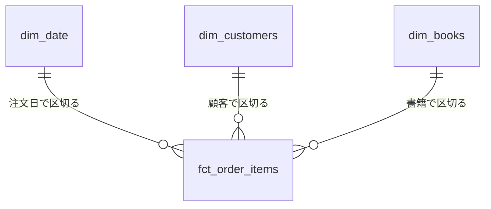

# 第4章 ディメンショナルモデリング

第3章では、非正規化を管理できる条件を判断基準として整理し、正規形の知識が崩すときの検査の設計に使えることを確かめた。
しかしあの基準が答えるのは「崩してよいか」であり、「どんな形に崩すか」ではない。
第1章で作った結合済みの一枚のテーブルは崩し方の一つにすぎず、DWH のテーブル群をどんな形に組むかの指針はまだ持っていない。

OLAP 側のテーブル設計には、30 年来の定石がある。
Ralph Kimball が 1990 年代に体系化した**ディメンショナルモデリング**である[^kimball]。
本章では、分析の問いの形からファクトとディメンションの二分を導き、その配置であるスタースキーマと、設計を進める手順である Kimball の設計プロセスを扱う。
具体例では、書籍オンラインストアの注文データをスタースキーマに設計し直す。

## 概念の解説

### 分析の問いの形

設計の入力は、分析者が立てる問いである。
「先月の売上はいくらだったか」「書籍別ではどうか」「休日と平日で差はあるか」。
形はどれも同じで、測る数値が一つあり（売上金額）、それを区切る切り口が付く（月ごと、書籍ごと、休日か平日か）。
SQL に写せば、測る数値は SUM などの集約関数の中に、切り口は GROUP BY と WHERE に現れる。

ディメンショナルモデリングは、この問いの形をそのままテーブルの形にする技法である。
測る数値を**メジャー**、切り口を**ディメンション**と呼び、メジャーを集めるテーブルと、切り口ごとの属性を集めるテーブルに分けて設計する。
第2章の ER モデリングが業務の対象ごとに、第3章の正規化が事実の単位ごとにテーブルを分けたのに対し、ここでの分割の単位は分析の問いにおける役割である。
同じリレーショナルなテーブルを作るのでも、何に沿って分けるかが違う。

### ファクトテーブルとグレイン

二分の測る側を受け持つのが**ファクトテーブル**である。
業務で起きた測定可能な出来事を 1 行ずつ記録し、列はメジャーと、各ディメンションのテーブルを指す外部キーでほぼ占められる。
説明のための文字列を持たないから、行数は多いが列は細い、という形になる。

ファクトテーブルの設計は、**グレイン**（1 行が現実の何に対応するかの宣言）を決めることから始まる。
「注文明細 1 行」「書籍と日付の組ごとの在庫残高 1 行」のように、業務の言葉の一文で宣言する。
宣言を先に固定するのは、粒度の違う行が混ざったテーブルでは集計が信用できなくなるからである。
明細の行と注文合計の行が同じテーブルに同居すれば、SUM は同じ売上を二重に数える。

メジャーには、どの切り口に沿って合計してよいかの違いがあり、**加法性**と呼んで三つに分ける。

- **加法的**：どの切り口で区切って合計しても意味を持つ。販売金額や数量。
- **半加法的**：一部の切り口でしか合計できない。在庫残高は書籍を跨いで合計できるが、日付を跨いだ合計（月曜の在庫と火曜の在庫の和）は意味を持たない。
- **非加法的**：合計そのものが意味を持たない。単価や比率など。

集計の主役は加法的なメジャーである。
比率のような非加法的な値は、そのまま持たずに分子と分母を加法的なメジャーとして持ち、問い合わせの側で割って求める。
平均単価が欲しいなら、単価の平均ではなく、金額の合計を数量の合計で割る。

ここまで想定してきたのは、出来事の発生ごとに 1 行を追加するファクトテーブルであり、**トランザクションファクト**と呼ぶ。
Kimball はほかに二種類を区別する。

- **周期スナップショットファクト**：日次や月次の周期で、その時点の状態を 1 行ずつ写す。日次の在庫残高が典型で、半加法的メジャーの主な置き場になる。
- **累積スナップショットファクト**：一連の業務プロセス 1 件を 1 行とし、注文、出荷、配送完了といった節目の日付列を進行に応じて埋めていく。工程間の所要日数の分析に向く。

### ディメンションテーブル

二分のもう一方、切り口の側を受け持つのが**ディメンションテーブル**である。
ファクトの行を、誰が、何を、いつ、という言葉で説明する属性を集め、絞り込みとグループ化の語彙を提供する。
分析者が GROUP BY や WHERE に書けるのはディメンションにある列だけだから、属性の列が多いほど、答えられる問いが増える。

構造は正規化しない。
書籍のディメンションに著者名の連結を持つのも、ジャンルの大分類と小分類を同じ行に並べるのも、意図した設計である。
第3章の判断基準に照らせば、ディメンションテーブルは変換処理だけが書き込み、実行のたびに作り直され、読み取り専用で使われるから、三つの条件を満たしている。

最も定番のディメンションは日付である。
年や月や曜日は日付関数でも計算できるから、テーブルにするまでもないように見える。
日付ディメンションの価値は、計算では導けない属性を持てることにある。
祝日かどうか、営業日かどうか、セール期間か、会計年度のどの四半期かは、どれもカレンダーという業務知識であり、テーブルとして持つほかない。
日付を主キーにすれば、10 年分でも 4,000 行に満たない。

ファクトとディメンションの行数には、大きな非対称がある。
明細のファクトが数千万から数億行に育つ一方で、顧客は数十万、書籍は数万、日付は数千の桁にとどまる。
ディメンション側の非正規化が容量の点でほとんど問題にならないのは、この非対称のためである。

### スタースキーマ

ファクトテーブルを中心に置き、ディメンションテーブルが外部キーで結ばれて取り囲む配置を**スタースキーマ**と呼ぶ。
ER 図に描いたときの星形にちなむ名である。

この配置の利点は、問い合わせが定型になることにある。
どの問いも、ディメンションの属性で絞り込み、ディメンションの属性でグループ化し、ファクトのメジャーを集約する、という一つの形の SQL に収まる。
結合は常にファクトとディメンションの一段だけで、経路を選ぶ余地がない。
定型であるおかげで、BI ツールはスタースキーマを前提に問い合わせを自動で組み立てられ、分析者はテーブル構造ではなく問いに集中できる。

ディメンションをさらに正規化して枝分かれさせた配置は**スノーフレークスキーマ**と呼ばれる[^snowflake-name]。
書籍のディメンションから著者のテーブルを切り出して結合で参照するような形である。
Kimball はこれを推奨しない。
前節の非対称のとおりディメンションは小さく、正規化で節約できる容量はわずかな一方で、結合の段数と、分析者が把握すべきテーブルの数が増えるからである。

### ディメンションのサロゲートキー

第2章で、サロゲートキーは DWH 側では履歴管理という別の役割で登場すると述べた。
その役割をここで確かめる。
Kimball の設計では、ディメンションテーブルの主キーに、ソースシステムの ID ではなく DWH 側で新たに振るサロゲートキーを使う。
理由は履歴にある。
顧客の属性が変わったとき、変更前と変更後を別々の行として残すなら、同じ customer_id を持つ行が二つでき、customer_id では行を特定できなくなる。
行を特定するキーは、DWH の側で振り直すほかない。
複数のソースシステムの統合（同じ顧客が別々の ID を持つ）や、ソース側の ID の振り直しからの防御も、同じ結論を支える理由に挙げられる。

ただし、この必要が生じるのは履歴を持たせるときである。
常に現在値で上書きするディメンションなら、ソースの ID をキーに使っても差し支えない。
履歴の持ち方は第5章の Slowly Changing Dimensions で扱い、サロゲートキーの採番もそこで具体化する。
本章の具体例は上書き方式にとどめ、ソースの ID をそのままキーに使う。

### Kimball の設計プロセス

部品がそろったところで、設計をどの順で進めるかである。
Kimball は次の 4 ステップを定式化した。

1. **ビジネスプロセスの選択**：測定の対象とする業務活動（注文、出荷、在庫補充など）を選ぶ。部門やレポートの要望単位ではなく業務の出来事単位で選ぶのは、同じ出来事のデータが複数の部門の問いに答えるからである。
2. **グレインの宣言**：ファクトテーブルの 1 行が何かを、業務の言葉の一文で宣言する。Kimball は、それ以上分けられない最も細かい粒度（原子的グレイン）を推奨する。集計して粗くした粒度は、宣言の時点で想定していなかった切り口の問いに答えられないからである。
3. **ディメンションの識別**：グレインの 1 行について値が一意に決まる記述を、ディメンションとして列挙する。
4. **ファクトの識別**：グレインと整合するメジャーを列挙する。整合しない数値は、別のグレインを持つ別のファクトテーブルに割り当てる。

グレインの宣言が、ディメンションとファクトの識別より前にあることがこの手順の要点である。
1 行が何かが決まってはじめて、「1 行について一意に決まるか」「グレインと整合するか」という後半二つの判定が下せる。

ビジネスプロセスを一つずつ選んではこの手順でスタースキーマを作っていくと、注文のスキーマと在庫のスキーマが同じ日付や書籍のディメンションを共有する形が自然に生まれる。
複数のファクトテーブルから共有されるディメンションを**適合ディメンション**（conformed dimension）と呼び、プロセスごとに作られたスキーマ群を一つの DWH へつなぎ合わせる役割を担う。
この考え方が DWH 全体のアーキテクチャ論にどう発展するかは、第6章で Inmon の方式と対比しながら扱う。

## 具体例

第1章の具体例では、月次のタイトル別集計のために、title を明細に複製した結合済みのテーブル fct_order_items を dbt で作った。
その後、分析の要望が増えたとしよう。
休日と平日で売れ行きは違うか。
共著の書籍は単著より売れるか。
要望のたびにあの一枚のテーブルへ列を足していく道もある（その行き着く形は第8章で扱う）。
本章では Kimball の設計プロセスに従い、同じデータをスタースキーマとして設計し直す。

### 設計プロセスの適用

ビジネスプロセスには注文を選ぶ。
入荷や在庫にも測定すべき出来事はあるが、届いている問いはどれも売上についてのものだからである。

グレインは「注文明細 1 行」と宣言する。
注文というプロセスの原子的グレインであり、第1章のテーブルと同じ粒度である。
注文 1 件を 1 行とする粗い粒度でも売上の合計には答えられるが、書籍別の問いには答えられない。

ディメンションは、明細 1 行について一意に決まる記述を挙げて、日付（注文日）、顧客、書籍の三つとする。
グレインを先に宣言した効果は、著者の扱いに現れる。
共著の書籍では明細 1 行に複数の著者が対応するから、「著者」は明細について一意に決まらず、そのままではディメンションにならない。
著者の情報は、書籍ディメンションの属性へ畳み込むことにする（畳み方は書籍ディメンションの節で示す）。

ファクトは quantity と unit_price、それに quantity × unit_price で導出する amount の三つである。
amount と quantity は加法的で、集計の主役になる。
unit_price は非加法的だが、注文時点の販売価格という明細の事実だから、明細のグレインと整合し、ここに置いてよい。
一方、注文全体の送料を扱うことになったら、それは明細ではなく注文 1 件のグレインに属する数値だから、このテーブルには置かず、注文グレインの別のファクトテーブルを立てる。

残った order_id と line_no は、メジャーでもなければ、ディメンションテーブルを立てるほどの属性も持たない、ただの識別子である。
この種の列は**縮退ディメンション**（degenerate dimension）と呼び、ファクトテーブルに直接置く。
明細を注文単位にまとめ直すときや、個別の注文をソースと突き合わせるときの手がかりになる。

設計の結果を図とテーブル定義で示す。



- **dim_date**：date_day（主キー）、year、month、day_of_week、is_weekend、is_holiday
- **dim_customers**：customer_id（主キー）、name、email
- **dim_books**：book_id（主キー）、isbn、title、list_price、author_names、author_count
- **fct_order_items**：order_id と line_no（縮退ディメンション。複合で 1 行を特定する）、ordered_date、customer_id、book_id（各ディメンションへの外部キー）、quantity、unit_price、amount（メジャー）

dim_customers は stg_customers の写しそのままなので、以降では日付と書籍の二つのディメンションを作る。

### 日付ディメンション

日付ディメンションは、ソースシステムから取り込むのではなく DWH 側で生成する。
連続した日付の列は dbt_utils の date_spine マクロで作れる[^date-spine]。
年や曜日のような計算で導ける属性は式で付け、計算で導けない祝日は、リポジトリで管理する祝日一覧の CSV（dbt では seed と呼ぶ）を結合して写す。

```sql
-- models/marts/dim_date.sql
WITH date_spine AS (
    {{ dbt_utils.date_spine(
        datepart="day",
        start_date="DATE '2020-01-01'",
        end_date="DATE '2031-01-01'"
    ) }}
)

SELECT
    s.date_day,
    EXTRACT(YEAR FROM s.date_day)                AS year,
    EXTRACT(MONTH FROM s.date_day)               AS month,
    EXTRACT(DAYOFWEEK FROM s.date_day)           AS day_of_week,
    EXTRACT(DAYOFWEEK FROM s.date_day) IN (1, 7) AS is_weekend,
    h.holiday_date IS NOT NULL                   AS is_holiday
FROM date_spine AS s
LEFT JOIN {{ ref('jp_holidays') }} AS h ON h.holiday_date = s.date_day
```

曜日番号の規約は製品ごとに違うため、is_weekend の式は利用する製品に合わせて読み替える[^dayofweek]。
セール期間や会計年度の四半期が切り口として必要になったら、同じ要領で列を足せばよい。

### 書籍ディメンション

書籍ディメンションは、正規化された書籍、著者、対応表の三つのテーブルを一枚に畳む。
著者は書籍 1 冊について複数いるから、表示順に連結した文字列と人数の二つの属性に要約する[^string-agg]。

```sql
-- models/marts/dim_books.sql
SELECT
    b.book_id,
    b.isbn,
    b.title,
    b.list_price,
    STRING_AGG(a.name, ', ' ORDER BY ba.position) AS author_names,
    COUNT(a.author_id)                            AS author_count
FROM {{ ref('stg_books') }} AS b
LEFT JOIN {{ ref('stg_book_authors') }} AS ba ON ba.book_id = b.book_id
LEFT JOIN {{ ref('stg_authors') }} AS a ON a.author_id = ba.author_id
GROUP BY b.book_id, b.isbn, b.title, b.list_price
```

author_names のカンマ区切りは、第3章で第1正規形違反の典型として分解した、まさにあの形である。
ここでは意図した設計として再導入している。
このテーブルを書くのは変換処理だけで、実行のたびに作り直され、読み取り専用で使われるから、第3章の判断基準を満たす。
そして「共著か単著か」で区切る問いには author_count が、集計結果に著者名を添える表示には author_names が答える。

ただし、答えられない問いも残る。
特定の著者一人の売上を集計しようにも、連結された文字列から著者を取り出せないから、この形では書籍単位までしか区切れない。
著者単位の集計が実際に必要になったときの道具として、Kimball はブリッジテーブルを示している[^bridge]。

### ファクトテーブルの再構成

ファクトテーブルは、第1章の fct_order_items から説明的な属性を取り除いた形になる。

```sql
-- models/marts/fct_order_items.sql
SELECT
    i.order_id,
    i.line_no,
    CAST(o.ordered_at AS DATE) AS ordered_date,
    o.customer_id,
    i.book_id,
    i.quantity,
    i.unit_price,
    i.quantity * i.unit_price  AS amount
FROM {{ ref('stg_order_items') }} AS i
JOIN {{ ref('stg_orders') }} AS o ON o.order_id = i.order_id
```

第1章の版にあった books との結合と title の列が消えている。
書籍を説明する属性はすべて dim_books にあり、ファクト側は book_id で指すだけでよいからである。
問いが増えて書籍の属性を足したくなっても、変わるのは数万行の dim_books だけで、数億行に育つファクトテーブルには手を入れなくて済む。
切り口の追加がディメンション側の変更で閉じることが、一枚のテーブルに列を足し続ける道との違いである。

### スタースキーマでの問い合わせ

「休日と平日で書籍ごとの売れ行きは違うか」という問いは、次の一文になる。

```sql
SELECT
    CASE WHEN d.is_weekend OR d.is_holiday THEN 'holiday' ELSE 'weekday' END AS day_type,
    b.title,
    SUM(f.amount) AS total_amount
FROM fct_order_items AS f
JOIN dim_date AS d ON d.date_day = f.ordered_date
JOIN dim_books AS b ON b.book_id = f.book_id
GROUP BY day_type, b.title
ORDER BY day_type, total_amount DESC;
```

祝日の判定は注文データからは導けないが、この問い合わせには祝日の一覧も日付の計算も現れない。
切り口は dim_date の列としてあらかじめ用意してあるからである。
共著と単著の比較に変えるなら、b.title を author_count の条件式に差し替えるだけでよい。
どの問いも「ディメンションで区切り、メジャーを集約する」という同じ形に収まっており、概念の解説で述べた問い合わせの定型性がここに現れている。

### グレインと参照の検査

第2章で、DWH の整合性はロード後の検査として担保すると述べた。
スタースキーマでは、何を検査すべきかが設計の宣言そのものから決まる。
グレイン「注文明細 1 行」の宣言は、(order_id, line_no) の組の一意性の検査に翻訳できる。
変換の誤りで明細が重複すると、すべての集計が静かに水増しされるからである。
星形の結合は、ファクトの外部キーが対応するディメンションの行に必ず当たる、という検査に翻訳できる。
当たらない行があると、結合でその行が落ち、集計が静かに欠ける。

```yaml
# models/marts/_marts.yml
models:
  - name: fct_order_items
    tests:
      - dbt_utils.unique_combination_of_columns:
          combination_of_columns:
            - order_id
            - line_no
    columns:
      - name: ordered_date
        tests:
          - not_null
          - relationships:
              to: ref('dim_date')
              field: date_day
      - name: customer_id
        tests:
          - not_null
          - relationships:
              to: ref('dim_customers')
              field: customer_id
      - name: book_id
        tests:
          - not_null
          - relationships:
              to: ref('dim_books')
              field: book_id
```

### 上書きされるディメンションの限界

最後に、この設計に残る宿題を確かめる。
dim_customers は stg_customers の写しだから、顧客が氏名やメールアドレスを変えると、次の作り直しで全行が現在の値になる。
過去の注文を集計しても、添えられる顧客の属性はすべて今の値である。
それで困らない問いも多いが、「注文の時点の属性で過去を区切りたい」という問い（当時の会員ランク別の売上など）には、上書きでは答えられない。
変更を上書きせず履歴として残す技法が Slowly Changing Dimensions であり、概念の解説で予告したサロゲートキーが必要になるのもそこである。
第5章で扱う。

## 参考文献

- Ralph Kimball, Margy Ross, *The Data Warehouse Toolkit*, 3rd Edition, Wiley, 2013.（ディメンショナルモデリングの定番書。本章の内容はほぼ本書の前半に対応する）
- Kimball Group, "Kimball Dimensional Modeling Techniques". https://www.kimballgroup.com/data-warehouse-business-intelligence-resources/kimball-techniques/ （設計技法を項目別に整理した公式リファレンス）
- Christopher Adamson, *Star Schema: The Complete Reference*, McGraw-Hill, 2010.（スタースキーマ設計だけを扱った網羅的な解説書）
- Lawrence Corr, Jim Stagnitto, *Agile Data Warehouse Design*, DecisionOne Press, 2011.（要件の聞き取りからディメンショナルモデルを組み立てる手法。日本語訳『アジャイルデータモデリング』翔泳社、2024 年）

[^kimball]: 初版の *The Data Warehouse Toolkit*（1996 年）で広まった。Kimball の名は DWH 全体のアーキテクチャ論でも登場するが（第6章で Inmon と対比する）、本章で扱うのはテーブル設計の技法の側である。

[^snowflake-name]: 枝分かれした形を雪の結晶に見立てた名であり、製品の Snowflake とは無関係である。

[^date-spine]: date_spine は、指定した範囲の連続する日付を生成する dbt_utils パッケージのマクロである。日付の生成に使う SQL の方言差をマクロが吸収してくれる。

[^dayofweek]: 週を何曜から始め、番号を何から振るかが製品ごとに違う。本文の式は BigQuery の規約（日曜が 1、土曜が 7）で書いている。

[^string-agg]: STRING_AGG は BigQuery と PostgreSQL の関数で、Snowflake では LISTAGG ... WITHIN GROUP が相当する。

[^bridge]: 多対多のディメンションとファクトの間に、対応 1 組を 1 行とする中間テーブルを挟み、必要なら按分の係数（weighting factor）を持たせて金額を著者に配分する技法。結合も解釈も複雑になるため、その問いが実際に届くまで導入しないのが普通の判断である。
