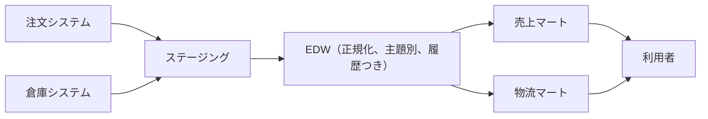
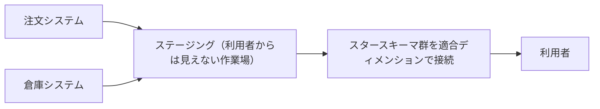

# 第6章 DWH アーキテクチャ

第5章の最後で、履歴の設計をどこに置くかという問いが、テーブル一枚の設計を超えることを確かめた。
履歴を持つ dim_customers を複数のビジネスプロセスのスタースキーマで共有するなら、履歴の設計は共有される一枚の上で一度だけ行いたい。
どのテーブルを共有し、ソースから利用者までの間にどんな層を並べるかを決める、この全体の組み立てが **DWH アーキテクチャ**である。

この問いには、DWH の草創期に確立された二つの古典的な回答がある。
Bill Inmon の、正規化された中央のウェアハウスからマートを派生させる方式と、Ralph Kimball の、適合ディメンションでスタースキーマ群をつなぐ方式である。
本章では両者の構造と対比、それぞれでのデータマートの位置づけ、そして現代のクラウド DWH と dbt の実務が両者をどう組み合わせているかを扱う。
具体例では、書籍オンラインストアに出荷のプロセスを追加し、適合ディメンションによる統合を dbt で実装する。

## 概念の解説

### データウェアハウスとデータマート

ここまでの章では DWH という語を、分析用データの置き場という程度の意味で使ってきた。
アーキテクチャを論じるには、この語の古典的な定義から始めるのがよい。
DWH という概念を定式化した Inmon は、**データウェアハウス**を、意思決定の支援のための、主題指向で、統合済みで、時系列で、不揮発なデータの集合と定義した[^inmon-def]。
四つの形容には、それぞれ設計上の含意がある。

- **主題指向**（subject-oriented）：注文システム、倉庫システムといったアプリケーションの単位ではなく、顧客、書籍、注文といった業務の主題の単位でデータを編成する。
- **統合済み**（integrated）：ソースシステムごとに食い違う ID の体系、コード、単位、表記を、格納する前にそろえる。
- **時系列**（time-variant）：現在の状態だけでなく履歴を保持する。第5章の SCD は、この性質をディメンションの上で実現する技法だった。
- **不揮発**（non-volatile）：ロードした行を業務アプリケーションのようには書き換えない。追記と読み取りだけで運用する。

四つのうち統合済みは、ここまでの具体例に現れる機会がなかった。
ソースシステムが注文システムの一つだけで、統合の仕事が生じなかったからである。
本章の具体例で、初めて二つ目のソースを迎える。

一方、**データマート**は、特定の部門や分析用途のための、範囲を絞ったデータの集合を指す。
マーケティングが見る売上分析のスタースキーマ、物流チームが見る出荷分析のスタースキーマ、という単位である。
分析者や BI ツールが日々問い合わせる相手はデータマートであり、この点はどの流儀でも変わらない。
アーキテクチャ論が分かれるのは、ソースとマートの間に何を置き、マート同士の整合をどう保つかである。

### 独立データマートとサイロ

アーキテクチャなしにマートだけを積み上げるとどうなるかが、議論の出発点になる。
部門ごとにソースシステムから直接データを抽出し、それぞれの変換でそれぞれのマートを作る形を、**独立データマート**と呼ぶ。
一番手軽に始められるが、マートが増えるにつれて、同じはずの数字が食い違い始める。
経営会議で営業のいう売上とマーケティングのいう売上が合わない、という広く知られた症状である。

食い違いは、偶然のバグではなく構造から生まれる。
キャンセルされた注文を数えるか、送料や割引をどう扱うか、月の区切りを注文日と出荷日のどちらで取るかといった決定が、マートの数だけ別々に下されるからである。
どの数字が正しいかの調査は、マートをまたいだ変換ロジックの突き合わせになり、マートと部門が増えるほど手に負えなくなる。
この状態はサイロ（またはストーブパイプ）と呼ばれ、Inmon と Kimball のどちらもが防ごうとした共通の相手である。

したがって二つのアーキテクチャは、「ソースの統合と共通の定義を一度だけ行う場所を、マートの手前に用意する」という同じ処方を共有している。
分かれるのは、その場所の形である。

### Inmon のアーキテクチャ

Inmon の回答は、中央に一つの**エンタープライズデータウェアハウス**（EDW）を築くことである[^cif]。



EDW は、前節の定義の四性質をそのまま体現する層である。
全社のデータを主題別に編成し、履歴を持ち、おおむね第3正規形に正規化してモデリングする。
利用者は EDW を直接問い合わせない。
部門や用途ごとのデータマートを EDW から派生させ、利用者にはマートだけを見せる。
マートの形はディメンショナルでよく、Inmon もマートにスタースキーマを用いることは認めている。

中央の層を正規化する理由は、EDW の役割から出てくる。
EDW の役割は特定の分析の問いに答えることではなく、将来のどんなマートの源にもなることである。
分析の問いは移ろうから、どれかの問いの形（特定のグレインや切り口）に寄せた構造は、次のマートを作るときに足かせになる。
問いから独立に、業務の事実を重複なく一度だけ持つ形として、正規化が選ばれる。
第3章で正規化は OLTP 側の技法として学んだが、「同じ事実を一箇所にだけ書く」という性質は、多数のソースを矛盾なく統合し続ける中央層でも同じように効く。

進め方はトップダウンになる。
まず全社のデータモデルを設計し、EDW を構築し、そのうえでマートを切り出していく。
統合と履歴の設計が一箇所に集まる見返りに、先行投資は大きい。
全社モデルの合意と EDW の構築が済むまで、分析者の手元には何も届かない。

### Kimball のバスアーキテクチャ

Kimball の回答は、別立ての正規化された中央層を作らないことである。
第4章の設計プロセスに従ってビジネスプロセスごとにスタースキーマを作っていき、その集合をそのまま DWH とする。



中央層なしでサイロを避けられるのは、統合の仕事を**適合ディメンション**が引き受けるからである。
第4章の最後で、複数のファクトテーブルから共有されるディメンションとして導入した部品がこれである。
注文のファクトも出荷のファクトも同じ dim_customers と dim_date を参照していれば、どのマートでも顧客の区分と月の区切りが同じになり、プロセスをまたいだ数字の突き合わせが成り立つ。
共通の定義は、中央の層にではなく、共有されるディメンションそのものに宿る。

この構造を**バスアーキテクチャ**と呼ぶ[^bus]。
適合ディメンションが共通規格のバスであり、新しいプロセスのスタースキーマは、既存のディメンションに接続する形で追加されていく。

計画の道具として、Kimball は**バスマトリクス**を使う。
行にビジネスプロセスを、列にディメンションを並べ、どのプロセスがどのディメンションで記述されるかを印で埋めた表である。
複数の行から印の付く列が、適合させるべきディメンションを教える。
表を埋める作業は全社を見渡して行うが、実装はプロセス一つずつでよく、最初のスタースキーマが完成した時点から分析者は使い始められる。
この進め方がボトムアップと呼ばれる。

Kimball の世界では、DWH とデータマートの区別は薄い。
プロセスごとのスキーマ群がそれぞれマートであり、適合ディメンションで結ばれたその全体が DWH である。
ステージング領域（Kimball の言葉ではバックルーム）はあるが、あくまで利用者から見えない作業場であり、恒久的にモデリングされた層としては扱わない。

代償は、適合を守り続ける規律である。
どのチームがいつスキーマを足すときも、既存の適合ディメンションを再利用しなければならない。
目先の都合で専用の顧客テーブルを立てたスキーマは、その時点でバスから外れ、独立データマートに逆戻りする。

### 二つのアーキテクチャの対比

| 観点 | Inmon | Kimball |
| --- | --- | --- |
| 進め方 | トップダウン（全社モデルから） | ボトムアップ（プロセスごと） |
| 中央の統合層 | 正規化された EDW を置く | 置かない |
| 統合と共通定義の担い手 | EDW | 適合ディメンション |
| 履歴の置き場 | EDW | ディメンション（SCD） |
| データマート | EDW から派生する別の層 | スタースキーマ群そのもの |
| 最初の価値が届くまで | 遅い | 早い |

1990 年代から 2000 年代にかけて、両陣営の論争は盛んだった。
しかし対立の図式だけで覚えると、共有されているものを見落とす。
統合と共通の定義を一度だけ行うこと、利用者に見せる形はディメンショナルであること、履歴を共有の場所で管理することでは、両者は一致している。
争点は「正規化された中央層を、利用者向けの層とは別に持つ価値があるか」に絞られる。
Inmon は、個々のマートの要望から独立した安定の層としてその価値を取り、Kimball は、利用者に直接届かない層を構築し維持し続けるコストは価値に見合わないと見た。

どちらに寄せるかは、組織の条件で決まる。
ソースシステムの数が多く食い違いが深いほど、また規制対応のように問いから独立したデータの保全が求められるほど、中央層の価値は上がる。
ソースが少なく、目の前の分析要望に早く応えることが求められるほど、バスの軽さが効く。

### 現代の実務での混成

現代のクラウド DWH と dbt の実務は、どちらか一方を純粋に採るより、両者の要素を層として並べる形に落ち着いている。

背景には、物理的な事情の変化がある。
論争の当時、EDW とマートは別々のサーバに立つ別々のシステムであることが多く、中央層を持つかどうかは機材と運用への大きな投資判断だった。
クラウド DWH では、どの層も同じ製品の中のスキーマ（データセット）にすぎず、層を一つ増やすことは dbt のディレクトリを一つ増やすことでしかない。
持つかどうかの判断は残るが、その重みが桁で変わった。

dbt Labs が推奨するプロジェクト構成は、staging、intermediate、marts の三層である[^dbt-structure]。

- **staging**：ソースのテーブルと 1 対 1 のモデルを置き、列名と型の整えやコードの読み替えを行う。ソースごとの癖をここで吸収する。
- **intermediate**：複数の staging モデルにまたがる共通の変換を、必要に応じて置く。
- **marts**：利用者に見せるディメンショナルな層。ファクトテーブルと適合ディメンションを置く。

この構成は、marts が Kimball のバスをそのまま実装しつつ、EDW が一手に担っていた仕事の一部（ソース差異の吸収と履歴の獲得）を staging と snapshot が引き受けた、混成の形として読める[^medallion]。
第5章の設計を振り返ると、履歴の獲得は入り口の snapshot で一度だけ行い、履歴の表現は marts の dim_customers で一度だけ行った。
あの配置は、統合と共通の定義を一度だけ行うという本章の処方に沿っている。

## 具体例

書籍オンラインストアに、二つ目のビジネスプロセスとして出荷を加えよう。
出荷を記録しているのは注文システムではなく、倉庫で使われている倉庫管理システムである。
注文が入ると倉庫に出荷指示が渡り、倉庫管理システムには、どの注文に対して、どの書籍を何冊、どの配送業者でいつ出荷したかが記録される。
在庫が足りなければ出荷は分割され、遅れもする。
だから物流チームからは、こんな問いが届いている。
「書籍ごとに、注文された冊数と出荷された冊数を月別で並べたい。差が開いている書籍は、欠品か出荷漏れを疑いたい。」

注文と出荷の数字を同じ表に並べるこの問いは、プロセスをまたいでおり、単一のスタースキーマの中では答えられない。
本章のアーキテクチャの出番である。

### バスマトリクスによる計画

出荷に第4章の設計プロセスを適用する前に、バスマトリクスで全体を見る。

| ビジネスプロセス | 日付 | 顧客 | 書籍 | 配送業者 |
| --- | --- | --- | --- | --- |
| 注文 | ✓ | ✓ | ✓ | |
| 出荷 | ✓ | ✓ | ✓ | ✓ |

出荷の行を足すときの読み方はこうである。
日付、顧客、書籍の列にはすでに注文の印が付いているから、出荷のスキーマはこの三つを新設せず、既存の dim_date、dim_customers、dim_books に接続する。
新しい列は配送業者だけで、これは出荷専用のディメンション dim_carriers として新設する。
つまりこの拡張で増える実装は fct_shipments と dim_carriers の二つだけで、既存のディメンションには手を入れない。

グレインは「出荷明細 1 行」（1 回の出荷に含まれる書籍 1 種ごとに 1 行）と宣言する。
メジャーは出荷冊数 quantity である。

### 二つ目のソースシステムの統合

ソースが二つになったことは、dbt では sources の宣言に現れる。

```yaml
# models/staging/_sources.yml（抜粋）
sources:
  - name: shop   # 注文システム
    tables:
      - name: customers
      - name: orders
      - name: order_items
      - name: books
  - name: wms    # 倉庫管理システム
    tables:
      - name: shipments
      - name: shipment_items
      - name: carriers
```

そして、概念の解説で予告した統合の仕事が、ここで初めて実際に生じる。
倉庫管理システムは、書籍を注文システムの book_id では識別していない。
倉庫の現場で現物との突き合わせに使うのはバーコード、すなわち ISBN であり、別システムの内部連番を倉庫側が使う理由がないからである。
ここで第2章の決定が効いてくる。
books を設計したとき、ISBN は主キーには不適として退けつつ、代替キーとして一意性制約で守っていた。
ソースをまたいで同じ書籍を指せる共通の語彙は、システム内部の連番ではなく、この業界標準の自然キーである[^isbn-limit]。

読み替えは staging 層で行う。
ソースの列の語彙を DWH の語彙にそろえるのは、staging の役目だからである。

```sql
-- models/staging/stg_shipment_items.sql
SELECT
    i.shipment_id,
    b.book_id,
    i.quantity
FROM {{ source('wms', 'shipment_items') }} AS i
JOIN {{ ref('stg_books') }} AS b ON b.isbn = i.isbn
```

これ以降のモデルは、出荷明細を book_id の語彙で扱える。
ヘッダ側の stg_shipments は列名と型を整えるだけの写しである。
dim_carriers は倉庫管理システムのコード表の写しで、変更は上書きし、ソースの carrier_code をそのままキーに使う（第4章の dim_customers と同じ扱いなので、定義は省略する）。

### 出荷ファクトテーブル

fct_shipments は、ここまでの章で作った部品に接続するだけで組み上がる。

```sql
-- models/marts/fct_shipments.sql
SELECT
    s.shipment_id,
    i.book_id,
    s.order_id,
    CAST(s.shipped_at AS DATE) AS shipped_date,
    c.customer_sk,
    o.customer_id,
    s.carrier_code,
    i.quantity
FROM {{ ref('stg_shipment_items') }} AS i
JOIN {{ ref('stg_shipments') }} AS s ON s.shipment_id = i.shipment_id
JOIN {{ ref('stg_orders') }} AS o ON o.order_id = s.order_id
JOIN {{ ref('dim_customers') }} AS c
    ON  c.customer_id = o.customer_id
    AND c.valid_from <= s.shipped_at
    AND s.shipped_at < c.valid_to
```

顧客の割り当ては第5章のパターンそのままで、有効期間を照合してサロゲートキーを引く。
照合に使う時刻を注文時ではなく出荷時にしているのは、このファクトが記録する出来事が出荷だからである。
shipment_id と order_id は縮退ディメンションとしてそのまま持ち、order_id は注文側のファクトとの突き合わせの手がかりにもなる。

このモデルで注目すべきは、書いていないことのほうである。
dim_date にも dim_customers にも dim_books にも、変更が一切ない。
出荷のスキーマは、注文のスキーマが参照しているのと同じディメンションの行を参照する。
これがバスに接続するということであり、バスマトリクスで立てた計画（増える実装は二つだけ）がそのまま実現している。

### ドリルアクロスによるプロセス横断の問い合わせ

届いていた問いに答える。
注文と出荷という別々のファクトの数字を並べるとき、二つのファクトテーブルを直接結合するわけにはいかない。
グレインが違うからである。
1 件の注文明細が分割出荷で複数の出荷明細に対応すると、直接の結合では注文冊数が出荷明細の数だけ複製され、合計が静かに水増しされる。
第4章で、粒度の違う行が混ざったテーブルの集計は信用できないと述べたのと同型の事故が、結合結果の上で起きる。

定石は、各ファクトを共通のディメンション属性でそれぞれ集計してから、集計結果同士を突き合わせることである。
この操作を**ドリルアクロス**と呼ぶ。

```sql
WITH monthly_orders AS (
    SELECT
        d.year,
        d.month,
        b.title,
        SUM(f.quantity) AS ordered_qty
    FROM fct_order_items AS f
    JOIN dim_date AS d ON d.date_day = f.ordered_date
    JOIN dim_books AS b ON b.book_id = f.book_id
    GROUP BY d.year, d.month, b.title
),

monthly_shipments AS (
    SELECT
        d.year,
        d.month,
        b.title,
        SUM(f.quantity) AS shipped_qty
    FROM fct_shipments AS f
    JOIN dim_date AS d ON d.date_day = f.shipped_date
    JOIN dim_books AS b ON b.book_id = f.book_id
    GROUP BY d.year, d.month, b.title
)

SELECT
    COALESCE(o.year, s.year)   AS year,
    COALESCE(o.month, s.month) AS month,
    COALESCE(o.title, s.title) AS title,
    COALESCE(o.ordered_qty, 0) AS ordered_qty,
    COALESCE(s.shipped_qty, 0) AS shipped_qty
FROM monthly_orders AS o
FULL OUTER JOIN monthly_shipments AS s
    ON  s.year = o.year
    AND s.month = o.month
    AND s.title = o.title
ORDER BY year, month, title;
```

結合を FULL OUTER JOIN にしているのは、問いの狙いが差にあるからである。
注文だけあって出荷のない組（欠品の疑い）も、出荷だけあって注文のない組（データの異常）も、どちらも落とさず 0 と並べて見せたい。

そして、この問い合わせが成り立つ条件が、本章の主題そのものである。
二つの CTE の year、month、title は、同じ dim_date と dim_books から来ている。
突き合わせのキーの語彙が両側で一致するのは、ディメンションが適合していることの直接の帰結である。
もし出荷のマートが書籍を ISBN のまま持っていたら、あるいは独自に取り込んだ書名の表記が揺れていたら、この結合は組にならない行を量産し、あらゆる書籍が欠品と異常に見える表が返る。
独立データマートの数字が合わないという冒頭の症状は、この壊れた突き合わせの姿にほかならず、適合ディメンションはそれを防ぐ仕組みとしてここで働いている。

### 適合を守る検査

第4章と第5章で、設計の宣言を検査に翻訳してきた。
本章の宣言は「出荷のスキーマは既存のディメンションに接続する」と「グレインは出荷明細 1 行」であり、これも同じ要領で検査になる。

```yaml
# models/staging/_sources.yml（追加分）
sources:
  - name: wms
    tables:
      - name: shipment_items
        columns:
          - name: isbn
            tests:
              - relationships:
                  to: ref('stg_books')
                  field: isbn
```

```yaml
# models/marts/_marts.yml（追加分）
models:
  - name: fct_shipments
    tests:
      - dbt_utils.unique_combination_of_columns:
          combination_of_columns:
            - shipment_id
            - book_id
    columns:
      - name: shipped_date
        tests:
          - not_null
          - relationships:
              to: ref('dim_date')
              field: date_day
      - name: book_id
        tests:
          - not_null
          - relationships:
              to: ref('dim_books')
              field: book_id
      - name: customer_sk
        tests:
          - not_null
          - relationships:
              to: ref('dim_customers')
              field: customer_sk
```

ソース側の isbn への relationships テストは、統合の破れを見張る。
注文システムの知らない ISBN が倉庫側に現れると、staging の読み替えの結合でその明細が静かに落ちるから、落ちる手前の入り口で検出する。
marts 側では、relationships テストの to が、出荷のために新設したテーブルではなく既存の dim_books や dim_customers を指していることが、バスへの接続の宣言として読める。
dbt が ref から組み立てる依存グラフは、バスマトリクスの実装版になっている。

### この構成はどちらのアーキテクチャか

最後に、出来上がった dbt プロジェクトを本章の対比に照らして振り返る。
利用者に見せる marts 層は、プロセス別のスタースキーマを適合ディメンションでつないだ、Kimball のバスそのものである。
一方で、staging 層はソースごとの癖（ISBN の読み替え、コードや型の整え）を吸収し、snapshot は履歴を獲得しており、EDW が一手に担っていた統合と時系列の仕事の一部がこの入り口の層に移っている。
正規化された明示的な統合層は、このプロジェクトにはまだない。
ソースが二つ、ソース間で重なる主題が書籍と顧客だけの現在の規模では、staging の読み替えで足りるからである。

この判断は、規模とともに変わりうる。
実店舗の POS と電子書籍のプラットフォームが加わり、同じ顧客と同じ書籍が四つのシステムに別々の姿で現れるようになれば、突き合わせのロジックは staging のあちこちに散らばって膨らむ。
そのときが、主題ごとの統合を明示する中間の層（EDW の役割の現代の後継）を立てる時機である。
その層のモデリング法には、第3正規形のほかにもう一つ、ソースから届いた変更の保存そのものを中核に据える流儀がある。
第7章の Data Vault で扱う。

## 参考文献

- W.H. Inmon, *Building the Data Warehouse*, 4th Edition, Wiley, 2005.（DWH の定義と Inmon 方式の原典。初版は 1992 年）
- Ralph Kimball, Margy Ross, *The Data Warehouse Toolkit*, 3rd Edition, Wiley, 2013.（第 1 章と第 4 章がバスアーキテクチャ、適合ディメンション、ドリルアクロスを扱う）
- Margy Ross, "Differences of Opinion", Kimball Group, 2004. https://www.kimballgroup.com/2004/03/differences-of-opinion/ （Kimball 陣営の視点から、両アーキテクチャと独立データマートを比較した記事）
- dbt Labs, "How we structure our dbt projects". https://docs.getdbt.com/best-practices/how-we-structure/1-guide （staging、intermediate、marts の三層構成の公式ガイド）

[^inmon-def]: *Building the Data Warehouse* にある定義 "a subject-oriented, integrated, time-variant, nonvolatile collection of data in support of management's decisions" の訳である。

[^cif]: Inmon 方式の全体像は、後に **Corporate Information Factory**（CIF）という体系にまとめられた。EDW とマートのほかに、業務側へ統合済みの現在値を返す ODS（Operational Data Store）などの部品を含む。本文の図は、DWH アーキテクチャの対比に関わる骨格だけを示している。

[^bus]: バスの名は、コンピュータの拡張バスに由来する。共通規格に合わせて作られた部品なら、どれでも同じバスに差し込めるという見立てである。

[^isbn-limit]: ただし第2章で見たとおり、ISBN が付与されない書籍もあり得る。本例は、倉庫で扱う（バーコードで管理される）商品には ISBN があるという前提を置いている。ISBN のない商品も倉庫で扱うなら、両システムで共有される別の商品コードが必要になる。

[^dbt-structure]: 参考文献に挙げた公式ガイドを参照。intermediate 層は必須ではなく、staging から marts への変換が込み入ってきたときに導入するものと位置づけられている。

[^medallion]: レイクハウス系の製品では、同型の層構成が **medallion アーキテクチャ**（bronze、silver、gold の三層）の名で呼ばれることが多い。bronze がソースの生の写し、silver が整形と統合、gold が利用者向けの層に相当する。

## 演習と音声

- [第6章 演習問題](exercises/06-dwh-architecture.md)：四択で章の理解を確認できる。
- [読み上げ音声（mp3）](audio/06-dwh-architecture.mp3)：聴いて復習できる（[原稿](audio-scripts/06-dwh-architecture.md)）。
