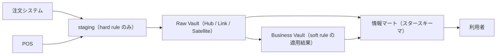
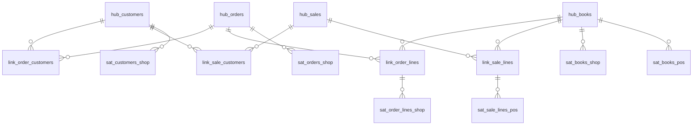

# 第7章 Data Vault

第6章の最後で、主題ごとの統合を明示する層を立てる時機を確かめた。
ソースが増え、同じ顧客と同じ書籍が別々の姿で複数のシステムに現れるようになると、突き合わせのロジックが staging に散らばって膨らむ。
そのときソースとマートの間に統合層を立てることになるが、その層のモデリング法は、Inmon が採った第3正規形だけではない。
本章では、もう一つの流儀である **Data Vault** を扱う。
ソースから届いた変更の保存そのものを中核に据える設計であり、Hub、Link、Satellite という三種類のテーブルへの分解を特徴とする。
具体例では、書籍オンラインストアの実店舗進出を機に、統合層を Data Vault で立てる。

## 概念の解説

### 第3正規形の統合層の弱点

第6章の Inmon 方式は、統合層（EDW）をおおむね第3正規形でモデリングする。
業務の事実を重複なく一度だけ持つ形は、どんなマートの源にもなれる安定した土台だった。
しかしこの安定は、業務の「あるべき一つの形」への合意を前提にしている。
第3正規形のモデルとは、顧客とは何か、注文とは何かを全社で一つに定めた姿だからである。

この前提は、変化の速い環境で二つの弱点になる。

第一の弱点は、ソースの追加と変更への弱さである。
新しいソースの事実が合意済みの形に収まらないと、テーブルの分解や列の意味を設計し直すことになる。
統合層はすべてのマートが共有する源だから、この改修の影響は、統合層を参照するロードとマートの全体に波及する。

第二の弱点は、入り口で解釈を確定させてしまうことである。
複数のソースが同じ書籍について食い違う値を届けたとき、統合層に「正しい一つの値」を格納するには、どちらを正とするかの判断（ビジネスルール）をロードの時点で適用するほかない。
判断より前の、ソースが実際に届けた値は、統合層には残らない。
だから、正とするソースを入れ替えたり突き合わせの規則を直したりしたくなっても、過去にさかのぼって統合をやり直せない。
レポートの数字の根拠をソースに記録されていた値まで遡って示すという監査の要件にも、同じ理由で応えられない。

### 事実の保存と解釈の分離

Data Vault は、この二つの弱点への回答として設計されている[^linstedt]。
出発点は、統合層の仕事の割り切りにある。
統合層は「ソースが何を言ったか」を漏れなく保存することに徹し、「どれが正しいか」の判断は、マートを作る段階へ遅らせる。
Linstedt はこれを、真実の単一版（single version of the truth）ではなく**事実の単一版**（single version of the facts）を持つのだ、と言い表している。

この割り切りは、変換の分類として明文化されている。
入り口で適用してよいのは、型をそろえる、文字コードや空白を整えるといった、値の意味を変えない変換（**hard rule**）だけである。
どのソースの値を採るか、二つの記録を同じものとみなすかといった、意味を選ぶ変換（**soft rule**）は、統合層の後段で適用する。
soft rule の適用前の姿が層として残るから、規則を変えても、保存済みの事実から結果を作り直せる。

もう一つの規則は、追記だけで運用することである。
届いた事実を後から書き換えると「ソースが何を言ったか」の記録が壊れるから、更新と削除を行わず、新しい事実は常に新しい行として足す。
第6章の DWH の定義にあった不揮発を、統合層の設計原則にまで徹底した形と言える。

### 三種類のテーブルへの分解

保存に徹するだけなら、ソースの写しを積み上げるだけでも足りるように見える。
実際、写しに取得時刻を付けて捨てずに積む持ち方（persistent staging と呼ばれる）もあり、監査の要件だけならそれで満たせる。
Data Vault が写しの蓄積と違うのは、保存の形をソースの構造から切り離す点である。
写しの蓄積はソースのテーブル構造をそのまま引き継ぐから、ソース側の構造変更がそのまま層の構造変更になり、ソースをまたいだ同じ主題（同じ書籍、同じ顧客）は別々のテーブルに散らばったままになる。
Data Vault は、どのソースから届いた事実も、三種類の部品に分解して格納する。

分解の軸は、変わりにくさである。

- **ビジネスキー**：業務が対象を指すのに使うキー（ISBN、会員番号、注文番号）。業務プロセスやシステムが入れ替わっても最後まで残る、最も安定した部分である。
- **関係**：どのキーとどのキーが結びついたか（この注文はこの会員のもの、この明細はこの書籍）。業務の進め方が変わると、結び方も変わる。
- **記述**：対象や関係を説明する属性（書名、価格、会員ランク）。最も頻繁に変わる。

この三つを、それぞれ Hub、Link、Satellite という別のテーブルに置く。
安定したものと変わりやすいものを同居させなければ、変化は、変わりやすい部品への追記と、新しい部品の追加だけで受け止められる。
これが、ソースの追加のたびに再設計を迫られた第3正規形への回答になっている。

### Hub（ビジネスキーの台帳）

**Hub** は、一つの主題のビジネスキーの値の一覧である。
hub_books なら、どのソースに現れたかを問わず、これまでに現れたすべての ISBN が 1 行ずつ並ぶ。
列は、ビジネスキーそのもの、キーから計算したハッシュキー、最初に現れた時刻（load_ts）、最初に届けたソース（record_source）だけであり、書名も価格も持たない。
属性を持たせないのは、属性はソースごとに食い違い頻繁に変わるからで、それは Satellite の仕事である。

Hub の設計で決めることは、実質的にビジネスキーの選定だけである。
選ぶべきは、システム内部の連番ではなく、業務がソースをまたいで対象を指すのに使っているキーである。
第6章で、注文システムの book_id ではなく ISBN が倉庫との共通の語彙だったのと同じ判断であり、Hub はその語彙の台帳を主題ごとに一枚立てる。

主キーには、ビジネスキーから MD5 などのハッシュ関数で計算した**ハッシュキー**を使う[^dv2]。
連番と違って採番の状態を持たず、同じビジネスキーからはどこで計算しても同じ値が出る。
この性質は、次の Link のロードで効く。

### Link（キーの組の台帳）

**Link** は、二つ以上の Hub にまたがるキーの組の一覧である。
「注文 1001 は会員 42 のものだ」という結びつきが 1 行になり、列は組に参加する各 Hub のハッシュキー、組全体から計算したハッシュキー、load_ts、record_source だけである。
数量や金額のような関係を説明する属性は、ここでも Satellite に出す。

Link は、カーディナリティを常に多対多として持つ。
今の業務では 1 注文 1 会員でも、その制約をテーブル構造（注文側に会員の外部キー列を置く形）に焼き込むと、業務が変わったとき（法人契約で複数の担当者が同じ注文に紐づくようになったときなど）に構造の改修になる。
組を行として持つ形なら、新しい結び方は行が増えるだけで受け止められる。
これは、事実の形を業務の制約どおりに固定するという、第2章以来の正規化の方向とは逆の選択である。
統合層は受け入れを優先し、制約の検査と表現は下流のマートに任せる。

ハッシュキーの効用は、このロードに現れる。
注文と会員の Link を作るとき、注文番号と会員番号からそれぞれのハッシュキーを計算すれば、Hub を結合して引き当てる必要がない。
Hub、Link、Satellite のロードが互いの完了を待たないから、ソースとテーブルが増えても、ロードは並列に走る。

### Satellite（記述の履歴）

**Satellite** は、一つの Hub または Link に付く、記述属性の履歴である。
主キーは親のハッシュキーと load_ts の組で、属性が変わるたびに新しい行を追記する。
いつからいつまでその姿だったかを表す点で第5章の Type 2 と同じ問題を解いているが、持ち方が一つ違う。
valid_to を持たない。
行の終端を書き込むには前の行の更新が要り、追記だけという規則が破れるからである。
終端は、問い合わせの時点で次の行の load_ts から導く。

変更の検出には **hashdiff** を使う。
比較対象の属性列をまとめてハッシュした値を各行に持たせ、ソースの現在値から計算したハッシュが最新行のハッシュと違ったら、新しい行を足す。
第5章の snapshot が check_cols の列比較でやっていた検出を、ハッシュ一つの比較に縮めた形である。

Satellite は、一つの親に複数付けられる。
分割の軸は二つある。
ソース別の分割は、注文システムの言う書名と POS の言う書名を別々のテーブルに積み、どちらの言い分も混ぜずに残す。
変更頻度別の分割は、頻繁に変わる属性とめったに変わらない属性を分け、速い属性の変更のたびに遅い属性の値まで行として複製されるのを防ぐ。
第5章で Type 4 のミニディメンションが速い属性を切り出したのと同じ動機である。

### Raw Vault から情報マートまで

三種類のテーブルの置き場を、第6章の層構成の中に位置づける。



ソースの事実を分解してそのまま積む層を **Raw Vault** と呼ぶ。
soft rule の適用結果（ソース間の優先順位を解決した属性や、計算済みの指標）を作り置く場合は、同じ構造の **Business Vault** として隣に並べる[^pit]。
利用者に見せる層は、これまでどおりディメンショナルな**情報マート**であり、Vault から導出して作る。

利用者に Vault を直接見せないのは、結合の多さと、解釈前の値のためである。
書籍の今の姿を一つ取るにも Hub と複数の Satellite の結合が要り、しかもどのソースの値を採るかがまだ解決されていない。
つまり Data Vault は、Kimball のスタースキーマと競合しない。
第6章の対比でいえば、Inmon の EDW の席（ソースとマートの間の統合層）に座る、もう一つのモデリング法である。

### 採用の判断

Data Vault の代償は、まず物量である。
一つの主題が Hub と複数の Satellite に、一つの取引が Link と Satellite に分かれるから、テーブル数は第3正規形のモデルの数倍になり、何かを読み出すときの結合数も同じだけ増える。
この物量のロードを手書きで維持できる規模ではないので、ロードのパターンを規約で固定し、コード生成で量産することが実務の前提になる[^automate]。
規約と命名にチームが習熟するまでの投資も要る。

この代償が見合うのは、変化と監査の要件が重いときである。

- ソースの数が多く、これからも増え続ける。統合層の拡張が「足すだけ」に固定される価値は、ソースが追加されるたびに繰り返し効く。
- レポートの数字をソースの記録まで遡って説明する要件（規制産業、内部統制）がある。
- 複数のチームが統合層を並行して拡張する。ロードの独立性と規約の固定が、チーム間の調整を減らす。

裏返せば、ソースが少なく安定していて監査の要件も薄いなら、分解の物量だけを払うことになる。
第6章の具体例が、ソース二つの時点で統合層を立てなかった判断は、Data Vault を知った後でも変わらない。
判断は二段に分かれる。
まず統合層を立てるか（第6章の問い）、立てるならそのモデリングに第3正規形と Data Vault のどちらを使うか（本章の問い）である。

## 具体例

実店舗の 1 号店を出すことが決まったとしよう。
レジは POS システムで、書籍はバーコード、すなわち ISBN でスキャンされる。
会員は、オンラインストアと共通のポイントを店舗でも使えるように、アプリの会員バーコードで同じ会員番号を提示する（店舗とオンラインで会員基盤を共通にする作りは、小売のポイントプログラムでよく見るだろう）[^same-as]。
さらに翌年には、電子書籍ストアの開設も計画されている。

ソースは shop と wms の二つから、pos を加えた三つになり、四つ目も見えている。
POS の商品マスタが届き始めると、同じ書籍の書名の表記や価格がソースごとに食い違うことも分かってきた。
第6章の最後に置いた時機、突き合わせのロジックが staging に散らばって膨らみ始める状況である。
統合層を立てる。

そのモデリングに第3正規形ではなく Data Vault を選ぶ根拠は、ソースの追加が続くと確定していることにある。
まだ仕様の見えない電子書籍ストアまで収まる全社モデルを先に合意するより、届いた事実から積み上げて拡張で受け止める方が、この状況に合う。

### ビジネスキーの特定と骨格の設計

最初の仕事は、主題ごとのビジネスキーの特定である。

- **書籍**：ISBN。第2章で代替キーとして一意性制約で守り、第6章で倉庫との共通の語彙になったキーが、三たび効く。
- **会員**：会員番号。店舗とオンラインで会員基盤が共通だから、そのまま全社の語彙になる。
- **注文**：オンラインの注文番号。
- **店舗販売**：POS のレシート番号。ただしレシート番号は店舗の中でしか一意でないから、店舗コードとの複合ビジネスキーにする。

レシート番号の例が示すとおり、ビジネスキーの特定は自明な作業ではない。
ここで選んだキーの上にすべての Link と Satellite が載るから、Data Vault の設計作業の中心は、テーブルの描画ではなくこのキーの合意にある。

キーが決まれば、骨格は分解の規則から機械的に決まる。



Hub が 4、Link が 4、Satellite が 6 の計 14 テーブルである（第6章で加えた出荷の主題も同じ要領で Vault に置けるが、図では省いた）。
hub_books には shop と pos の両方から ISBN が集まり、その記述は sat_books_shop と sat_books_pos にソース別に積まれる。
店舗販売と会員の link_sale_customers に行ができるのは会員がバーコードを提示した販売だけで、非会員の販売は Hub と明細の Link だけで表される。
関係を組の行として持つ形が、任意の関係を構造の変更なしに受け止めている。

以降、このうち代表のテーブルのロードを dbt で書く。
Vault は追記だけで運用するので、実行のたびに作り直す第6章までのモデルと違い、materialized には incremental（前回の結果に行を足す方式）を指定する。

### Hub のロード

hub_books は、どのソースに現れた ISBN も、まだ台帳にないものだけを追記する。

```sql
-- models/vault/hub_books.sql
{{ config(materialized='incremental') }}

WITH source_keys AS (

    SELECT isbn, 'shop' AS record_source
    FROM {{ ref('stg_books') }}

    UNION ALL

    SELECT isbn, 'pos' AS record_source
    FROM {{ ref('stg_pos_products') }}

)

SELECT
    {{ dbt_utils.generate_surrogate_key(['isbn']) }} AS book_hk,
    isbn,
    record_source,
    CURRENT_TIMESTAMP AS load_ts
FROM source_keys

WHERE isbn NOT IN (SELECT isbn FROM {{ this }})

QUALIFY ROW_NUMBER() OVER (PARTITION BY isbn ORDER BY record_source) = 1
```

is_incremental のブロックが台帳への追記を、QUALIFY が同じ実行で複数のソースに現れた ISBN を 1 行に絞ることを受け持つ。
record_source は、その ISBN を最初に届けたソースの記録として残る。
このロードの規則は、どの Hub でも一字一句同じである。
規則が固定されているからこそコード生成で量産でき、概念の解説で述べた自動化の前提がここで実感できる[^automate]。

### Link のロード

link_order_lines は、注文と書籍の結びつき（注文明細）の台帳である。

```sql
-- models/vault/link_order_lines.sql
{{ config(materialized='incremental') }}

SELECT
    {{ dbt_utils.generate_surrogate_key(['o.order_id', 'i.line_no']) }}
        AS order_line_hk,
    {{ dbt_utils.generate_surrogate_key(['o.order_id']) }} AS order_hk,
    {{ dbt_utils.generate_surrogate_key(['b.isbn']) }}     AS book_hk,
    i.line_no,
    'shop' AS record_source,
    CURRENT_TIMESTAMP AS load_ts
FROM {{ ref('stg_order_items') }} AS i
JOIN {{ ref('stg_orders') }} AS o ON o.order_id = i.order_id
JOIN {{ ref('stg_books') }}  AS b ON b.book_id = i.book_id

WHERE {{ dbt_utils.generate_surrogate_key(['o.order_id', 'i.line_no']) }}
      NOT IN (SELECT order_line_hk FROM {{ this }})

```

line_no は、同じ注文と同じ書籍の組が複数の明細になる場合を区別するための列で、従属子キーと呼ばれる[^dependent-child]。
stg_books との結合は、shop の内部連番 book_id から全社の語彙 ISBN への読み替えであり、値の意味を変えない hard rule としてここで済ませる。
一方、book_hk は hub_books を結合して引き当てるのではなく、ISBN から計算している。
どこで計算しても同じ値が出るハッシュキーの性質によって、このロードは Hub のロードの完了を待たない。

### Satellite のロード

sat_books_pos は、POS の商品マスタの言い分（店頭の表示名と売価）の履歴である。

```sql
-- models/vault/sat_books_pos.sql
{{ config(materialized='incremental') }}

WITH source_rows AS (

    SELECT
        {{ dbt_utils.generate_surrogate_key(['isbn']) }} AS book_hk,
        {{ dbt_utils.generate_surrogate_key(['display_name', 'shelf_price']) }}
            AS hashdiff,
        display_name,
        shelf_price,
        'pos' AS record_source,
        CURRENT_TIMESTAMP AS load_ts
    FROM {{ ref('stg_pos_products') }}

)

SELECT s.*
FROM source_rows AS s

LEFT JOIN (
    SELECT book_hk, hashdiff
    FROM {{ this }}
    QUALIFY ROW_NUMBER() OVER (PARTITION BY book_hk ORDER BY load_ts DESC) = 1
) AS latest ON latest.book_hk = s.book_hk
WHERE s.hashdiff IS DISTINCT FROM latest.hashdiff

```

最新行と hashdiff が違う行だけを追記する（初出の書籍は latest 側が NULL になるから、必ず追記される）。
sat_books_shop も同じ形で、shop の言い分（title と list_price）を別のテーブルに積む。
二つの Satellite は互いを参照せず、どちらが正しいかもここでは決めない。

第5章で dbt snapshot が担っていた変更検出と履歴の獲得は、この層に移る。
snapshot は入り口に置かれた道具だったが、Satellite は同じ差分検出を、モデリングされた恒久の層として行う。
取得の間隔より細かい変化を捉えられないという第5章の限界はここでも同じで、ソースが変更イベント（CDC）を流せるなら、その粒度のまま Satellite に積めばよい。

### 情報マートの再構築

マートの形は、第4章から何も変わらない。
変わるのは材料で、staging からではなく Vault から導出する。
dim_books を再構築すると、遅らせてきた soft rule がここで初めて現れる。

```sql
-- models/marts/dim_books.sql（Vault からの再構築。著者の列は省く）
WITH shop_now AS (
    SELECT book_hk, title, list_price
    FROM {{ ref('sat_books_shop') }}
    QUALIFY ROW_NUMBER() OVER (PARTITION BY book_hk ORDER BY load_ts DESC) = 1
),

pos_now AS (
    SELECT book_hk, display_name
    FROM {{ ref('sat_books_pos') }}
    QUALIFY ROW_NUMBER() OVER (PARTITION BY book_hk ORDER BY load_ts DESC) = 1
)

SELECT
    h.book_hk,
    h.isbn,
    COALESCE(s.title, p.display_name) AS title,
    s.list_price
FROM {{ ref('hub_books') }} AS h
LEFT JOIN shop_now AS s ON s.book_hk = h.book_hk
LEFT JOIN pos_now  AS p ON p.book_hk = h.book_hk
```

COALESCE の一行が soft rule である。
「書名はオンラインストアの表記を正とし、オンラインで扱いのない店頭専売の書籍だけ POS の表記を使う」という判断が、マートのこのモデルだけに書かれている。
Vault には両方の言い分が残っているから、店舗の表記を正に改めることになっても、このモデルを書き換えて再実行するだけでよい。
ソースへの再訪も、過去データの復元も要らない。
なお、ディメンションのキーは book_id から book_hk に替えている。
店頭専売の書籍は shop の連番を持たないから、book_id はもう全書籍を指せる語彙ではない。

履歴つきの dim_customers も、Satellite から導ける。

```sql
-- models/marts/dim_customers.sql（有効期間の導出部分の抜粋）
SELECT
    {{ dbt_utils.generate_surrogate_key(['h.customer_id', 's.load_ts']) }}
        AS customer_sk,
    h.customer_id,
    s.membership_rank,
    s.load_ts AS valid_from,
    COALESCE(
        LEAD(s.load_ts) OVER (PARTITION BY s.customer_hk ORDER BY s.load_ts),
        TIMESTAMP '9999-12-31 00:00:00'
    ) AS valid_to
FROM {{ ref('sat_customers_shop') }} AS s
JOIN {{ ref('hub_customers') }} AS h ON h.customer_hk = s.customer_hk
```

valid_to を持たない Satellite から、LEAD で次の行の開始時刻を取り、第5章と同じ半開区間の形を導出している。
前の行の終端と次の行の開始が同じ値になることは導出の式が保証するから、第5章で singular test に見張らせた期間の重複と欠落は、構造上起きない。
ファクトのロード（有効期間を照合したサロゲートキーの割り当て）とその先の問い合わせは第5章のままであり、利用者から見える形は何も変わらない。

店舗販売のファクトも、link_sale_lines と sat_sale_lines_pos から同じ要領で組める。
fct_store_sales が dim_books と dim_date を共有すれば、店舗とオンラインを合わせた売上は、第6章のドリルアクロスがそのまま答える。

### 保存の規則の検査

第4章から続けてきた要領で、この層の宣言も検査に翻訳する。
Vault の宣言は「Hub はビジネスキーの重複しない台帳である」「Satellite は親と時刻の組で一意である」「Link は組の重複しない台帳である」に尽きる。

```yaml
# models/vault/_vault.yml（抜粋）
models:
  - name: hub_books
    columns:
      - name: isbn
        tests:
          - unique
          - not_null
  - name: link_order_lines
    columns:
      - name: order_line_hk
        tests:
          - unique
          - not_null
  - name: sat_books_pos
    tests:
      - dbt_utils.unique_combination_of_columns:
          combination_of_columns:
            - book_hk
            - load_ts
    columns:
      - name: book_hk
        tests:
          - relationships:
              to: ref('hub_books')
              field: book_hk
```

第5章にあった期間の singular test が消えていることに意味がある。
期間は保存されず導出されるものになったから、検査の対象は導出の結果ではなく、保存の規則そのもの（台帳の一意性と、Satellite から Hub への参照）に移る。

### この統合層は見合うか

最後に、出来上がった構成を採用判断に照らして振り返る。
この Vault は、staging と marts の間に新しく挟まった 14 枚のテーブルである。
第6章までこの場所には何もなく、marts は staging から直接組めていたのだから、物量の代償は明白である。
増えた分が買っているのは、次の拡張の安さである。

電子書籍ストアが開設されたら、足すものは、staging のモデル、電子書籍ストアの言い分を積む sat_books_ebook、購入イベントの Hub と Link とその Satellite だけである。
hub_books は台帳のまま残り、既存の Satellite と Link とそのロードには一切手を入れない。
電子版には紙と別の ISBN が振られるから、hub_books には紙と電子が別の行として並ぶ。
それを同じ作品としてまとめて見るかどうかは soft rule であり、事実（別々の ISBN）は Vault に、解釈（同じ作品）はマートに置くという分担が、この拡張でも保たれる。

ソースが二つで止まっていた第6章の時点でこの 14 枚を立てていたら、分解の物量だけを払っていただろう。
ソースの追加が続くと確定した本章の状況で、初めて代償が回収に転じる。
Data Vault は常に正しい設計ではなく、変化の速さに賭ける設計である。

ところで、本章は統合層を分解の極へ振ったが、利用者に見せる層には逆向きの力が働いている。
クラウド DWH の列指向ストレージと安価な計算資源は、結合をあらかじめ済ませた一枚の広いテーブルという選択を現実的にした。
第8章では、この非正規化の極、One Big Table を扱う。

## 参考文献

- Daniel Linstedt, Michael Olschimke, *Building a Scalable Data Warehouse with Data Vault 2.0*, Morgan Kaufmann, 2015.（考案者による DV 2.0 の標準教科書。モデリングとロードパターンの原典）
- Dan Linstedt, "Data Vault Basics". https://danlinstedt.com/solutions-2/data-vault-basics/ （考案者のサイトにある概説。定義と設計原則が読める）
- Hans Hultgren, *Modeling the Agile Data Warehouse with Data Vault*, 2012.（モデリング寄りの解説書。ビジネスキーの特定と Hub の設計判断が詳しい）
- AutomateDV documentation. https://automate-dv.readthedocs.io/ （dbt で Hub / Link / Satellite のロードをマクロ生成するパッケージ。旧称 dbtvault）

[^linstedt]: Data Vault は Dan Linstedt が 1990 年代から 2000 年代初頭にかけて考案し、2013 年に方法論とハッシュキーを加えた Data Vault 2.0 として体系化された。Linstedt 自身の定義は「業務の一つ以上の機能領域を支える、詳細指向で、履歴を追跡する、一意に結ばれた正規化テーブルの集合」である。

[^dv2]: DV 1.0 は連番のサロゲートキーを使っていた。ハッシュキーへの置き換えは、採番の一元管理をなくして並列ロードと分散処理に道を開くための、DV 2.0 の中心的な変更である。第5章で dbt のサロゲートキーにハッシュ方式を選んだのと同じ理由がここでも働いている。

[^pit]: Business Vault には、問い合わせを補助するテーブルも置かれる。代表は、各時点で有効な Satellite の行のキーをあらかじめ表引きにした **PIT**（point-in-time）テーブルと、複数の Link をまたぐ経路を平坦化した **bridge** テーブルである。本文のマート導出で使った、QUALIFY で最新行を選ぶ書き方は、規模が大きくなると PIT の参照に置き換わる。

[^automate]: dbt では AutomateDV や datavault4dbt といったパッケージがこの生成を担う。本文のロード SQL は、パッケージが生成するものと同じ規則を、学習のために手で開いて見せている。

[^same-as]: 会員基盤が共通でない場合（買収した事業の顧客名簿を統合する場合など）は、同一人物の突き合わせという別の難問が加わる。Data Vault では、同一とみなしたキーの対を **same-as link** と呼ぶ Link に記録し、突き合わせの判断そのものを事実として保存する。

[^dependent-child]: それ自体はビジネスキーではないが、組を一意にするために要る列を**従属子キー**（dependent child key）と呼ぶ。
