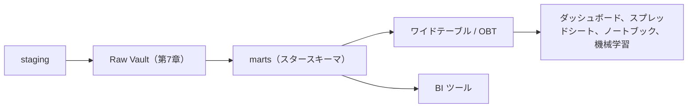

# 第8章 ワイドテーブルと One Big Table

第7章の統合層は、届いた事実を三種類の部品に分解して積む、分解の徹底だった。
一方その章の最後で見たとおり、利用者に見せる層には逆向きの力が働いている。
クラウド DWH の列指向ストレージと安価な計算資源が、結合をあらかじめ済ませた一枚の広いテーブルという選択を現実的にした。
本章では、この選択を支える前提の変化を確かめたうえで、**ワイドテーブル**と **One Big Table** の設計と代償を扱う。
具体例では、スタースキーマから提供用の一枚を導出し、第4章で持ち越した著者単位の集計に答える。

## 概念の解説

### スタースキーマが残す結合の負担

第4章のスタースキーマは、どんな問いも、ディメンションで絞り込み、ディメンションでグループ化し、メジャーを集約するという一つの形に収めた。
ただしその形は、毎回の結合の上に成り立っている。
休日と平日の売れ行きを比べる問い合わせは、ファクトに日付と書籍の二つのディメンションを結合していた。
問いのたびに、必ず結合が走る。

この結合は、まず計算の負担である。
毎朝開かれるダッシュボードは、同じ結合を毎日何百回も実行する。
分散環境での結合は、結合キーごとに行を計算ノード間で再配置する操作（シャッフルと呼ばれる）を伴い、ファクトが億の桁に育つほど、この再配置が問い合わせ時間と計算費の主因になっていく。

結合は、使い手の負担でもある。
スタースキーマを正しく問い合わせるには、テーブルの形からは読み取れない規約の知識が要る。
履歴を持つディメンションへはサロゲートキーで結合すること（第5章）や、グレインの違うファクト同士を直接結合しないこと（第6章）は、破っても構文エラーにならず、静かに水増しされた数字が返るだけである。
提供先が分析チームの中に閉じているうちは教育で守れるが、全社に広がるほど、全員にこの知識を求めるわけにはいかなくなる。

さらに、道具の制約がある。
スプレッドシート、ノートブックのデータフレーム、機械学習の学習データは、どれも一枚の表を入力の前提にしており、スタースキーマのままでは渡せない。

結合を減らしたい要求自体は古くからあり、かつては集計済みテーブルや OLAP キューブ、すなわちグレインを粗くして行数を抑えた形で応えられてきた[^cube]。
明細のグレインのまますべての属性を複製する形が採られなかったのは、それが割に合わなかったからである。
この損得を変えたのが、クラウド DWH のストレージの形式である。

### 列指向ストレージが変えた損得

OLTP の製品の多くは**行指向**、すなわち 1 行分の値をひとまとまりにして格納する。
1 行の読み書きがストレージの一箇所へのアクセスで済むから、特定の行を出し入れする OLTP の点の操作に向く。
分析の問い合わせは逆で、少数の列を全行にわたって走査する。
クラウド DWH が採る**列指向**は、同じ列の値を列ごとにまとめて格納する形式であり、この走査に向く[^columnar]。

列指向の帰結の一つ目は、参照しない列は読まれないことである。
列が 200 あるテーブルでも、問い合わせが触るのが 5 列なら、走査されるのは 5 列分だけになる。
テーブルを広くすること自体は、読み取りをほとんど遅くしない。

二つ目は、複製が圧縮で消えることである。
同じ列の値がまとめて置かれるから、値の種類が少ない列には辞書圧縮やランレングス圧縮がよく効く。
書名を数億行の明細に複製しても、列指向の格納では、書名の列は数万種類の値の辞書と、それを指す参照の並びに縮む。
行指向で同じ複製をすれば、全行がそのまま太る。

一方で、結合は相対的に高い操作として残った。
シャッフルの費用は圧縮では消えず、行数に応じて掛かり続ける。
ストレージの単価が下がり、計算が従量課金になったクラウドでは、一度の変換で複製を作っておく費用と、問いのたびに結合を払い続ける費用の比較が、後者に不利に傾いていく。

要するに、行指向の OLTP で成り立っていた「複製は高く、結合で導く方が安い」という損得が、列指向の DWH では反転した。
複製の書き込み側の危険（更新の異常）は、変換処理だけが書き込み、実行のたびに作り直され、読み取り専用で使われるという第3章の判断基準が既に抑えていた。
残っていた読み取り側の費用の心配を、列指向ストレージが取り除いた。

### ワイドテーブルと One Big Table

この条件の下で自然に現れるのが、結合をあらかじめ済ませておく設計である。
結合済みで列の多いテーブルを総称して**ワイドテーブル**と呼ぶ。
第1章で書名を明細に複製した一枚も、第4章で著者名を書籍に畳み込んだ dim_books も、広い意味でのワイドテーブルである。

その徹底形が **One Big Table**（OBT）である[^obt-name]。
一つのビジネスプロセスのファクトについて、グレインを保ったまま、参照するすべてのディメンションの属性を畳み込んだ一枚を指す。
利用者はこの一枚を絞り込んでグループ化するだけで、そのプロセスに関する問いのほとんどに、結合なしで答えられる。

置き場所は、層構成の最後尾である。



OBT はスタースキーマから導出する一枚であって、スタースキーマを置き換えるモデリング法ではない。
なぜ導出にとどめるのかは、代償を数えたあとの採用の判断で述べる。

### 一対多を畳み込むネスト構造

OBT を実際に組もうとすると、平らな結合では畳み込めない関係が残る。
一対多である。
共著の書籍では、明細 1 行に複数の著者が対応する。
著者のテーブルを平らに結合すれば、明細の行が著者の数だけ複製され、「注文明細 1 行」というグレインの宣言が壊れる。
第6章でグレインの違うファクトの直接結合が起こした水増しと、同じ事故である。

第4章では、この関係を連結文字列と人数（author_names と author_count）に要約して畳み込んだ。
書籍単位の問いには足りたが、連結された文字列からは著者を取り出せないため、著者単位の集計は諦めていた。

クラウド DWH の型システムは、この妥協をなくす道具を持っている。
列の型に配列（ARRAY）と構造体（STRUCT）を使えるので、明細 1 行の中に、著者の構造体の配列を 1 列として格納できる。
行数は明細のまま変わらず、多側の情報も失われない。
ネストした列も列指向のまま分解されて格納されるから、配列の列に触れない問い合わせは、その列を読みもしない[^dremel]。

読み出すときは、UNNEST で配列を行に開いてから集計する[^unnest]。
このときも行は著者の数だけ複製されるが、結合の副作用として気づかず起きるのではなく、集計の直前に意図して行う展開である点が違う。

### 採用の判断

OBT の代償は三つ数えられる。

第一に、切り口の追加と定義の変更が、一枚全体の再構築になる。
第4章のスタースキーマでは、切り口の追加はディメンション側の変更で閉じ、数億行のファクトには手を入れずに済んだ。
OBT では属性が全行に焼き込まれているから、列を一つ足すにも、属性の定義を一つ直すにも、一枚を作り直す。
列指向が安くしたのは読み取りであって、数億行の書き直しには相応の計算費が掛かる[^incremental]。

第二に、答えられる問いが一つのプロセスに閉じる。
OBT はグレイン一つにつき一枚であり、注文の OBT と出荷の OBT を直接結合すれば、第6章と同じ水増しが起きる。
プロセスをまたぐ問いには、OBT の世界でもドリルアクロスが要る。
名前に反して、One Big Table は全社を一枚にするテーブルではない。

第三の代償は、構成を誤ったときにだけ現れるが、最も高くつく。
OBT をソースから直接組み、指標の定義や突き合わせのロジックをその変換に書き始めると、OBT が増えるたびに定義が複製される。
ダッシュボードごとの一枚が別々の定義を持ち始めた姿は、第6章の独立データマートのサイロが、提供層で再演されたものである。
これが、OBT を導出にとどめる理由である。
グレインの宣言、適合ディメンション、履歴の表現はスタースキーマの側に一度だけ置き、OBT はそれを平らに写すだけの層にする。
ワイドテーブルは提供の形であって、定義の置き場ではない。

この代償を払っても見合うのは、次の場面である。

- 提供先に設計の知識を前提にできない。スプレッドシートやノートブックの利用者への提供や、社外への共有。
- 同じ結合を高頻度で繰り返す。定型のダッシュボードなら、事前の一度の結合が毎回の結合を消す。
- 一枚の表を要求する道具に渡す。機械学習の特徴量や、データのエクスポート。

裏返せば、結合を自分で書ける分析者が探索的に使う分には、スタースキーマのままが柔らかい。
OBT は畳み込んだ時点の切り口に問いを固定するが、スタースキーマはどのディメンションのどの属性でも後から自由に組み合わせられる。
だから両者は置き換えではなく併存になり、図に描いたとおり、BI ツールにはスタースキーマを、一枚を要する提供先には OBT を見せる。

では、スタースキーマを飛ばして最初から OBT だけで始めてよいか。
ソースが一つで、問いが安定していて、履歴の要件もない規模なら、staging から直接一枚を組んでも回る。
実際、第1章はそうやって始めた。
しかし切り口の変更が届き、履歴が要り、プロセスが増えた時点で、定義を一箇所に置く層が要ることは、第4章から第7章まで一歩ずつ確かめてきたとおりである。
本書の並びは、その層を先に持ってから一枚に畳む順になっている。

## 具体例

マーケティングチームが自分たちで数字を見たいと言い出し、分析チームの外で SQL が書かれ始めたとしよう。
ほどなく、会議に出た会員ランク別の売上レポートの合計が、ダッシュボードの総売上と合わないという相談が届く。
原因は結合だった。
担当者は fct_order_items と dim_customers を customer_id で結合しており、ランクの履歴を持つ顧客では、注文明細が履歴の行数だけ複製されていた。
第5章の設計では、ファクトへの結合はサロゲートキー customer_sk で行い、customer_id は突き合わせの手がかりにとどめる。
だがこの規約は設計者の知識であって、テーブルの形からは読み取れない。

規約の教育で防ぎ続ける代わりに、正しい結合を済ませた一枚を提供することにする。
注文明細の OBT、obt_order_items を作る。

### 注文明細の One Big Table

材料は、第7章の再構築を経た marts のスタースキーマである（dim_books のキーは book_hk になっている）。
定義のとおりにはすべての属性を写せばよいが、紙面では、切り口として使う列に絞って示す。

```sql
-- models/marts/obt_order_items.sql
{{ config(materialized='table') }}

WITH book_authors AS (

    SELECT
        bk.isbn,
        ARRAY_AGG(
            STRUCT(a.name AS author_name, ba.position AS position)
            ORDER BY ba.position
        ) AS authors
    FROM {{ ref('stg_book_authors') }} AS ba
    JOIN {{ ref('stg_books') }}   AS bk ON bk.book_id = ba.book_id
    JOIN {{ ref('stg_authors') }} AS a  ON a.author_id = ba.author_id
    GROUP BY bk.isbn

)

SELECT
    -- グレインを特定する縮退ディメンション
    f.order_id,
    f.line_no,

    -- 日付ディメンション
    f.ordered_date,
    d.year  AS order_year,
    d.month AS order_month,
    d.is_weekend,
    d.is_holiday,

    -- 顧客ディメンション（注文時点の姿）
    c.customer_id,
    c.membership_rank,

    -- 書籍ディメンション
    b.isbn,
    b.title,
    b.list_price,
    ba.authors,

    -- メジャー
    f.quantity,
    f.unit_price,
    f.amount
FROM {{ ref('fct_order_items') }} AS f
JOIN {{ ref('dim_date') }}      AS d ON d.date_day = f.ordered_date
JOIN {{ ref('dim_customers') }} AS c ON c.customer_sk = f.customer_sk
JOIN {{ ref('dim_books') }}     AS b ON b.book_hk = f.book_hk
LEFT JOIN book_authors AS ba ON ba.isbn = b.isbn
```

事故を起こした結合の規約は、このモデルの中に一度だけ書かれた。
customer_sk で引くから、写る membership_rank は注文時点の値であり、利用者は有効期間の照合を知らなくてよい。
氏名やメールアドレスのような Type 1 の属性も同じ要領で写せるが、その場合は、作り直しのたびに全行が現在値へ変わるという第4章の上書きの性質ごと持ち込まれることは意識しておく。
どちらも挙動はスタースキーマと同じで、OBT が変えるのは提供の形だけである。

列名には、どのディメンション由来かが分かる接頭辞を付けた（order_year など）。
複数の日付ディメンションを畳み込むようになると、同じ year という列名が衝突するからである。

著者は、概念の解説で述べたネスト構造で畳み込んだ。
書籍と著者の対応は shop の staging モデルにあるので、ISBN の語彙に読み替えて配列に集約している。
平らな結合と違って行は増えず、グレインは注文明細 1 行のままである。

### 結合が消えた問い合わせ

第4章の休日と平日の問いは、次の形になる。

```sql
SELECT
    CASE WHEN is_weekend OR is_holiday THEN 'holiday' ELSE 'weekday' END AS day_type,
    title,
    SUM(amount) AS total_amount
FROM obt_order_items
GROUP BY day_type, title
ORDER BY day_type, total_amount DESC;
```

返る答えは第4章と同じで、違いは FROM 句から結合が消えたことだけである。
この形なら、スプレッドシートに写しても、SQL に不慣れな利用者が書いても、結合の誤りようがない。

この一枚は、第4章の分かれ道で言及した「要望のたびに列を足していく道」の行き着く形でもある。
見た目は第1章で作った結合済みのテーブルに戻ったが、出自が違う。
第1章の一枚は staging から直接組まれ、グレインも属性の定義もそのモデル自身が抱えていた。
この一枚はスタースキーマからの導出であり、グレインの宣言も、履歴の表現も、ソースをまたぐ読み替えも、すべて上流の層が決めたものを写している。
第4章から第7章までの回り道が、一枚の中身の信頼を支えている。

### 著者単位の集計

第4章で見送ったブリッジテーブルの出番になりそうな問いが、ここで届いたとしよう。
「著者別の売上ランキングを出したい。」

```sql
SELECT
    a.author_name,
    SUM(f.amount) AS total_amount
FROM obt_order_items AS f
CROSS JOIN UNNEST(f.authors) AS a
GROUP BY a.author_name
ORDER BY total_amount DESC;
```

UNNEST が配列を行に開き、共著の明細は著者の数だけ展開されてから集計される。
連結文字列では答えられなかった問いに、ブリッジテーブルを新設せずに答えられた。
ネストした配列は、多対多の対応表を一枚の中に畳み込んだ形と読める。

ただし、この集計では共著書の売上が各著者に全額計上される。
按分が要るかどうかは問いの側の決めごとであり、必要なら配列の要素数で割ればよい[^allocation]。

### グレインの検査

第4章から続けてきた要領で、この層の宣言も検査に翻訳する。
OBT の宣言は「obt_order_items は fct_order_items の導出であり、グレインを変えない」である。
行数と、加法的メジャーの合計が一致することを見張ればよい。

```sql
-- tests/assert_obt_order_items_preserves_grain.sql
WITH fct AS (
    SELECT COUNT(*) AS row_count, SUM(amount) AS total_amount
    FROM {{ ref('fct_order_items') }}
),

obt AS (
    SELECT COUNT(*) AS row_count, SUM(amount) AS total_amount
    FROM {{ ref('obt_order_items') }}
)

SELECT *
FROM fct, obt
WHERE fct.row_count != obt.row_count
   OR fct.total_amount != obt.total_amount
```

誤った結合が行を複製すれば行数と合計が増え、内部結合の取りこぼしが行を落とせば減るから、水増しと欠けの両方をこの一つの検査が捕まえる。
ファクトとディメンションの間の参照は第4章以来の relationships テストが見張っているので、この検査が破れたとき疑うべき場所は、OBT の導出そのものに絞られる。

### 切り口の追加と定義の置き場

出来上がった構成を、採用の判断に照らして振り返る。
marts には役割の違う二種類のモデルが並んだ。
定義を持つスタースキーマと、それを平らに写した提供用の一枚である。

セール期間で売上を区切りたいという次の要望を受けたときの流れに、この分担が現れる。
定義の変更は一箇所で済む。
dim_date にセール期間の列を足すのは、第4章で確かめたとおりディメンション側で閉じる変更であり、スタースキーマの利用者はその時点から新しい切り口を使える。
obt_order_items には、その列を写す一行を足して再構築する。
どの日がセール期間かを知っているのは dim_date だけで、OBT が払うのは再構築の計算費だけである。
グレインの検査も relationships テストも、変更なしに効き続ける。

ダッシュボードが増え、提供する一枚が増えていくと、次の問いが現れる。
どの指標の定義をどの層のどのモデルに置くか、staging から OBT までの並びをどんな規約で保つか。
テーブル一枚の形の技法から、変換の流れ全体の規約へと、問いの単位が上がっている。
第9章では、この問いへの現在の答えとして、dbt のレイヤリングの設計と、指標の定義をテーブルに焼き込まず宣言として一元管理するセマンティックレイヤーを扱う。

## 参考文献

- Google Cloud, "Use nested and repeated fields", BigQuery documentation. https://cloud.google.com/bigquery/docs/best-practices-performance-nested （非正規化とネスト構造を推奨する公式ガイド）
- Sergey Melnik et al., "Dremel: Interactive Analysis of Web-Scale Datasets", VLDB 2010.（BigQuery の原型となったシステムの論文。ネストしたデータの列指向格納を示した）
- Mike Stonebraker et al., "C-Store: A Column-oriented DBMS", VLDB 2005.（列指向 DBMS の代表的研究。現在のクラウド DWH の設計の源流の一つ）
- dbt Community Discourse, "Is Kimball dimensional modeling still relevant in a modern data warehouse?". https://discourse.getdbt.com/t/is-kimball-dimensional-modeling-still-relevant-in-a-modern-data-warehouse/225 （クラウド DWH 時代のスタースキーマとワイドテーブルの使い分けをめぐる実務者の議論）

[^cube]: OLAP キューブは、あらかじめ決めたディメンションの組み合わせごとに集計値を事前計算して持つ構造で、専用の多次元データベース（MOLAP 製品）として提供されてきた。グレインを粗くする方向の事前計算であり、グレインを保ったまま属性を広げる OBT とは逆の向きである。クラウド DWH が明細のままの走査を高速化したことで、キューブの役割の多くは DWH 上の問い合わせに置き換わった。

[^columnar]: 列指向 DBMS の設計は C-Store（参考文献に挙げた論文）などの研究で体系化され、BigQuery、Snowflake、Redshift といったクラウド DWH はいずれもこの系譜にある。

[^obt-name]: One Big Table は標準化された方法論の用語ではなく、実務の中で定着した俗称である。ワイドテーブルとほぼ同義に使われることも多い。本書では、結合済みの広いテーブルの総称をワイドテーブル、一つのプロセスの属性を網羅した徹底形を OBT と使い分ける。

[^dremel]: ネストしたデータを列指向のまま格納する技法は、参考文献に挙げた Dremel の論文が示した。配列や構造体の中の各フィールドも独立した列として格納されるため、走査は平らな列と同じように、触れたフィールドの分しか起きない。

[^unnest]: UNNEST は BigQuery の構文である。Snowflake では LATERAL FLATTEN が相当する。配列と構造体の型やアクセス構文は製品差が大きく、方言の吸収は dbt のマクロに頼ることが多い。

[^allocation]: 全額計上のまま著者別の合計を足し合わせると、共著書の分が重複して総売上を超える。均等に按分するなら amount を ARRAY_LENGTH(authors) で割ればよい。この係数は、第4章の脚注で触れたブリッジテーブルの按分係数（weighting factor）に相当する。

[^incremental]: 実務では、日付パーティションを利用した増分構築（incremental モデル）で再構築の範囲を絞る。ただし Type 1 属性の変更は過去の行にも及ぶため増分では反映できず、定期的な全再構築と組み合わせて運用することが多い。
