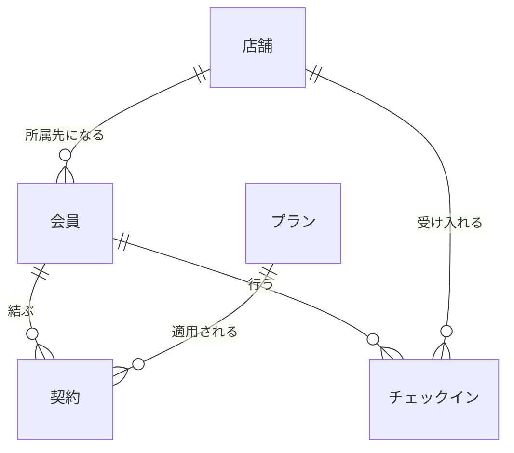

# 第11章 総合演習

第10章の末尾で、本書の道具は出そろったと述べた。
本章では、新しい技法を導入しない。
題材のドメインを一つ決め、概念モデルから物理モデルまでを通しで設計し、各章の判断を一つの設計の中で組み合わせて使う。
題材には、ここまでの書籍オンラインストアではなく、フィットネスクラブチェーンを選ぶ。
慣れた題材を手放すのは、各章の判断が書籍という題材の性質にではなく、業務と問いの形に結びついていることを、別のドメインの上で確かめるためである。

## 概念の解説

### 通しの設計で判断が現れる順序

これまでの章は、技法を一つずつ、それが解く問題と対にして学んできた。
通しの設計では、同じ判断が互いに依存し合いながら、おおむね決まった順序で現れる。

設計の入力は二種類ある。
業務の構造と、届いている問いである。
OLTP 側の設計は業務の構造から導かれる。
テーブルの分解を決める関数従属は、業務ルールの写しだった（第3章）。
分析基盤の設計は問いから導かれる。
グレインと切り口は分析の問いの写しであり（第4章）、NoSQL のキー設計はアクセスパターンの写しだった（第10章）。
そしてどちらの側の設計も、業務を実装から独立に捉えた概念モデルを出発点に共有する（第1章）。
だから通しの設計は、業務と問いの把握から始まり、概念モデルを経て、OLTP と分析基盤へ枝分かれして進む。

| 段階 | 決めること | 主に効く章 |
| --- | --- | --- |
| 業務と問いの把握 | エンティティ、業務ルール、問いの一覧 | 第1章、第4章 |
| 概念モデル | エンティティと関係、カーディナリティ | 第1章、第2章 |
| OLTP の論理と物理 | キー、正規化、制約 | 第2章、第3章 |
| 取り込みと層 | ELT、層の規約、統合層の要否 | 第6章、第7章、第9章、第10章 |
| マート | グレイン、ディメンション、履歴 | 第4章、第5章、第6章 |
| 提供と指標 | 提供の形、指標の定義 | 第8章、第9章 |

この表は工程表ではなく、依存の向きの整理である。
実際の作業は段階を行き来する。
マートを設計してみて問いの漏れに気づけば把握に戻るし、ソースが増えれば取り込みの判断を下し直す。
それでも、後の段階の判断が前の段階の成果物（概念モデル、キーの選定、グレインの宣言）に載っているという依存の向きは変わらない。

### 使わない判断も設計のうち

各章の後半には、決まって採用の判断の節があった。
Data Vault は変化と監査の要件が重いときに（第7章）、OBT は提供先に設計の知識を前提にできないときに（第8章）、セマンティックレイヤーは同じ指標を使う提供先が複数あるときに（第9章）見合う、という要領である。
通しの設計では、この条件の照合が道具の数だけ繰り返される。
だから出来上がった設計は、使った道具の一覧であると同時に、見送った道具とその理由の一覧にもなる。

裏返せば、学んだ道具を総動員した設計は、それだけで見直しの合図である。
どの道具も特定の問題への対価つきの答えであり、起きていない問題のために払う対価は、そのまま維持の負債になる。
第7章の最後で確かめた「ソースが二つで止まっていたら、分解の物量だけを払っていただろう」という振り返りが、この照合の実例だった。

以降の具体例が本章の本体であり、この表の段階を頭から歩く。

## 具体例

フィットネスクラブチェーンの運営会社が、24 時間営業のジムを 5 店舗で展開している。
会員は月額プラン（デイタイム、スタンダード、プレミアムの 3 種）を契約し、どの店舗も利用できる。
入館は、モバイルアプリの会員バーコードをゲートにかざして行う。
この会社に一人目のデータエンジニアとして加わり、内製する会員管理システムのデータベース設計と、分析基盤の立ち上げを任された、という場面を演習にする。

システムは三つある。
会員管理システム（club）は内製で、会員、プラン、契約、店舗を持つ。
入退館ゲート（gate）は既製品で、チェックインのイベントを吐き出す。
モバイルアプリ（app）は会員証を担い、後の節でワークアウト記録の機能が加わる。

届いている問いを集めるところから始める。

| 問い | 発行者 | 頻度 |
| --- | --- | --- |
| 店舗別、プラン別の月末会員数の推移を見たい | 経営 | 月次 |
| 解約率を月次で追いたい | 経営 | 月次 |
| 時間帯別のチェックイン数で店舗の混雑を把握したい | 店舗運営 | 週次 |
| プラン別に利用頻度を比べたい。プランはチェックイン当時のもので区切りたい | マーケティング | 随時 |

### 概念モデル

業務の事実を業務の言葉で確かめる。
会員は一つの店舗に所属して入会する（所属店舗は、キャンペーンの案内や店舗業績の集計の単位になる）。
会員は在籍中、常に一つのプランの契約を持ち、プランの変更と退会ができる。
チェックインは、会員がどこかの店舗で行う。



契約をエンティティとして描いているのは、第2章の連関エンティティの判断である。
会員とプランの関係は、ある時点では 1 対 1 でも、時間を通せば多対多になる（会員は複数のプランを渡り、プランは多くの会員に適用される）。
契約はこの多対多を二つの 1 対多に分解し、さらに期間と料金という、会員にもプランにも属さない関係そのものの属性を持つ。
書籍と著者の間で表示順を持った book_authors と、同じ位置づけである。

### 論理モデルとキーの選定

概念モデルをリレーショナルモデルに写す。

- **stores**：store_id（主キー）、store_code（代替キー）、name、opened_on
- **plans**：plan_id（主キー）、plan_code（代替キー）、name、monthly_fee（現行料金）
- **members**：member_id（主キー）、member_code（代替キー）、name、email、home_store_id（外部キー）、joined_on
- **contracts**：contract_id（主キー）、member_id と plan_id（外部キー）、monthly_fee（契約料金）、valid_from、valid_to

キーの選定で迷うのは会員番号（member_code）である。
自社で採番し、アプリのバーコードとゲートが読み取る識別子だから、一意で NULL にもならない。
それでも主キーには使わない。
カードの紛失や不正利用で会員番号を振り直す運用があり得る以上、不変とは言い切れないからである。
第2章の ISBN と同じ結論で、主キーはサロゲートの member_id とし、member_code は代替キーとして一意性制約で守る。

正規化の点検は、料金の列に現れる。
contracts の monthly_fee は、plan_id ではなく contract_id に従属する。
プランの現行料金は改定されるし、入会キャンペーンの割引は契約ごとに違うから、契約時点の適用料金は契約の事実として契約の行に置くほかない。
plans.monthly_fee（定価）と contracts.monthly_fee（契約料金）の関係は、第3章で確かめた list_price と unit_price の関係の再現である。

もう一つの点検は、置かない列の判断である。
会員が在籍中か退会済みかを表すステータス列を members に置きたくなるが、この値は「有効な契約が存在するか」から導出できる。
導出できる値を列に持てば、契約と食い違ったまま残る修正異常の温床になるから、置かない。
在籍の判定は契約の側に一元化する。

### OLTP の物理モデル

論理モデルを DDL に落とす。
stores と plans は同様なので、members と contracts だけを示す。

```sql
CREATE TABLE members (
    member_id     BIGINT       NOT NULL,
    member_code   CHAR(7)      NOT NULL,
    name          VARCHAR(100) NOT NULL,
    email         VARCHAR(254) NOT NULL,
    home_store_id BIGINT       NOT NULL,
    joined_on     DATE         NOT NULL,
    PRIMARY KEY (member_id),
    UNIQUE (member_code),
    FOREIGN KEY (home_store_id) REFERENCES stores (store_id)
);

CREATE TABLE contracts (
    contract_id BIGINT         NOT NULL,
    member_id   BIGINT         NOT NULL,
    plan_id     BIGINT         NOT NULL,
    monthly_fee NUMERIC(10, 0) NOT NULL,
    valid_from  DATE           NOT NULL,
    valid_to    DATE,
    PRIMARY KEY (contract_id),
    FOREIGN KEY (member_id) REFERENCES members (member_id),
    FOREIGN KEY (plan_id)   REFERENCES plans (plan_id),
    CHECK (monthly_fee >= 0),
    CHECK (valid_to IS NULL OR valid_from < valid_to)
);
```

契約の期間は、第5章以来の半開区間である。
プラン変更は、旧契約の valid_to と新契約の valid_from を同じ日にして接続し、退会は valid_to を閉じて後続を作らない。
現に有効な契約は valid_to が NULL の行になる。

この DDL には、宣言できていない業務ルールが一つ残る。
「同じ会員の契約期間は重複しない」である。
期間の重なりの禁止は、行の中の値の検査（CHECK）にも、値の完全一致だけを禁じる一意性制約にも収まらず、標準的な制約では宣言できない[^exclude]。
第2章で下限カーディナリティを扱ったときと同じ配分で、アプリケーションの検証で守り、後の節で DWH 側の検査としても見張る。

### 取り込みと層の判断

分析基盤は、クラウド DWH への ELT で組む。
ソースごとの取り込み方は、データの残り方で決まる。
club のテーブルは日次で写す。
契約は期間を自分で持つ台帳だから、現在の写しに履歴がそのまま含まれている。
gate のチェックインは追記のイベントであり、届いた分を積むだけでよい（第10章の読書進捗と同じ扱いである）。

層の構成は、第9章の規約を最初から適用する。
staging はソースと 1 対 1（stg_club_members、stg_gate_checkins など、ソース別のサブディレクトリに置く）、結合と集約は置かない。
この規約が早速効くのが、ゲートの語彙である。
ゲートのイベントは店舗を機器 ID（device_code）で識別しており、店舗コードへの読み替えには機器マスタとの結合が要る。
第9章で stg_shipment_items を intermediate へ移した教訓を、今度は最初から適用し、読み替えを int_checkins に置く。

```sql
-- models/intermediate/int_checkins.sql
SELECT
    c.checkin_id,
    c.member_code,
    d.store_code,
    c.checked_in_at
FROM {{ ref('stg_gate_checkins') }} AS c
JOIN {{ ref('stg_gate_devices') }} AS d ON d.device_code = c.device_code
```

次は統合層の要否である（第7章の二段の判断の一段目）。
ソースは club と gate の二つで、アプリの記録機能が加わっても三つである。
ソースをまたいで同じ対象を指す主題は会員と店舗だけで、その語彙は会員番号と店舗コードにそろっている。
ゲートとアプリは会員バーコードを読み取る仕組みそのものだから、語彙の食い違いが生まれる余地が小さい。
ソースの追加予定はなく、監査の要件もない。
したがって Data Vault はもちろん、第3正規形の統合層も立てず、読み替えは intermediate で足りると判断する。
ただし、この判断の前提であるビジネスキー（会員番号、店舗コード、プランコード）が全社の語彙であることは、文書として残しておく。
買収や新業態でソースが増え、突き合わせのロジックが staging と intermediate に散らばり始めたら、第7章の時機の判断に戻る。

### バスマトリクスとグレインの宣言

マートの設計は、第4章の設計プロセスと第6章のバスマトリクスで計画する。
問いの一覧から、測定すべきビジネスプロセスを拾い出す。

| ビジネスプロセス | 日付 | 会員 | 店舗 |
| --- | --- | --- | --- |
| チェックイン | ✓ | ✓ | ✓ |
| 会員資格（月次） | ✓ | ✓ | ✓ |
| 退会 | ✓ | ✓ | ✓ |

グレインは三つ宣言する。
fct_checkins は「チェックイン 1 回で 1 行」のトランザクションファクトである。
ただし、このファクトには金額や数量にあたるメジャーが一つもない。
チェックインは起きたこと自体が事実であり、集計はもっぱら行を数えることになる[^factless]。
fct_membership_monthly は「月末時点の在籍会員 1 人で 1 行」の周期スナップショットファクトである。
第4章で在庫残高を例に紹介した型が、会員数の推移という問いでここに現れる。
fct_cancellations は「退会 1 件で 1 行」である。

ディメンションは、日付、会員、店舗の三つで、三つのファクトすべてが同じものを参照する。
dim_date は第4章のものに、月末日のフラグ is_month_end を足して使う[^month-end]。
dim_stores は store_code をキーとする上書きの写しで、第6章の dim_carriers と同じ扱いである。
残る dim_members が、この設計の要になる。

### 会員ディメンション

マーケティングの問いは「チェックイン当時のプランで区切りたい」だから、プランは Type 2 で持つ（第5章の使い分けのとおり、履歴の問いが現に届いている属性である）。
氏名とメールアドレスは、過去の値で区切る問いが考えにくいから Type 1 とする。
所属店舗は入会時に決まり、変更は退会と再入会として扱う運用なので、変更そのものが起きない。

第5章とここが違うのは、履歴の獲得である。
snapshot は、ソースが現在値しか持たない場合に、定期取得と比較で履歴を組み立てる道具だった。
この基盤で履歴が要る属性はプランであり、その履歴は契約テーブルが期間として持っている。
業務自体が期間を記録しているのだから、snapshot は使わず、契約から直接 Type 2 の行を組む。

```sql
-- models/marts/dim_members.sql
SELECT
    {{ dbt_utils.generate_surrogate_key(['m.member_code', 'c.valid_from']) }}
        AS member_sk,
    m.member_code,
    m.name,
    m.email,
    s.store_code AS home_store_code,
    p.plan_code,
    p.name AS plan_name,
    c.valid_from,
    COALESCE(c.valid_to, DATE '9999-12-31') AS valid_to,
    c.valid_to IS NULL AS is_current
FROM {{ ref('stg_club_contracts') }} AS c
JOIN {{ ref('stg_club_members') }} AS m ON m.member_id = c.member_id
JOIN {{ ref('stg_club_plans') }}   AS p ON p.plan_id = c.plan_id
JOIN {{ ref('stg_club_stores') }}  AS s ON s.store_id = m.home_store_id
```

契約 1 件が、そのまま版 1 行になる。
サロゲートキーの採番、未来側の番兵値、is_current は第5章の部品のままで、snapshot の dbt_valid_from の席に契約の valid_from が座っただけである。
第5章で要った「導入前の期間を過去側に開く」手当ても、ここでは要らない。
契約は入会の初日から記録されており、履歴の始まりと業務の始まりが一致しているからである。
Type 1 の氏名とメールアドレスは stg_club_members からの結合なので、過去の版の行にも常に今の値が付く。
退会中の会員はどの期間の行にも当たらないが、契約がなければチェックインも起きないから、宙に浮くファクトは生まれない。

検査もここで決まる。
Type 2 の宣言「各会員の有効期間は重複なく並ぶ」は、第5章の singular test がそのまま使える。
そしてこの検査は、OLTP の DDL で宣言できなかった契約期間の排他を、ロード後に見張る検査でもある。
これが破れたとき疑うべきは変換ではなく、会員管理システム側のデータの誤りである。

### チェックインのファクト

fct_checkins は、int_checkins に当時の会員の版を割り当てて組む。

```sql
-- models/marts/fct_checkins.sql
SELECT
    c.checkin_id,
    CAST(c.checked_in_at AS DATE)      AS checkin_date,
    EXTRACT(HOUR FROM c.checked_in_at) AS checkin_hour,
    m.member_sk,
    c.member_code,
    c.store_code,
    c.checked_in_at
FROM {{ ref('int_checkins') }} AS c
JOIN {{ ref('dim_members') }} AS m
    ON  m.member_code = c.member_code
    AND m.valid_from <= CAST(c.checked_in_at AS DATE)
    AND CAST(c.checked_in_at AS DATE) < m.valid_to
```

有効期間を照合してサロゲートキーを引く形は、第5章のパターンそのままである。
時間帯の切り口 checkin_hour は時刻の関数で導けるから、列として焼いてファクトに置く。
早朝割引の対象時間帯のような業務知識の切り口が要るようになったら、第4章の日付と同じ理屈で時刻のディメンションに出せばよい。

混雑の問いは、スタースキーマの定型の一文になる。

```sql
SELECT
    f.store_code,
    f.checkin_hour,
    COUNT(*) AS checkins
FROM fct_checkins AS f
JOIN dim_date AS d ON d.date_day = f.checkin_date
WHERE NOT d.is_weekend AND NOT d.is_holiday
GROUP BY f.store_code, f.checkin_hour
ORDER BY f.store_code, f.checkin_hour;
```

当時のプラン別の利用頻度は、サロゲートキーの結合で答える。

```sql
SELECT
    m.plan_code,
    COUNT(*) AS checkins,
    COUNT(DISTINCT m.member_code) AS members
FROM fct_checkins AS f
JOIN dim_members AS m ON m.member_sk = f.member_sk
GROUP BY m.plan_code;
```

プラン変更をまたいだ会員のチェックインは、変更前の行が旧プランに、変更後の行が新プランに数えられる。
1 人あたりの利用回数が欲しければ、checkins を members で割る。
メジャーを持たないファクトでも、比率は分子と分母を別々に数えて問い合わせ側で割るという第4章の要領は変わらない。

### 会員数と退会のファクト

会員数の推移は、月末ごとの在籍の状態を行にした周期スナップショットで答える。
ソースに「月末に在籍していた」というイベントはないから、このファクトの行は、日付ディメンションと有効期間の照合で生成する。

```sql
-- models/marts/fct_membership_monthly.sql
SELECT
    d.date_day AS month_end_date,
    m.member_sk,
    m.member_code,
    m.home_store_code,
    m.plan_code
FROM {{ ref('dim_date') }} AS d
JOIN {{ ref('dim_members') }} AS m
    ON  m.valid_from <= d.date_day
    AND d.date_day < m.valid_to
WHERE d.is_month_end
  AND d.date_day < CURRENT_DATE
```

月末ごとに、その日に有効だった版の行が 1 会員 1 行で並ぶ。
店舗別、プラン別の月末会員数は、このテーブルの COUNT で答えられる。
ただし半加法の注意がそのまま効く。
会員数は店舗やプランをまたいでは合計できるが、月をまたいだ合計（4 月末と 5 月末の会員数の和）は意味を持たない。

退会のファクトは、契約の終わり方から導出する。
契約が閉じ、同じ日に始まる後続の契約がないことが、退会の定義である。

```sql
-- models/marts/fct_cancellations.sql
SELECT
    m.member_sk,
    m.member_code,
    m.home_store_code,
    m.plan_code,
    m.valid_to AS cancelled_date
FROM {{ ref('dim_members') }} AS m
LEFT JOIN {{ ref('dim_members') }} AS n
    ON  n.member_code = m.member_code
    AND n.valid_from = m.valid_to
WHERE NOT m.is_current
  AND n.member_sk IS NULL
```

後続の行がある閉じた版はプラン変更であり、退会には数えない。
「退会とは何か」という決定が、このモデルの一箇所だけに書かれたことになる[^rejoin]。
plan_code には退会時点のプランが付くから、どのプランから退会が出ているかもこのまま区切れる。

グレインの検査は、宣言から翻訳する第4章以来の要領である。
fct_checkins は checkin_id の一意性、fct_membership_monthly は (month_end_date, member_code) の組の一意性、各ファクトからディメンションへの参照は relationships テストで見張る。

### 提供の形と指標の定義

店舗のスタッフは SQL を書かず、混雑の表をスプレッドシートで見たいと言っている。
提供先に設計の知識を前提にできないという第8章の条件がそのまま当てはまるから、fct_checkins に dim_date と dim_members と dim_stores の属性を写した一枚 obt_checkins を導出して渡す。
組み方は第8章の obt_order_items と同じで、member_sk で結合するから、写るプランはチェックイン当時の値になる。
定義はスタースキーマの側に残り、OBT は写すだけの層にとどめる。

経営の問いの残り、解約率には、テーブルの追加では答えない。
解約率は「当月の退会数を前月末の会員数で割った比率」であり、分子と分母が別のファクトから来る。
この計算式を経営企画とマーケティングがそれぞれの SQL に書けば、第9章で見た食い違いが再演される。
指標は宣言に出す。

```yaml
# models/semantic/_metrics.yml（要旨）
metrics:
  - name: member_count
    label: 会員数
    type: simple
    type_params:
      measure: members_at_month_end

  - name: cancellation_count
    label: 退会数
    type: simple
    type_params:
      measure: cancellations

  - name: churn_rate
    label: 解約率
    type: ratio
    type_params:
      numerator: cancellation_count
      denominator: member_count
```

分母を前月末の値にずらす指定を含め、宣言の細部は第9章の要領なので省く[^offset]。
「解約率とはこの二つの数の比である」という決定が一箇所に書かれ、BI もスプレッドシートも同じ定義から同じ数字を受け取る。

### ワークアウト記録の追加

開業から半年、アプリにワークアウトを記録する機能が加わった。
記録はアプリのバックエンドのドキュメントデータベースに、1 回のワークアウトが 1 文書として入る。
店舗運営からは、マシンの入れ替え計画の材料として、種目別の実施回数を店舗別に見たいという問いが届いた。

データチームは、第10章と同じ二つの立場で関わる。
まず集約の境界のレビューである。

```json
{
  "workout_id": "W-000318",
  "member_code": "M100482",
  "store_code": "S03",
  "started_at": "2027-02-08T07:12:00Z",
  "exercises": [
    {"exercise_code": "chest_press", "sets": 3, "reps": 10, "weight_kg": 40.0},
    {"exercise_code": "treadmill", "minutes": 20}
  ]
}
```

種目の明細はワークアウトと常に一緒に読み書きされ、記録後は増えも変わりもしないから、埋め込みが正しい。
会員と店舗は member_code と store_code の参照にとどまっており、全社の語彙と決めたビジネスキーが、新しいソースとの合流点としてここでも効いている。

次に取り込みである。
文書は変更ストリームから日次で生テーブルへ積み、stg_app_workouts は 1 文書 1 行のまま型付けだけを行う（第10章の stg_ebook_orders と同じ形である）。
配列を行に開くのは、行数を変える操作だから intermediate に置く。

```sql
-- models/intermediate/int_workout_exercises.sql
SELECT
    w.workout_id,
    w.member_code,
    w.store_code,
    w.started_at,
    JSON_VALUE(item, '$.exercise_code') AS exercise_code
FROM {{ ref('stg_app_workouts') }} AS w
CROSS JOIN UNNEST(w.exercises) AS item
```

マートには、グレイン「ワークアウト中の種目 1 件で 1 行」の fct_workout_exercises を足す。
member_sk の割り当ては fct_checkins と同じ期間照合であり、種目の名称と部位の区分は、アプリの設定ファイルを原本とする一覧をリポジトリの seed として取り込んで dim_exercises にする（第4章の祝日一覧と同じ扱いである）。
バスマトリクスにはワークアウトの行と種目の列が増えるが、日付、会員、店舗の列は既存の印をなぞるだけで、dim_date にも dim_members にも dim_stores にも手を入れない。
ソースが一つ増えても、増える実装が staging と intermediate の各 1 枚、ファクト 1 枚、専用ディメンション 1 枚に収まるのは、第6章でバスへの接続として確かめた効果である。

### 設計の振り返り

出来上がった設計を、章の並びに沿って振り返る。

| 章 | この設計に現れた判断 |
| --- | --- |
| 第1章 | 概念、論理、物理を順に下り、OLTP と分析基盤で別の物理モデルを選んだ |
| 第2章 | 会員番号を代替キーに回してサロゲートキーを主キーにし、宣言できない制約を検査に回した |
| 第3章 | 契約料金の関数従属を点検し、定価と契約料金を別の事実として置いた。導出できるステータス列を置かなかった |
| 第4章 | プロセスごとにグレインを宣言し、チェックインと月次在籍と退会のファクトを分けた |
| 第5章 | プランを Type 2、連絡先を Type 1 とし、ソースが期間を持つから snapshot を使わない判断をした |
| 第6章 | バスマトリクスで計画し、三つのファクトに同じディメンションを接続した |
| 第7章 | 統合層を見送り、ビジネスキーの特定と文書化だけを先に済ませた |
| 第8章 | スプレッドシートの利用者に OBT を導出し、定義はスタースキーマに残した |
| 第9章 | 三層の規約を最初から適用し、解約率を宣言で一元化した |
| 第10章 | ドキュメント DB の集約の境界をレビューし、文書を開いて取り込んだ |

表の右側の判断は、どれもフィットネスクラブという題材の業務と問いから導かれた。
プランを Type 2 にしたのは当時のプランで区切る問いが届いていたからであり、統合層を見送ったのはソースが少なく語彙がそろっていたからであり、snapshot を使わなかったのは契約が期間を記録していたからである。
題材が変われば、同じ条件の照合が別の結論を出す。
契約のような台帳を持たないドメインなら snapshot が要り、買収でソースが増え続けるなら統合層が立つ。
変わらないのは結論ではなく、結論を導く条件の側である。

本書は、正規化からセマンティックレイヤーまでの技法を、「この決定をどこに一度だけ置くか」への答えとして学んできた。
残るのは、読者自身のドメインでこの手順を歩くことである。
業務を聞き、問いを集め、概念モデルを描き、キーを選び、グレインを宣言し、道具ごとの条件に照らして、使う判断と使わない判断を下す。
その一つ一つに本書のどれかの章が対応しているから、迷ったときは、対応する章の採用の判断の節に戻ればよい。

## 参考文献

- Ralph Kimball, Margy Ross, *The Data Warehouse Toolkit*, 3rd Edition, Wiley, 2013.（設計プロセス、ファクトの三分類、SCD。本章の演習の答え合わせに最も近い一冊）
- Lawrence Corr, Jim Stagnitto, *Agile Data Warehouse Design*, DecisionOne Press, 2011.（業務の聞き取りから問いとモデルを組み立てる手順。演習の最初の段階を実務で行うときの方法論。日本語訳『アジャイルデータモデリング』翔泳社、2024 年）
- Steve Hoberman, *Data Modeling Made Simple*, 2nd Edition, Technics Publications, 2009.（概念、論理、物理の三レベルを通しで進める実務の入門。第1章に続き、通し設計の骨組みの参考）
- Martin Kleppmann, *Designing Data-Intensive Applications*, O'Reilly Media, 2017.（OLTP、イベント、ドキュメントまで、本章のソース側に現れた形式全般の背景）
- dbt Labs, "How we structure our dbt projects". https://docs.getdbt.com/best-practices/how-we-structure/1-guide （層と命名の規約。演習のプロジェクト構成の下敷き）

[^exclude]: 製品固有の手段ならある。PostgreSQL の排他制約（EXCLUDE USING gist）は、範囲型と組み合わせて期間の重複しない制約を宣言できる。採用している DBMS がこれを備えるなら、アプリケーションの検証より確実な選択肢になる。

[^factless]: メジャーの列を持たないファクトテーブルを、Kimball は factless fact table と呼ぶ。出来事の発生そのものが記録すべき事実である場合に現れ、イベントの記録のほか、「どのプランがどの店舗で契約できるか」のような適用関係の記録にも使われる。

[^month-end]: is_month_end は date_day = LAST_DAY(date_day, MONTH)（BigQuery）や date_day = LAST_DAY(date_day)（Snowflake）の式で導ける。計算で導ける属性を列として持たせておく、第4章の要領である。

[^rejoin]: 退会した会員が同じ会員番号で再入会すると、その会員の退会の行は複数になる。グレイン「退会 1 件で 1 行」は、この場合も保たれている。

[^offset]: 分母を前月末の値にずらす部分は、MetricFlow では offset_window を指定した派生指標として書く。セマンティックモデル側の宣言（entities、dimensions、measures）も第9章と同じ要領なので、本文では指標の構造だけを示した。
