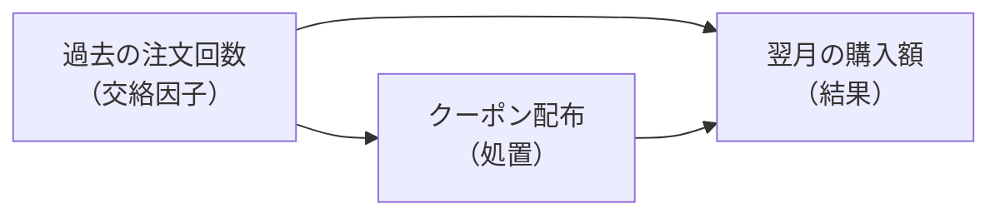

# 第9章 因果推論の入門

第 7 章では、相関があっても因果があるとは限らないと述べ、第 8 章では、ランダム化した A/B テストがなぜ因果効果を測れるのかを扱った。
しかし実務の分析では、ランダム化できない場面のほうが多い。
優良顧客にだけクーポンを配布した、価格を全店で一斉に改定した、外部のニュースで来訪が増えた、といった出来事の効果を問われるとき、手元にあるのは実験ではなく、蓄積された観察データである。

観察データから因果効果を推定する考え方と方法をまとめて**因果推論**と呼ぶ。
本章では、因果効果とは何かを潜在結果の考え方で定義し、単純な比較がなぜ効果を取り違えるのかを交絡という概念で説明する。
そのうえで、観察データで交絡を扱う代表的な方法（層別化、回帰による調整、傾向スコア、差の差）を、それぞれが置く前提とともに整理する。
新しい計算手法は、ほとんどが第 6 章と第 7 章の検定と回帰である。
本章で加わるのは、その計算をどんな前提のもとで因果の答えとして読んでよいか、という判断のほうである。

## 概念の解説

### 潜在結果と反事実

「クーポンの効果」を数として定義するところから始める。
ある顧客にクーポンを配布したとき、翌月の購入額が 5,000 円だったとする。
この顧客に配布しなかったとしたら翌月いくら買っていたか、が分かれば、二つの差がこの顧客にとってのクーポンの効果である。
配布した場合と配布しなかった場合のそれぞれの結果を**潜在結果**と呼び、実際には起きなかったほうの結果を**反事実**と呼ぶ[^rubin]。

反事実は定義上、観測できない。
同じ顧客の同じ月について、配布した世界と配布しなかった世界の両方を観測することはできず、一人の顧客について観測できる潜在結果は常に片方だけである。
だから個人の因果効果は原理的に測れず、因果推論が推定の対象にするのは、集団の平均である。
集団全体で「配布した場合の平均」から「配布しなかった場合の平均」を引いたものを**平均処置効果**（ATE）と呼ぶ。
ここで、クーポン配布のように効果を測りたい働きかけを**処置**、処置を受けた集団を処置群、受けなかった集団を対照群と呼ぶ。

平均であっても、片方の潜在結果しか観測できないという制約は消えない。
処置群について観測できるのは「配布した場合」の結果だけで、対照群について観測できるのは「配布しなかった場合」の結果だけである。
処置群の平均から対照群の平均を引く単純比較は、この二つを別々の集団から借りてきて差を取っている。
借りてきた対照群が処置群の反事実の代わりになっているかどうかが、因果推論のすべての問いである。

### 交絡と選択バイアス

単純比較がずれる仕組みを、式で確かめる。
処置群と対照群の観測された平均の差は、次の二つの和に分解できる。

```
観測された差 = 処置群での処置の効果
             + （処置群が処置を受けなかった場合の平均 − 対照群の平均）
```

第二項は、処置がなかったとしても二つの群のあいだにあったはずの差である。
これを**選択バイアス**と呼ぶ。
処置を受けるかどうかが、結果にも影響する何かによって決まっていると、この項はゼロにならない。

クーポンを購入回数の多い顧客に優先して配布する運用は、まさにこの状況である。
購入回数の多い顧客は、クーポンがなくても翌月の購入額が多い。
だから処置群は、処置を受けなかったとしても対照群より購入額が多かったはずで、単純比較はその差をクーポンの効果として数えてしまう。

このように、処置を受けるかどうかと結果の両方に影響する変数を**交絡因子**と呼び、交絡因子によって処置と結果の関係が歪むことを**交絡**と呼ぶ。
第 7 章で見た疑似相関（広告費と売上の両方を年末商戦が押し上げる）は、交絡の一例である。
因果ダイアグラムで描くと、交絡因子から処置と結果の両方へ矢印が出る形になる。



処置から結果への矢印が、測りたい因果効果である。
交絡因子を経由する迂回路（処置 ← 交絡因子 → 結果）は、処置と結果のあいだに因果とは無関係の相関を作る。
この迂回路を**バックドア経路**と呼ぶ。
観察データで因果効果を推定する方法は、どれもこの迂回路を何らかの手段で塞ぐ方法として読める。

### ランダム化が交絡を断つ理由

第 8 章の A/B テストが因果効果を測れるのは、処置の割り当てを乱数で決めるからである。
乱数は顧客のどんな属性とも無関係なので、交絡因子から処置への矢印が消える。
過去の注文回数のような把握している属性だけでなく、把握していない属性（読書への熱心さ、可処分所得）についても、両群の分布が期待値の意味で等しくなる。

この「把握していない属性についても」という点が、ランダム化と観察データの方法を分ける境界である。
以降で扱う方法は、どれも観測できた交絡因子については調整できるが、観測していない交絡因子については前提を置くしかない。
だから、ランダム化できる場面でランダム化しない理由はなく、観察データの方法はランダム化できないときの次善の策である。

### 観察データで交絡を扱う方法

観察データの方法は、置く前提によって二つの系統に分かれる。

一つ目の系統は、交絡因子がすべて観測できているという前提を置く。
観測した交絡因子の値が同じ顧客どうしを比べれば、処置の割り当ては乱数で決めたのと同じと見なせる、という前提であり、**無視可能性**と呼ぶ[^ignorability]。
この前提のもとで使える方法が、層別化、回帰による調整、傾向スコアの三つである。

- **層別化**：交絡因子の値で顧客を層に分け、層ごとに処置群と対照群の差を取り、層の大きさで重みを付けて平均する。
- **回帰による調整**：結果を処置と交絡因子で説明する回帰モデルを当てはめ、処置の係数を効果と読む。第 7 章の統制変数の使い方そのものである。
- **傾向スコア**：交絡因子から処置を受ける確率を予測するモデル（多くはロジスティック回帰）を作り、その予測確率を**傾向スコア**と呼ぶ。傾向スコアが近い顧客どうしを組にして比べる（マッチング）か、処置群には 1 ÷ 傾向スコア、対照群には 1 ÷（1 − 傾向スコア）の重みを付けて平均を取る（**逆確率重み付け**）。交絡因子が多いとき、層別化では層が細かくなりすぎるが、傾向スコアは複数の交絡因子を一つの数に要約するので扱いやすい。

三つの方法は、同じ前提のもとで同じものを推定する道具の違いであり、どれかが前提を緩めるわけではない。
また、どの方法にも**共通サポート**という条件がつく。
交絡因子のある値の顧客が処置群にしかいなければ、その顧客に対応する対照群は存在せず、比較のしようがない。
配布の基準を満たす顧客の全員にクーポンを配っていたなら、その顧客層についての効果は観察データからは推定できない。

二つ目の系統は、交絡因子が観測できていなくても、それが時間を通じて変わらないという前提を置く。
代表が**差の差**（DID）である。
処置の前後で結果を測っておき、処置群の前後の変化から対照群の前後の変化を引く。
処置群が元から購入額が多いという差は、前の期にも後の期にも同じだけ含まれるので、前後の変化を取ると消える。
一方、季節や景気のように両群に等しく効く時間の変化は、対照群の変化を引くことで消える。
残るのが処置の効果である。

差の差が置く前提は、処置がなかったとしたら、処置群と対照群の結果は同じように変化していた、というものであり、**平行トレンド**の仮定と呼ぶ。
この仮定は、処置より前の期間が複数あれば、その期間で二つの群の推移が平行だったかを確かめられる。
確かめられるのは処置前の平行だけで、処置後も平行だったはずだという部分は、あくまで仮定として残る。

同じ系統には**回帰不連続**もある。
処置の割り当てが、ある変数の閾値（購入額 5,000 円以上なら送料無料、など）で機械的に決まるとき、閾値のすぐ上とすぐ下の顧客はほとんど同じ顧客であり、処置の有無だけが違うと見なす。
閾値の両側での結果の跳びが、閾値付近の顧客についての効果になる。

| 方法 | 使う情報 | 置く前提 |
| --- | --- | --- |
| 層別化、回帰による調整、傾向スコア | 観測した交絡因子 | 観測した交絡因子で処置の割り当てが説明できる（無視可能性）、共通サポート |
| 差の差 | 処置前後の結果 | 処置がなければ両群は同じように変化した（平行トレンド） |
| 回帰不連続 | 割り当ての閾値 | 閾値の前後で処置以外は連続的に変わる |

### 何を調整し、何を調整しないか

回帰による調整は、モデルに変数を足すだけで実行できるため、関係がありそうな変数を片端から足したくなる。
しかし、足すと効果の推定を壊す変数が二種類ある。

一つは、処置の結果として決まる変数である。
クーポンを配布すると商品ページの閲覧数が増え、閲覧数が増えると購入額が増える、という経路があるとする。
閲覧数を調整すると、この経路を通る効果を取り除いてしまい、クーポンの効果のうち閲覧数を経由しない部分だけが残る。
処置の後に決まる変数は、それが処置の働く経路の一部である限り、調整の対象にしない。

もう一つは、処置と結果の両方から矢印を受ける変数である。
これを**コライダー**と呼ぶ。
たとえば会員ランクが、クーポンの受け取り履歴と購入額の両方で決まるとする。
会員ランクで条件づけると、同じランクの中では「クーポンを受け取ったのに購入額が少ない顧客」と「受け取っていないのに購入額が多い顧客」が対応することになり、処置と結果のあいだに元はなかった負の相関が生まれる。
交絡因子を調整するとバックドア経路が塞がるのに対し、コライダーを調整すると閉じていた経路が開く。

どの変数を調整すべきかは、変数の一覧からは決まらず、変数のあいだの因果の向きを描いた**因果ダイアグラム**（DAG）から決まる。
分析の前に、処置と結果に関わる変数と矢印の向きを、業務の知識に基づいて図にしておく。
図が正しいという保証はないが、図にすれば前提が目に見える形になり、業務の担当者とその前提について議論できる。

### 分析の限界の書き方

観察データによる因果効果の推定は、置いた前提が成り立つ範囲でしか意味を持たない。
だから結果の報告には、推定値と信頼区間に加えて、次の三点を添える。

- 置いた前提。無視可能性なら、どの交絡因子を調整し、どんな交絡因子が残っている可能性があるか。平行トレンドなら、処置前の推移で確かめた範囲。
- 効果が定義されている集団。共通サポートのある顧客層についての効果なのか、処置群についての効果なのか。
- 前提を変えたときの推定値の動き。調整変数の組を変えても推定値が大きく動かないなら、結論は前提の細部に依存していない。

この三点を書くと、報告は「クーポンで購入額が 500 円増えた」ではなく、「過去の注文回数で調整したうえで、クーポンを配布した顧客層について、購入額が 500 円程度増えたと推定される。読書への熱心さのような未観測の要因が配布と購入額の両方に効いていれば、この推定は過大になる」という形になる。
長くなるが、この長さが観察データで因果を語るときの誠実さである。

## 具体例

書籍オンラインストアで、前月の末に一部の顧客へ 500 円引きのクーポンを配布したとする。
配布先はマーケティング担当が決め、過去 1 年の注文回数が多い顧客を優先した。
問われているのは、クーポンが翌月の購入額をどれだけ増やしたかである。
実験ではないので、A/B テストの割り当てテーブルはなく、あるのは配布の記録だけである。

分析には、模擬データを使う。
実際の効果が分かっているデータで方法を比べるためで、真の効果を 500 円、全顧客に共通する翌月の増加（季節による）を 300 円に設定した。
顧客は 1 万人、過去 1 年の注文回数は平均 4 回、注文回数が多いほど配布されやすいように割り当てた。
配布率は 37.7% である。
模擬データを作るコードは次のとおりで、以降の数値はこのデータから計算している。

```python
import numpy as np
import pandas as pd

rng = np.random.default_rng(7)
n = 10000
past_orders = rng.poisson(4, n)                      # 過去 1 年の注文回数
tendency = rng.lognormal(0, 0.35, n)                 # 顧客ごとの持続的な購買傾向
base = (1500 + 500 * past_orders) * tendency         # 月あたりの購入額の水準
p = 1 / (1 + np.exp(-(past_orders - 5) / 1.5))      # 注文回数が多いほど配布されやすい
coupon = (rng.random(n) < p).astype(int)
pre = base * rng.lognormal(0, 0.3, n)                # 配布前の月
post = base * rng.lognormal(0, 0.3, n) + 300 + 500 * coupon   # 配布後の月
df = pd.DataFrame({
    "customer_id": np.arange(1, n + 1),
    "past_orders": past_orders,
    "coupon": coupon,
    "pre_amount": pre.round().astype(int),
    "post_amount": post.round().astype(int),
})
```

実データなら、この表は注文テーブルと配布記録から作る。
配布記録を coupon_distributions（customer_id、distributed_at）とすると、顧客ごとの前月と翌月の購入額は次の SQL で集計できる。

```sql
SELECT
    c.customer_id,
    CASE WHEN d.customer_id IS NULL THEN 0 ELSE 1 END AS coupon,
    COUNT(CASE WHEN o.ordered_at >= DATE '2024-12-01'
                AND o.ordered_at <  DATE '2025-12-01' THEN 1 END) AS past_orders,
    COALESCE(SUM(CASE WHEN o.ordered_at >= DATE '2025-11-01'
                       AND o.ordered_at <  DATE '2025-12-01' THEN o.amount END), 0) AS pre_amount,
    COALESCE(SUM(CASE WHEN o.ordered_at >= DATE '2025-12-01'
                       AND o.ordered_at <  DATE '2026-01-01' THEN o.amount END), 0) AS post_amount
FROM customers AS c
LEFT JOIN coupon_distributions AS d ON d.customer_id = c.customer_id
LEFT JOIN orders AS o ON o.customer_id = c.customer_id
GROUP BY c.customer_id, coupon;
```

### 単純比較はなぜ過大評価になるか

まず、配布の有無で翌月の購入額の平均を比べる。

| 群 | 顧客数 | 過去 1 年の注文回数 | 配布前の月の購入額 | 配布後の月の購入額 |
| --- | --- | --- | --- | --- |
| 対照群（配布なし） | 6,234 | 3.3 回 | 3,492 円 | 3,779 円 |
| 処置群（配布あり） | 3,766 | 5.3 回 | 4,615 円 | 5,421 円 |

配布後の差は 5,421 − 3,779 = 1,642 円で、第 6 章の t 検定を当てれば p 値はほぼ 0 になり、95% 信頼区間は 1,552 円から 1,731 円である。
真の効果は 500 円なので、3 倍以上の過大評価である。

過大評価の理由は、表の左側にある。
処置群は対照群より注文回数が 2 回多く、配布前の月の時点ですでに購入額が 1,123 円多い。
配布前の差はクーポンの効果ではありえないので、この 1,123 円は、処置群が処置を受けなかったとしても対照群より多く買っていたはずの差、すなわち選択バイアスである。
1,642 円のうち大半は、クーポンではなく配布先の選び方が作った差である。

### 差の差による推定

配布前の月の購入額があるので、差の差が使える。
表の右二列から、各群の前後の変化を取る。

```
対照群の変化 = 3,779 − 3,492 = 287 円     （季節による共通の増加）
処置群の変化 = 5,421 − 4,615 = 806 円     （共通の増加 + クーポンの効果）
差の差       = 806 − 287     = 519 円
```

真の効果 500 円に近い値が得られた。
処置群が元から多く買うという差は前後で共通なので変化を取ると消え、季節による増加は対照群の変化を引くことで消える。

信頼区間まで求めるには、前後の行を縦に並べたデータに、処置の有無、前後、その交互作用を説明変数とする回帰を当てはめる。
交互作用の係数が差の差である。
同じ顧客の 2 行が独立でないため、標準誤差は顧客ごとにまとめるクラスタ標準誤差を使う。

```python
import statsmodels.formula.api as smf

long = pd.concat([
    df.assign(period=0, amount=df["pre_amount"]),
    df.assign(period=1, amount=df["post_amount"]),
])[["customer_id", "coupon", "period", "amount"]]

did = smf.ols("amount ~ coupon * period", data=long).fit(
    cov_type="cluster", cov_kwds={"groups": long["customer_id"]}
)
print(did.summary().tables[1])
```

```
                    coef    std err          z      P>|z|      [0.025      0.975]
---------------------------------------------------------------------------------
Intercept      3491.9719     24.497    142.550      0.000    3443.960    3539.984
coupon         1122.5286     48.339     23.222      0.000    1027.786    1217.271
period          286.9406     20.949     13.697      0.000     245.881     328.001
coupon:period   519.3161     41.681     12.459      0.000     437.623     601.009
```

四つの係数が、そのまま先ほどの表の読み方になっている。
切片が対照群の配布前の平均、coupon の係数が配布前の群の差（選択バイアス）、period の係数が対照群の前後の変化（季節）、交互作用が差の差である。
効果の推定値は 519 円、95% 信頼区間は 438 円から 601 円で、真の値 500 円を含む。

この推定が頼っている前提は平行トレンドである。
クーポンがなければ、処置群も対照群と同じ 287 円だけ増えていた、という仮定であり、模擬データではそう作ったので成り立っている。
実データでは、配布前の数か月について両群の推移を並べ、平行に動いていたかを確かめる[^ashenfelter]。

### 回帰による調整と傾向スコア

配布の基準が過去 1 年の注文回数だと分かっているので、それを交絡因子として調整する方法も使える。
翌月の購入額を、処置の有無と注文回数で説明する回帰を当てはめる。

```python
adj = smf.ols("post_amount ~ coupon + past_orders", data=df).fit()
print(adj.params["coupon"], adj.conf_int().loc["coupon"].values)
# 485.  [393. 578.]
```

処置の係数は 485 円、95% 信頼区間は 393 円から 578 円で、こちらも真の値を含む。
注文回数を足す前の回帰（説明変数が処置だけ）の係数が単純比較と同じ 1,642 円だったことと比べると、注文回数という一つの変数がバックドア経路を塞いだことが分かる。

層別化でも同じことを確かめられる。
注文回数で五つの層に分け、層ごとに差を取る。

| 注文回数の層 | 対照群の平均 | 処置群の平均 | 差 | 顧客数 |
| --- | --- | --- | --- | --- |
| 0〜1 回 | 2,458 円 | 2,946 円 | 488 円 | 901 |
| 2〜3 回 | 3,382 円 | 3,963 円 | 581 円 | 3,384 |
| 4〜5 回 | 4,398 円 | 4,968 円 | 570 円 | 3,522 |
| 6〜7 回 | 5,455 円 | 6,046 円 | 591 円 | 1,700 |
| 8 回以上 | 6,794 円 | 7,424 円 | 630 円 | 493 |

層の中では処置群と対照群の注文回数がほぼ同じなので、層ごとの差は 500 円前後に収まる。
顧客数で重みを付けた平均は 573 円である。
層別化は回帰による調整より粗いが、層ごとの差が見えるため、効果が顧客層によって違うかどうかを確かめる用途に向く。

傾向スコアでは、まず注文回数から配布される確率を予測する。

```python
ps_model = smf.logit("coupon ~ past_orders", data=df).fit(disp=0)
df["ps"] = ps_model.predict(df)

w = np.where(df["coupon"] == 1, 1 / df["ps"], 1 / (1 - df["ps"]))
treated, control = df["coupon"] == 1, df["coupon"] == 0
ate = (np.average(df.loc[treated, "post_amount"], weights=w[treated])
       - np.average(df.loc[control, "post_amount"], weights=w[control]))
print(round(ate))
# 486
```

逆確率重み付けによる推定値は 486 円で、回帰による調整とほぼ一致する。
交絡因子が注文回数一つなら、傾向スコアは注文回数を確率に写し直しただけで、回帰による調整と同じ情報しか使っていない。
傾向スコアが本領を発揮するのは、交絡因子が年齢、地域、登録からの期間、と増えて層別化が現実的でなくなったときである。

共通サポートは、傾向スコアを見ると確かめられる。
このデータでは、注文回数が 11 回以上の顧客は全員に配布されており、対照群がいない。
つまり上の推定値は、注文回数が 10 回以下の顧客層についての比較と、11 回以上の顧客層については処置群の情報だけから外挿した値を含んでいる。
報告では、効果が定義されている範囲として、この点を書き添える。

調整変数の選び方が結果を左右することも、この模擬データで確かめられる。
注文回数の代わりに配布前の月の購入額だけで調整すると、係数は 924 円になる。
前月の購入額は購買傾向を反映しているが、月ごとの揺らぎも含むため、交絡因子である購買傾向を注文回数ほど正確には写していない。
調整が不完全な分だけ、選択バイアスが残る。
調整に使う変数は、処置の割り当てを実際に決めた変数か、それを正確に写す変数でなければ効かない。

四つの推定値を並べる。

| 方法 | 推定値 | 95% 信頼区間 | 置いた前提 |
| --- | --- | --- | --- |
| 単純比較 | 1,642 円 | 1,552〜1,731 円 | 割り当てが結果と無関係（成り立たない） |
| 差の差 | 519 円 | 438〜601 円 | 平行トレンド |
| 回帰による調整 | 485 円 | 393〜578 円 | 注文回数で割り当てが説明できる |
| 逆確率重み付け | 486 円 | （ブートストラップで求める） | 同上 |

前提の異なる二つの系統（差の差と、注文回数による調整）が近い値を返したことは、結論が一つの前提に依存していないことの根拠になる。
実データでは真の効果を知る手段がないので、この一致が推定を信頼する主な手がかりになる。

## 参考文献

- 安井翔太『効果検証入門 正しい比較のための因果推論／計量経済学の基礎』技術評論社、2020 年。（セレクションバイアス、回帰、傾向スコア、差の差を実務の言葉で解説した入門書。本章の構成の主な参考）
- 中室牧子、津川友介『「原因と結果」の経済学 データから真実を見抜く思考法』ダイヤモンド社、2017 年。（交絡と反事実の考え方を数式なしで説明した入門書）
- Judea Pearl, Dana Mackenzie, *The Book of Why: The New Science of Cause and Effect*, Basic Books, 2018.（因果ダイアグラム、バックドア経路、コライダーの考え方。日本語訳は『因果推論の科学』文藝春秋、2022 年）
- Guido W. Imbens, Donald B. Rubin, *Causal Inference for Statistics, Social, and Biomedical Sciences: An Introduction*, Cambridge University Press, 2015.（潜在結果の枠組みと傾向スコアの教科書）
- Joshua D. Angrist, Jörn-Steffen Pischke, *Mostly Harmless Econometrics: An Empiricist's Companion*, Princeton University Press, 2009.（回帰による調整、差の差、回帰不連続の理論と実践）
- Scott Cunningham, *Causal Inference: The Mixtape*, Yale University Press, 2021.（各手法のコード付きの解説。オンラインで無償公開されている）

[^rubin]: 潜在結果で因果効果を定義する枠組みは、Neyman の 1923 年の論文に始まり、Rubin が 1974 年に一般化したため、Rubin 因果モデルとも呼ばれる。「片方の潜在結果しか観測できない」という制約は、Holland が 1986 年に因果推論の根本問題と名づけた。
[^ignorability]: 正確には、観測した交絡因子で条件づければ、処置の割り当てが潜在結果と独立になるという条件である。文献によって無視可能性、条件付き交換可能性、unconfoundedness と呼ばれるが、指している条件は同じである。
[^ashenfelter]: 処置前の値そのものを基準に配布先を選ぶと、平行トレンドは崩れやすい。前月にたまたま多く買った顧客を選ぶと、その顧客の翌月の購入額は処置とは無関係に平均へ戻る（平均への回帰）ため、処置群の変化が小さく出る。職業訓練の効果の研究で見つかったこの現象は、Ashenfelter's dip と呼ばれる。本章の模擬データでは、配布先を前月の購入額ではなく過去 1 年の注文回数という安定した属性で選んだので、この問題は起きていない。
