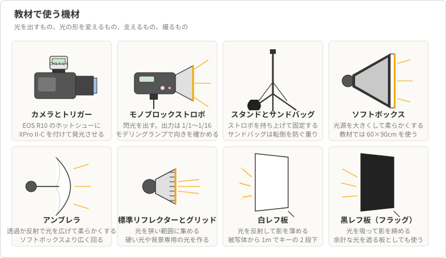
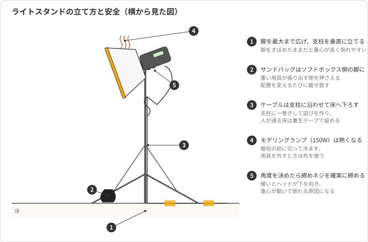
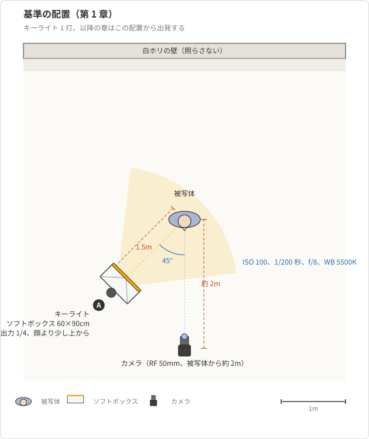

# 第1章 スタジオ撮影の全体像

屋外や窓際で人物を撮った経験があれば、光が写真を決めることは体で分かっている。
曇りの日は顔の影が薄く、晴れた日の正午は目の下に濃い影が落ち、夕方の窓際は片側だけが暖かく照らされる。
ただし自然光の撮影では、その光を選ぶことはできても、作ることはできない。
スタジオ撮影は、この関係を逆にする。
光のない部屋に自分で光源を置き、明るさも向きも柔らかさも自分で決める。

本章は、その撮影の全体を見渡すための章である。
自然光の撮影と何が変わるのか、レンタルスタジオにはどんな設備があるのか、どの機材が何を担うのか、撮影日はどう進むのかを先に押さえておく。
細かい設定や配置は第 2 章以降で一つずつ扱うので、本章では個々の数値を覚える必要はない。
代わりに、教材を通して使う題材と機材、そして各章が出発点にする基準の設定を紹介する。

## 概念の解説

### 自然光の撮影とストロボの撮影の違い

スタジオ撮影が自然光の撮影と違う点は、突き詰めると二つある。
一つ目は、光を自分で作るので、同じ結果を何度でも再現できることである。
自然光は時刻と天候で刻々と変わるため、同じ場所で撮っても昨日と今日で写りが違う。
これに対して、暗幕で窓を塞いだスタジオでは、光源はストロボだけになる。
ストロボの位置、高さ、向き、出力を記録しておけば、来月同じスタジオを借りても同じ写りが得られる。
逆に言えば、写りが気に入らないときは、その原因が必ず自分の置いた光の中にある。

二つ目は、ファインダーで見えている明るさと、写る明るさが一致しないことである。
自然光の撮影では、ファインダーに映る明るさがそのまま写真の明るさになる。
ストロボは、シャッターが開いている一瞬だけ強い光を出す装置である[^strobe]。
シャッターを切るまでは、その光はどこにも存在しない。
だからファインダーには、部屋の薄暗い定常光しか映らず、写真の明るさは撮ってみるまで分からない。
この違いが、スタジオ撮影のほとんどの戸惑いの源になる。
ファインダーで見て明るさを決める習慣をいったん捨て、撮った結果のヒストグラムで判断する習慣に置き換える必要がある（第 2 章）。

[^strobe]: 本教材で「ストロボ」と呼ぶのは、キセノン管を放電させて閃光を出す写真用の照明である。「フラッシュ」と同じ意味で、カメラに内蔵された小さなものも、スタンドに載せる大型のものも含む。「モノブロック」は、電源部と発光部が一体になった、スタンドに載せるタイプを指す。

とはいえ、まったくの手探りではない。
ストロボには**モデリングランプ**という、閃光の代わりに光の向きを見せるための定常光が付いている。
影の落ち方や光の当たる範囲はモデリングランプで確かめられる。
確かめられないのは明るさだけであり、それは試し撮りで合わせる。
スタジオ撮影とは、光の向きと形をモデリングランプで作り、明るさを試し撮りで合わせる作業だと言える。

### レンタルスタジオの二つの部屋

個人が借りられるレンタルスタジオには、大きく二種類の撮影スペースがある。
一つは**白ホリ**である。
壁と床を白く塗り、壁と床の境目を曲面（R 面と呼ぶ）でつないだ部屋で、境目の線が写らない。
背景を真っ白に飛ばして人物だけを浮かせる撮影や、床まで含めた全身の撮影に向く。
全身を撮るには被写体を壁から離す距離が要るので、白ホリは奥行きのある部屋になっている（第 8 章）。

もう一つは、**背景紙**を使うブースである。
天井近くに取り付けたロールから幅 2.72m の紙を引き出し、床まで垂らして背景にする。
白、グレー、黒のほか、さまざまな色の紙があり、撮影のたびに巻き替えられる。
白ホリより狭くて済む代わりに、幅が紙の幅に限られるので、上半身や一人の全身の撮影が中心になる（第 9 章）。

どちらの部屋でも、撮影に使う機材はほとんど同じである。
違うのは背景の作り方と、被写体を置ける広さだけである。
本教材の題材では、両方の部屋を持つスタジオを借り、白ホリで人物を、背景紙のブースで商品を撮る。
人物の上半身は、背景の扱いを学ぶために背景紙のブースでも撮る（第 6 章、第 7 章、第 9 章）。

### 機材とその役割

スタジオ撮影の機材は、光を出すもの、光の形を変えるもの、それらを支えるもの、そしてカメラに分けられる。
本教材で想定する機材の外見を図 1-1 に、それぞれの役割を表に示す。

<figure markdown="span">

<figcaption>図 1-1 教材で使う機材。光を出すもの、光の形を変えるもの、支えるもの、撮るもの</figcaption>
</figure>

| 区分 | 機材 | 役割 |
| --- | --- | --- |
| 光を出す | Godox SK400II（モノブロックストロボ） | 閃光を出す。出力は 1/1 から 1/16 まで変えられる。モデリングランプで光の向きを確かめる |
| 光を出す | Godox XPro II-C（ワイヤレストリガー） | カメラのホットシューに付け、シャッターと同時に電波でストロボを発光させる。出力もここから変える |
| 光の形を変える | ソフトボックス、アンブレラ | 光源を大きくして、光を柔らかくする |
| 光の形を変える | 標準リフレクター、グリッド | 光を狭い範囲に集め、硬い光や背景専用の光を作る |
| 光の形を変える | 白レフ板、黒レフ板 | 光を反射して影を薄める（白）、光を吸って影を締める（黒） |
| 支える | ライトスタンド、サンドバッグ | ストロボを持ち上げて固定する。サンドバッグは転倒を防ぐ重り |
| 撮る | Canon EOS R10 | APS-C のミラーレスカメラ。電子シャッターではストロボが使えないので、メカシャッターか電子先幕で撮る |
| 撮る | RF-S 18-150mm、RF 50mm F1.8 | 全身とテーブル上の商品には 18-150mm、上半身には 50mm（フルサイズ換算 80mm） |

ストロボとトリガーの間の通信は、Godox の X システムという 2.4GHz の電波で行う。
ストロボは 3 灯まで借りられ、トリガーからは灯ごとに別の出力を指定できる。
一灯で始めて、必要に応じて二灯目、三灯目を足していくのが、本教材の章の進み方でもある（第 6 章、第 7 章）。

### 撮影日の流れ

スタジオは時間で借りるので、撮影日の作業は限られた時間に収める必要がある。
半日（4 時間）の撮影であれば、流れはおおむね次のようになる。

1. 入室し、借りる機材をそろえ、ストロボをスタンドに載せて電源を入れる。
2. カメラをスタジオ向けの設定にし、トリガーを付けて、一灯が発光することを確かめる。
3. 被写体を立たせ、モデリングランプで光の向きを決め、試し撮りで明るさを合わせる。
4. 本番を撮る。合間にヒストグラムと拡大表示で露出とピントを確かめる。
5. 次の被写体や背景に移り、3 と 4 を繰り返す。
6. 撤収し、機材を冷ましてから返す。

この流れの中で、初心者が時間を使いすぎるのは 3 の段階である。
光の位置を少し動かすたびに明るさが変わり、明るさを直すと影の形も変わって見えるためである。
これを短く済ませる鍵は、出発点となる配置と設定を先に決めておき、そこからの差分だけを調整することにある。
本教材が基準の設定を用意しているのはそのためである。
細かい段取りとトラブルへの対処は第 11 章で扱う。

### 安全

スタジオの機材は家庭の照明より重く、熱く、電圧も高い。
撮影の前に、次の点を確かめておく（スタンドまわりの要点は図 1-2）。

- **スタンドの転倒**：ソフトボックスを付けたストロボは重心が高く、脚に触れただけで倒れる。スタンドの脚には必ずサンドバッグを載せ、脚を最大まで広げる。
- **ケーブル**：モノブロックは AC 電源で動くので、床にケーブルが這う。人が通る場所は避けるか、養生テープで床に留める。
- **モデリングランプの熱**：150W のモデリングランプは点けたままにすると、リフレクターやソフトボックスの内側が触れないほど熱くなる。撤収の前には切って冷ます。用具を外すときは布を使う。
- **被写体の目**：ストロボの閃光は一瞬だが、近距離で目に向けて何度も発光させると疲れる。テスト発光は被写体に向けずに行い、本番の枚数も必要な分にとどめる。
- **放電**：モノブロックは内部に高電圧を蓄える。電源を切っても分解したり濡らしたりしない。

<figure markdown="span">

<figcaption>図 1-2 ライトスタンドの立て方。脚を広げ、ソフトボックス側の脚にサンドバッグを載せ、ケーブルは支柱に沿わせて床で留める</figcaption>
</figure>

これらは撮影の技術とは別の話だが、レンタルスタジオでは機材の破損が弁償につながる。
配置を変えるたびにサンドバッグを載せ直す習慣を最初につけておく。

### 各章の見取り図

以降の章は、カメラとストロボの基礎から始めて、ライティングの組み立て、スタジオごとの撮り方、当日の運用へと進む。

| 章 | 扱う内容 |
| --- | --- |
| 第 2 章 | 露出の基本。絞り、シャッター速度、ISO の関係と、ストロボ撮影でそのどれが効くか |
| 第 3 章 | EOS R10 をスタジオ向けに設定する。M モード、シャッター方式、AF、レンズ |
| 第 4 章 | モノブロックストロボとトリガーの操作。出力と距離で明るさを決める |
| 第 5 章 | 光の質と方向。ソフトボックスやレフ板が何を変えるか |
| 第 6 章 | 一灯とレフ板でポートレートを撮る |
| 第 7 章 | 二灯目、三灯目を足して多灯にする |
| 第 8 章 | 白ホリで背景を白く飛ばし、全身を撮る |
| 第 9 章 | 背景紙の色と明るさを操り、環境光の混入を防ぐ |
| 第 10 章 | 商品を撮る。反射と被写界深度 |
| 第 11 章 | 撮影当日の段取りとトラブル対処、データの扱い |
| 第 12 章 | 別の題材で撮影計画を通しで立てる総合演習 |

第 2 章から第 5 章までが道具の理解、第 6 章から第 10 章までが光の組み立て、第 11 章と第 12 章が運用にあたる。

## 具体例

### 題材の撮影と基準の設定

本教材では、一つの撮影を題材にして章を進める。
モデル役の友人のプロフィール写真（上半身と全身）と、ハンドメイド雑貨のオンラインショップに載せる陶器のマグカップの商品写真を、レンタルスタジオを半日借りて撮る、という撮影である。
スタジオには白ホリ（幅 5m、奥行 6m、天井 3.5m）と背景紙のブース（幅 2.72m の白、グレー、黒）があり、窓は暗幕で塞げる。
ストロボは 3 灯借りる。

各章は、次の基準の設定から出発し、章の目的に合わせて一部を変える。

| 項目 | 基準 |
| --- | --- |
| カメラ | M モード、ISO 100、シャッター速度 1/200 秒、絞り f/8、ホワイトバランス 5500K、RAW 記録 |
| キーライト | 60×90cm のソフトボックスを付けたストロボ 1 灯。被写体の斜め前 45 度、顔より少し上から見下ろす角度、被写体から 1.5m |
| 出力 | 1/4。この位置と出力で、被写体の顔が f/8 で適正になる |

この配置を上から見た図が図 1-3 である。
以降の章の配置図も、背景を上、カメラを下に置いて描く。

<figure markdown="span">

<figcaption>図 1-3 基準の配置（上から見た図）。キーライト 1 灯を被写体の斜め前 45 度、1.5m に置く</figcaption>
</figure>

この基準には、後の章で使う二つの性質が含まれている。
一つは、シャッター速度 1/200 秒がストロボの同調速度 1/250 秒より遅いことである。
同調速度以下であれば、シャッター速度を変えても閃光の写りは変わらない（第 2 章）。
もう一つは、明るさが出力と距離で決まることである。
ライトを被写体から 2 倍の距離に離すと 2 段暗くなり、出力を 1 段上げると 1 段明るくなる（第 4 章）。
基準の位置で f/8 になるという事実を一つ覚えておけば、そこからの変化は段の足し引きで見積もれる。

### 最初の二枚の試し撮り

撮影日にこの基準を組んだら、本番の前に二枚だけ試し撮りをする。
一枚目は、トリガーの電源を切って撮る。
ISO 100、1/200 秒、f/8 では、モデリングランプだけの部屋は真っ黒に写る。
これで、部屋の定常光が写真に影響していないことが確かめられる。
もしうっすら写るなら、暗幕の隙間や天井の照明が残っている（第 9 章）。

二枚目は、トリガーの電源を入れて撮る。
今度は被写体の顔が写り、ヒストグラムの山が中央付近に来る。
ここで顔が暗ければ出力を上げ、明るければ下げる。
出力の一目盛りは 0.1 段なので、ヒストグラムを見ながら数目盛りずつ動かせば数枚で合う（第 4 章）。

この二枚の試し撮りは、以降のどの章の配置でも最初に行う。
一枚目で「写っている光はすべて自分が置いた光である」ことを確かめ、二枚目でその光の明るさを合わせる。
自然光の撮影にはなかったこの手順が、スタジオ撮影の再現性を支えている。

## 参考文献

- Fil Hunter, Steven Biver, Paul Fuqua, Light: Science and Magic, 5th ed., Routledge, 2015（光源の大きさと向きが写りを決める、という本教材の見方の土台）
- Scott Kelby, The Digital Photography Book, Part 1, 2nd ed., Rocky Nook, 2020（スタジオ機材の役割と最初の一灯の置き方）
- キヤノン, EOS R10 アドバンストユーザーガイド（Web 版）（シャッター方式とストロボの制約）
- Godox, SK400II 取扱説明書（出力の範囲、モデリングランプ、安全上の注意）
