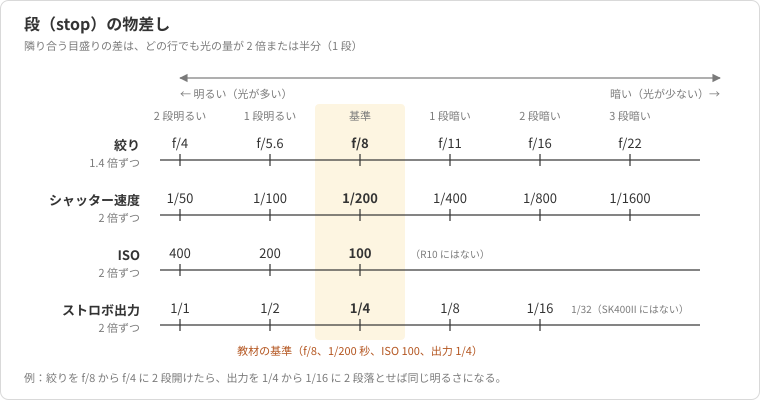
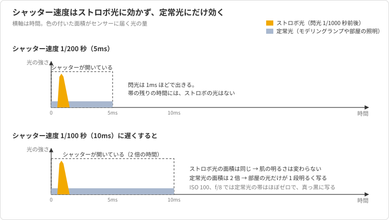
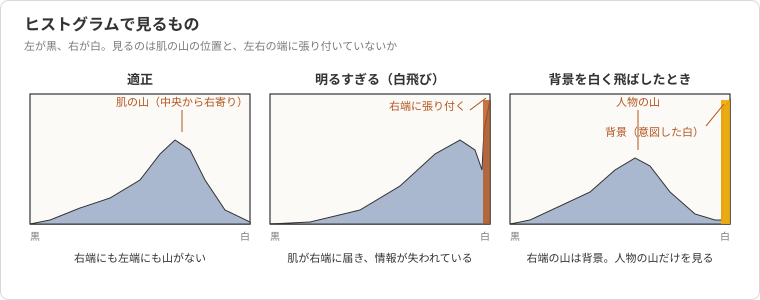

# 第2章 露出の基本とストロボ撮影の露出

第 1 章で、スタジオ撮影は自然光の撮影と違って光を自分で作る撮影だと述べた。
光を自分で作るということは、写真の明るさを決める変数がカメラの外にも増えるということである。
自然光で撮ってきた読者は、絞り、シャッター速度、ISO の三つで明るさを合わせることに慣れているだろう。
スタジオでは、そこにストロボの発光量と、ストロボから被写体までの距離が加わる。

しかも、この五つの変数は同じ重みで効くわけではない。
自然光で最も頻繁に触るシャッター速度は、ストロボの光に対してはほとんど効かない。
この違いを知らないままスタジオに入ると、シャッター速度を上げても下げても明るさが変わらないことに戸惑うことになる。

本章では、まず自然光と共通の土台である露出と段の考え方を確認し、次にストロボ撮影で露出を決める四つの要素を整理する。
最後に、露出計を持たない読者がヒストグラムと試し撮りで露出を合わせる手順を、題材の撮影で示す。
第 3 章のカメラ設定と第 4 章のストロボの操作は、本章の考え方の上に載る。

## 概念の解説

### 露出と段

写真の明るさを決めるのは、センサーに届く光の量である。
この量を**露出**と呼び、絞り、シャッター速度、ISO 感度の三つで調整する。
絞りはレンズを通る光の太さを、シャッター速度は光を受ける時間を、ISO はセンサーが光をどれだけ増幅するかを決める。

三つの要素は単位も数字の並びも違うが、共通の物差しがある。
光の量が 2 倍になる変化、または半分になる変化を**段**（stop）と呼ぶ[^stop]。
三つの要素を段で見ると、次の表のように、隣の値との差がすべて 1 段になる。
図 2-1 は同じ対応を、後で扱うストロボの出力も含めて、教材の基準の周りに並べたものである。

| 段 | 絞り | シャッター速度 | ISO |
| --- | --- | --- | --- |
| 基準より 2 段明るい | f/4 | 1/50 秒 | 400 |
| 基準より 1 段明るい | f/5.6 | 1/100 秒 | 200 |
| 基準 | f/8 | 1/200 秒 | 100 |
| 基準より 1 段暗い | f/11 | 1/400 秒 | （R10 にはない） |
| 基準より 2 段暗い | f/16 | 1/800 秒 | |
| 基準より 3 段暗い | f/22 | 1/1600 秒 | |

<figure markdown="span">

<figcaption>図 2-1 段の物差し。教材の基準（f/8、1/200 秒、ISO 100、出力 1/4）を中央に置き、隣り合う目盛りの差はどの行でも 1 段</figcaption>
</figure>

絞り値の並びは 1.4 倍ずつ（正確には 2 の平方根倍）で、値が大きいほど光は少ない。
f/8 から f/5.6 に開ければ光は 2 倍、f/11 に絞れば半分である。
シャッター速度と ISO はそのまま 2 倍と半分で 1 段になる。
カメラの設定はふつう 1/3 段刻みで動くので、f/8 と f/11 の間には f/9 と f/10 がある。

段という物差しがあると、三つの要素を交換できる。
f/8、1/200 秒、ISO 100 で適正だった露出は、絞りを f/4 に 2 段開けてシャッター速度を 1/800 秒に 2 段速くしても、同じ明るさになる。
自然光の撮影では、この交換で被写界深度とブレのどちらを優先するかを選んでいる。
スタジオでも段で考える習慣はそのまま使うが、交換できる相手が変わる。

### 絞りと被写界深度

絞りは光の量と同時に、ピントの合う奥行きも決める。
ピントを合わせた位置の前後で、実用上ピントが合っていると見える範囲を**被写界深度**と呼ぶ。
絞りを開けるほど浅く、絞るほど深くなり、被写体に近づくほど、また焦点距離が長いほど浅くなる。

題材の上半身のポートレートでは、RF 50mm（換算 80mm）で被写体から 2m ほど離れて撮る。
この条件で f/8 なら、被写界深度はおよそ 30cm あり、鼻の先から耳までがピントに収まる。
f/2.8 まで開けると 10cm ほどしかなく、手前の目に合わせると奥の目や耳がすでにぼけ始める。
f/2 や f/1.8 では、わずかに前後しただけで目からピントが外れる。

スタジオ撮影が f/8 を基準にするのは、この深さのためである。
自然光の撮影で開放に近い絞りを選ぶのは、暗い場所で光を稼ぐためであることが多い。
スタジオでは光をいくらでも足せるので、光量のために絞りを開ける必要がなく、被写界深度だけで絞りを選べる。
背景をぼかしたいときに開けるのはよいが、それは「開けなければ暗い」からではなく、表現として選ぶことになる。

### シャッター速度と同調速度

自然光の撮影では、シャッター速度は被写体の動きによるブレと手ブレを抑えるために選ぶ。
ストロボ撮影では、シャッター速度にもう一つの上限がある。
EOS R10 のメカシャッターは、先幕が開いてから後幕が閉じるまでの間に、センサー全体が露光する瞬間を持つのは 1/250 秒までである。
これより速いシャッター速度では、先幕が開ききる前に後幕が追いかけ始め、センサーの上をスリット状の隙間が走る形で露光する。
ストロボはその瞬間にしか光らないので、隙間の位置だけが写り、残りは黒い帯になる。

ストロボが画面全体に写る最も速いシャッター速度を**同調速度**と呼び、R10 では 1/250 秒である。
教材では、無線トリガーの伝達に伴うわずかな遅れを見込んで、1/200 秒を基準にする[^sync]。
1/200 秒より遅くする分には、同調の問題はない。

### ストロボ撮影で露出を決める四つの要素

ここで、ストロボの光がどのくらいの時間で出ているかを見ておく。
Godox SK400II の閃光時間は、出力によって 1/800 秒から 1/2000 秒程度である。
シャッターが 1/200 秒開いている間に、ストロボは 1/1000 秒ほどで光をすべて出しきってしまう。
だからシャッター速度を 1/100 秒に遅くしても、シャッターが開いている時間の中でストロボの光が増えることはなく、センサーに届くストロボの光は同じ量である（図 2-2）。

<figure markdown="span">

<figcaption>図 2-2 シャッター速度を 1/200 秒から 1/100 秒に遅くしても、ストロボ光の量は変わらず、定常光の量だけが 2 倍になる</figcaption>
</figure>

したがって、ストロボの光による露出は、次の四つで決まる。

- **絞り**：レンズを通る光の太さ。1 段絞れば 1 段暗くなる。
- **ISO**：センサーの増幅。1 段下げれば 1 段暗くなる。
- **発光量**：ストロボの出力。1/4 から 1/8 に落とせば 1 段暗くなる。
- **距離**：ストロボから被写体までの距離。離すほど暗くなり、2 倍に離すと 2 段暗くなる[^inverse]。

シャッター速度がこの中にない。
これがストロボ撮影の露出で、自然光の撮影と最も違う点である。
シャッター速度が効くのは、部屋の照明や窓からの光のような、シャッターが開いている間ずっと当たり続けている光に対してだけである。
このような光を、ストロボの瞬間的な光と区別して**定常光**と呼ぶ。

つまり、ストロボ撮影の一枚の写真には二つの露出が重なっている。
ストロボ光の露出は絞り、ISO、発光量、距離で決まり、定常光の露出は絞り、ISO、シャッター速度で決まる。
スタジオでは、定常光の露出が真っ黒になる設定を選ぶことで、ストロボ光の露出だけを考えればよい状態を作る。
ISO 100、1/200 秒、f/8 でストロボを切って一枚撮り、真っ黒であることを確かめる手順がそれで、モデリングランプや天井の照明はこの設定では写らない。
窓からの光が入る場合や、わざと定常光を混ぜる撮影は第 9 章で扱う。

ストロボの閃光時間が短いことには、もう一つの帰結がある。
被写体のブレも手ブレも、1/1000 秒の閃光の間に起きる動きしか写らないので、事実上止まる。
R10 にボディ内手ブレ補正がないことは、スタジオでは問題にならない。

### 露出をどう判断するか

四つの要素で決まる露出が適正かどうかを、何で判断するかが次の問題である。
自然光ではカメラの露出計を見るが、ストロボ撮影ではファインダー内の露出計の指針は役に立たない。
露出計はシャッターを切る前の定常光しか測れず、まだ光っていないストロボの光は含まないからである。
M モードで指針が大きくマイナスに振れていても、それは定常光が真っ黒だと言っているだけで、ストロボ光の露出とは関係がない。

ストロボ光を測る専用の露出計（フラッシュメーター）があれば、被写体の位置で発光させて絞り値を直接読める。
しかし必須ではない。
デジタルカメラでは撮った結果をその場で見られるので、試し撮りを露出計の代わりにできる。

試し撮りで見るのは、背面モニターの見た目の明るさではなく**ヒストグラム**である。
ヒストグラムは画面の明るさの分布を、左を黒、右を白として並べたグラフで、モニターの明るさ設定や部屋の明るさに影響されない。
右端に山が張り付いていれば白飛びしており、左端に張り付いていれば黒つぶれしている。
肌の明るさは、ヒストグラムの中央から右寄りに来るのが目安で、右端には届かない（図 2-3）。

<figure markdown="span">

<figcaption>図 2-3 ヒストグラムの三つの見え方。見るのは肌の山の位置と、左右の端に張り付いていないか</figcaption>
</figure>

白飛びの場所を画面上で示すのが**ハイライト警告**で、飛んだ部分が点滅して表示される。
白いシャツやマグカップの光る縁のように、ハイライト側が心配な被写体では、ヒストグラムより先にこの点滅を見るほうが早い。
ただし、ストロボの反射で光る点（キャッチライトや陶器のつや）は飛んでいて正しいので、面として飛んでいるかどうかで判断する。

RAW で記録すれば、現像で 1 段ほどは明るさを戻せるので、多少の露出の外れは救える。
それでも白飛びした部分の情報は戻らない。
迷ったら、飛ばさない側に 1/3 段暗く撮っておくのが安全である。

## 具体例

題材の撮影で、基準の露出を作るところから、絞りを開けたいとき、被写体との距離が変わったとき、服の色が違うときの換算までを順に見る。
ライトの配置は第 1 章の基準（キーライトのソフトボックスを被写体の斜め前 45 度、1.5m。図 2-4）をそのまま使い、本章では露出の数値だけを追う。

<figure markdown="span">

<figcaption>図 2-4 本章で使う配置。第 1 章の基準と同じで、カメラは RF 50mm で被写体から約 2m</figcaption>
</figure>

### 基準の露出を作る

最初に、カメラを M モード、ISO 100、1/200 秒、f/8 にする（設定の手順は第 3 章）。
ストロボを切ったまま一枚撮り、真っ黒であることを確かめる。
これで定常光の露出は無視できる状態になった。

次に、キーライトを出力 1/4 にして一枚撮る。
ヒストグラムを見ると、肌の山が中央から右寄りにあり、右端には何もない。
ハイライト警告も出ていない。
これが基準の露出で、教材ではこの状態を「キー 1/4 で f/8」と呼んで各章で使う。

もし肌の山が中央より左に寄っていれば、1 段明るくする。
選択肢は、絞りを f/5.6 に開ける、出力を 1/2 に上げる、ISO を 200 にする、ライトを 1.1m に近づける、の四つで、どれも 1 段である。
被写界深度を変えたくなければ出力を上げるのが最も素直で、ライトを近づけると光の質も変わる（第 5 章）。
シャッター速度を 1/100 秒にしても、明るさは変わらない。

### 背景をぼかしたいとき

友人から、背景をもっとぼかした一枚も欲しいと言われたとする。
絞りを f/8 から f/4 に開ければ、被写界深度は浅くなり、白ホリの壁の継ぎ目もぼける。
しかし絞りを 2 段開けると、ストロボ光の露出も 2 段明るくなって肌が飛ぶ。
自然光ならシャッター速度を 2 段速くして相殺するところだが、ストロボ光にはシャッター速度が効かない。

代わりに、発光量で相殺する。
出力を 1/4 から 2 段落として 1/16 にすれば、f/4 で同じ肌の明るさになる。
絞りと出力の対応を表にすると、次のようになる。

| 絞り | 基準との段差 | 出力で相殺する場合 | 距離で相殺する場合 |
| --- | --- | --- | --- |
| f/8 | 0 | 1/4 | 1.5m |
| f/5.6 | 1 段明るい | 1/8 | 2.1m |
| f/4 | 2 段明るい | 1/16 | 3.0m |
| f/2.8 | 3 段明るい | 1/32（SK400II では設定できない） | 4.2m |

SK400II の出力は 1/16 が下限なので、f/2.8 では出力だけでは足りない。
そのときは、ライトを 1 段分離す（1.5m から 2.1m）か、レンズに ND フィルター（光量を一様に減らすフィルター）を付ける。
ライトを離すと光は硬くなり（第 5 章）、被写体に当たる範囲も変わるので、絞りを大きく開けたい撮影では ND フィルターのほうが配置を保てる。
より小さい出力まで下がる機種を選ぶ理由の一つがここにある。

### 全身に切り替えたとき

上半身の次に全身を撮る。
被写体は同じ場所に立ち、カメラだけが下がって 18-150mm の 24mm 域で撮るなら、ライトと被写体の距離は変わらず、露出も変わらない。
カメラと被写体の距離はストロボ光の露出に関係がない。

一方、全身を照らすためにソフトボックスを被写体から 2.1m に引いたなら、ライトから被写体までの距離が 1.4 倍になって 1 段暗くなる。
出力を 1/4 から 1/2 に上げるか、絞りを f/5.6 に開けて補う。
被写界深度を保ちたいので、出力を上げる。
ライトを動かしたら露出が変わる、という関係は第 4 章の逆二乗則でもう一度扱う。

### 白い服と黒い服

友人が白いシャツに着替えた。
肌の露出は同じでよいはずだが、試し撮りをするとシャツの胸元にハイライト警告が点滅した。
白い布は肌より 2 段ほど明るく写るので、肌を基準の明るさに置くとシャツが右端に届くことがある。

このときの判断は、シャツの点滅が面で出ているかで決める。
胸元の一部が点滅する程度なら、出力を 0.3 段落とせば消える。
XPro II-C は 0.1 段刻みで出力を変えられるので、絞りを動かさずに済む。
面として広く点滅するなら 1 段落とし、肌は現像で少し持ち上げる。

黒いセーターなら逆で、ヒストグラムの山が左に寄るのは服が黒いからで、露出不足ではない。
肌の山の位置だけを見て、基準のままにする。
ヒストグラムは画面全体の分布なので、服の色によって山の位置は動く。
見るべきなのは、肌の部分がどこにあるかと、右端と左端に張り付いていないかである。

## 参考文献

- Bryan Peterson, Understanding Exposure, 4th ed., Amphoto Books, 2016（絞り、シャッター速度、ISO と段の関係、被写界深度の考え方）
- Fil Hunter, Steven Biver, Paul Fuqua, Light: Science and Magic, 5th ed., Routledge, 2015（光量と距離の関係、露出の判断）
- キヤノン, EOS R10 アドバンストユーザーガイド（Web 版）（同調速度、ヒストグラムとハイライト警告の表示）
- Godox, SK400II 取扱説明書（出力の範囲と閃光時間）

[^stop]: 段は英語の stop をそのまま「ストップ」と呼ぶこともあり、「1 段明るく」「1 段絞る」のように使う。露出値（EV）で数えても同じで、1 EV が 1 段に当たる。
[^sync]: 電子先幕でも同調速度は 1/250 秒である。電子シャッターはストロボと同調しないので、スタジオでは使わない（第 3 章）。
[^inverse]: 距離と明るさの関係は逆二乗則と呼ばれ、明るさは距離の 2 乗に反比例する。距離 1.4 倍（2 の平方根倍）で 1 段、2 倍で 2 段暗くなる。第 4 章で数値を使って扱う。
