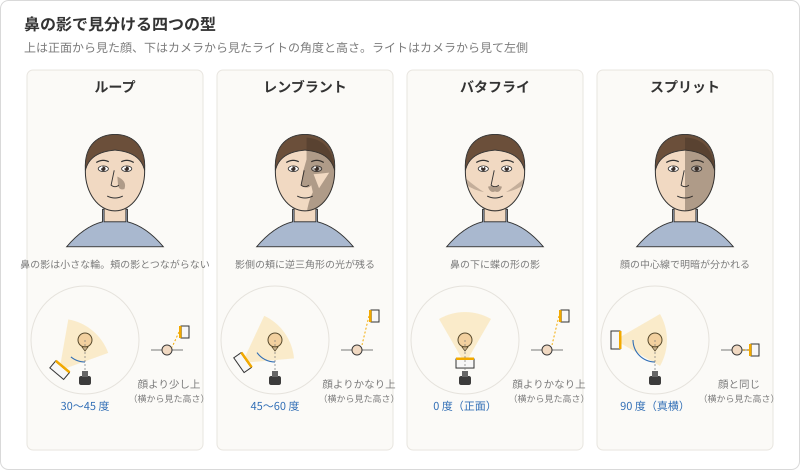
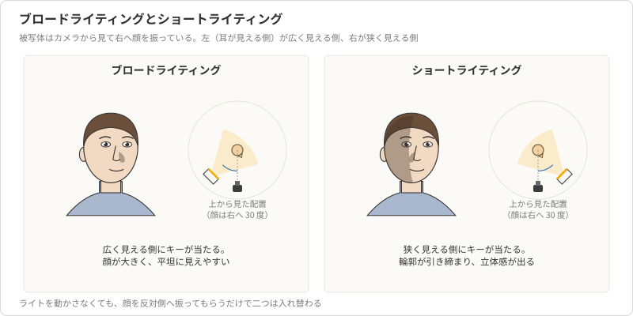
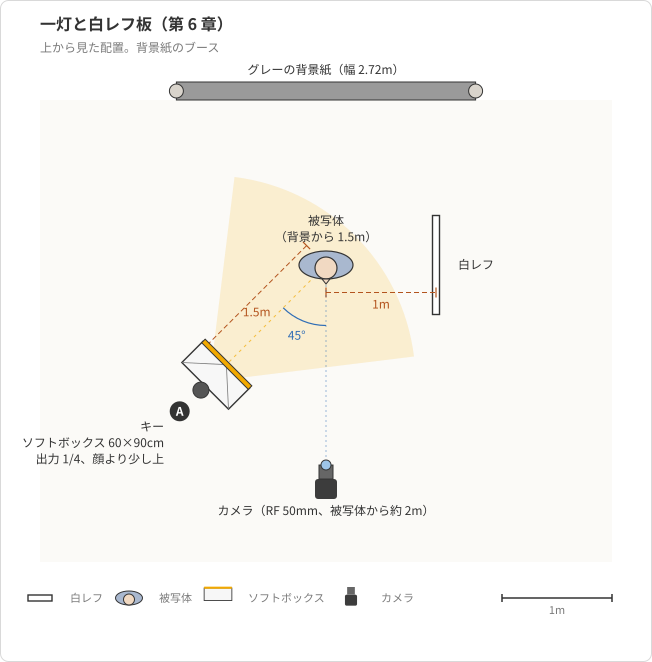

# 第6章 一灯で撮るポートレート

第 5 章で、光の硬さは被写体から見た光源の大きさで決まり、影の落ち方は光源の方向で決まることを見た。
本章では、その二つの道具を一つのライトに絞って、人の顔を撮る。
一灯だけで始めるのは、機材が足りないからではない。
ライトが一つなら、角度を 10 度変えたとき、高さを 20cm 上げたとき、写真のどこがどう変わったかを一対一で確かめられる。
第 7 章で二灯目、三灯目を足すときも、その効き方を一灯ずつ確かめる手順は変わらない。

題材は、モデル役の友人の上半身である。
背景紙のブースにグレーの背景紙を引き、キーライトの 60×90cm ソフトボックスと白レフ板だけで撮る。
カメラの設定は第 3 章の基準（M モード、ISO 100、1/200 秒、f/8、5500K、RAW）から動かさず、ストロボの出力と位置だけで写真を組み立てる。

本章の前半では、一灯の位置で決まる顔の陰影の型を、鼻の影の形で見分ける方法として整理する。
後半では、その型を実際に作り、試し撮りから追い込む手順と、初めての撮影で起きやすい失敗の直し方を示す。

## 概念の解説

### 鼻の影で見分ける四つの型

顔は鼻という出っ張りを持つので、ライトの方向は鼻の影の形にそのまま現れる。
ポートレートのライティングには、鼻の影の形で名前の付いた型がある（図 6-1）。
型を覚える目的は、名前を言えるようになることではなく、モデリングランプで顔を見ながら「いまどの型に近く、どちらへ動かせば別の型になるか」を判断できるようになることにある。

**ループライティング**は、ライトをカメラから見て 30〜45 度の横、顔より少し高い位置に置いたときの型である。
鼻の影は頬に向かって小さな輪（ループ）を描き、頬の影とはつながらない。
顔の両側に光が回り、鼻筋と頬骨に立体感が出るので、プロフィール写真のように顔立ちを素直に見せたいときの出発点になる。

**レンブラントライティング**は、ループの位置からライトをさらに横（45〜60 度）へ振り、高さも上げたときの型である。
鼻の影が伸びて頬の影とつながり、影側の頬に逆三角形の光が取り残される[^rembrandt]。
顔の半分近くが影になるので陰影は強く、落ち着いた印象や重厚な印象に向く。
同じ被写体でも、ループより顔が細く見える。

**バタフライライティング**は、ライトをカメラのすぐ上、顔の正面の高い位置に置いたときの型である。
鼻の真下に蝶の形をした影が落ち、頬骨の下にも影が入る。
顔が左右対称に照らされ、頬骨が強調されるので、美容写真や化粧品の広告で古くから使われてきた[^paramount]。
一方で、目の下やあごの下にも影が落ちるので、下から白レフを当てて影を起こすことが多い（第 7 章のクラムシェルはこれをストロボで作る）。

**スプリットライティング**は、ライトを被写体の真横（90 度）、顔と同じ高さに置いたときの型である。
顔の中心線で明るい側と影の側に分かれ、影側にはほとんど光が届かない。
四つの中で最も陰影が強く、人物の性格や緊張を表現する写真に向くが、プロフィール写真に使うことは少ない。

| 型 | ライトの角度（カメラから見て） | ライトの高さ | 鼻の影の形 | 印象 |
| --- | --- | --- | --- | --- |
| ループ | 30〜45 度 | 顔より少し上 | 頬に向かう小さな輪。頬の影とつながらない | 素直で立体的 |
| レンブラント | 45〜60 度 | 顔よりかなり上 | 頬の影とつながり、影側の頬に逆三角形の光が残る | 強い陰影、重厚 |
| バタフライ | 0 度（正面） | 顔よりかなり上 | 鼻の下に蝶の形 | 左右対称、頬骨を強調 |
| スプリット | 90 度（真横） | 顔と同じ | 顔の中心線で明暗が分かれる | 最も強い陰影 |

<figure markdown="span">

<figcaption>図 6-1 鼻の影で見分ける四つの型。下段はライトの角度と高さ</figcaption>
</figure>

四つの型は不連続な選択肢ではない。
ライトを正面から横へ動かせば、バタフライ、ループ、レンブラント、スプリットの順に連続して変わる。
だから実際の作業では、モデリングランプを点けたまま、ライトをゆっくり横へ動かして鼻の影を見る。
影が頬の影とつながった瞬間がレンブラントの始まりであり、そこから少し戻せばループになる。

### ブロードライティングとショートライティング

型の名前は、ライトと顔の角度で決まる。
これとは別に、被写体がカメラに対して顔を少し振っているときには、顔のどちら側にライトが当たるかという区別が生まれる。

顔を斜めに向けると、カメラから見て顔の片側は広く（耳まで見える側）、反対側は狭く見える。
広く見える側にキーライトが当たるのが**ブロードライティング**、狭く見える側に当たるのが**ショートライティング**である（図 6-2）。
ショートライティングでは、広く見える側が影になるので、顔の輪郭が引き締まって見え、立体感も出る。
ブロードライティングでは、顔の広い側がさらに明るく見えるので、顔が大きく、平坦に見えやすい。
一般には、ショートライティングを基本にし、顔の細い人や、あえて柔らかく平坦に見せたい場合にブロードを選ぶ。

<figure markdown="span">

<figcaption>図 6-2 ブロードライティングとショートライティング</figcaption>
</figure>

ライトの位置を動かさなくても、被写体に顔を反対側へ振ってもらうだけで、ブロードとショートは入れ替わる。
つまり同じループライティングでも、顔の向きによって印象は二通りある。
ライトの角度と被写体の顔の向きは、別々の操作として扱う。

### レフ板でフィルを入れる

一灯だけで撮ると、影側の頬は光がほとんど届かず、レンブラントやスプリットでは真っ黒に落ちる。
第 5 章で見たとおり、影を起こす二つ目の光を**フィル**と呼ぶ。
一灯の撮影では、フィルにストロボを使わず、キーライトの光を反射して返す**白レフ板**で作る。
レフ板は光源を増やさないので、影の形はキーライトが決めたまま、影の濃さだけを変えられる。

明るい側と影側の明るさの差は、第 2 章の段で数える。
本教材の基準では、白レフ板をキーライトの反対側、被写体から 1m に置くと、影側はキー側の約 2 段下になる（段差 2、比で言えば 4:1）。
段差 2 は、影側の頬の肌の色が読め、それでいて立体感も残る標準の陰影である。
レフ板を 50cm まで近づければ段差はおよそ 1 に縮んで柔らかい印象になり、レフ板を外せば段差は 3 以上に広がって陰影が強くなる。
逆に影をもっと締めたいときは、影側に**黒レフ板**を立てて、壁や天井から回ってくる光を吸わせる[^negative-fill]。

レフ板の置き方には二つの注意がある。
一つは高さで、被写体の顔と同じ高さか少し下に置き、面をわずかに上へ向ける。
低すぎると顔の下から光が返り、あごの下だけが不自然に明るくなる。
もう一つは角度で、レフ板はキーライトの光を鏡のように返すので、キーライトと被写体とレフ板の位置関係で、返る光の向きが決まる。
モデリングランプを点けて、レフ板を少し振りながら影側の頬の明るさを見ると、最も効く角度が分かる。

### キャッチライトとライトの高さ

目には、光源が小さな白い点として映り込む。
この映り込みを**キャッチライト**と呼ぶ。
キャッチライトが入ると目に潤いと生気が出て、入らないと同じ表情でも目が沈んで見える。
ソフトボックスなら四角い面が、アンブレラなら傘の形が映り、その位置と形でライトがどこにあったかが読める。

キャッチライトの有無は、ライトの高さで決まる。
ライトを高くするほど鼻の影は長く下に伸びて彫りの深い顔になるが、高すぎると眉と上まぶたが目に影を落とし、キャッチライトが消える。
目安は、被写体の目の中で、キャッチライトが時計の 10 時か 2 時のあたりに映る高さである。
12 時に近ければライトが高すぎ、9 時や 3 時に近ければライトが低すぎるか真横にある。
ライトの角度を型で決めた後、高さはキャッチライトの位置で決める、という順序にすると迷いにくい。

## 具体例

### ブースの準備とカメラの設定

背景紙のブースにグレーの背景紙を引き、友人には背景紙から 1.5m 離れた位置に立ってもらう。
背景から離す理由は、キーライトの光を背景に届きにくくして人物と背景を分けるためで、その効き方は後の失敗の節で確かめる。
レンズは RF 50mm F1.8 STM（換算 80mm）を付け、カメラは被写体から約 2m の位置で上半身が収まる画角にする。

カメラは第 3 章の基準どおり、M モード、ISO 100、1/200 秒、f/8、ホワイトバランス 5500K、RAW、メカシャッター、露出Simulation は「しない」に設定する。
AF は ONE SHOT、被写体検出は「人物」、瞳検出を有効にする。
トリガーの XPro II-C はチャンネル 1、ストロボはグループ A に設定し、モデリングランプを点ける。

### 配置と設定値

キーライトは 60×90cm のソフトボックスをスタンドに付け、カメラから見て被写体の左 45 度、被写体から 1.5m、ソフトボックスの中心が顔より 30cm ほど高くなる位置に置く。
ソフトボックスの面は顔へ向け、わずかに見下ろす角度にする。
白レフ板は被写体の右側、被写体から 1m、顔の高さに立てる。
配置を図 6-3 に示す。

<figure markdown="span">

<figcaption>図 6-3 一灯と白レフ板の配置（上から見た図）</figcaption>
</figure>

| 灯 | 用具 | 位置と距離 | 出力 | 被写体上の明るさ |
| --- | --- | --- | --- | --- |
| A（キー） | 60×90cm ソフトボックス | 被写体の左 45 度、顔より 30cm 上、1.5m | 1/4 | 顔の明るい側で f/8 |
| フィル | 白レフ板 | 被写体の右、顔の高さ、1m | （反射） | 影側で約 f/4（キーの 2 段下） |

この配置で、鼻の影は右の頬へ向かう小さな輪になり、ループライティングになる。
友人の顔をカメラから見て少し右へ振ってもらうと、ライトはカメラから見て狭い側の顔に当たるので、ショートライティングのループになる。

### 試し撮りから追い込む手順

ストロボの位置と出力は、次の順序で一つずつ決める。
一度に二つを変えると、写真の変化がどちらの操作によるものか分からなくなる。

1. **影の形を決める。**モデリングランプの光で友人の顔を見ながら、ソフトボックスを横へ動かして鼻の影が小さな輪になる角度を探し、次に高さを上下してキャッチライトが 10 時の位置に映る高さにする。ここではまだシャッターを切らない。
2. **環境光を確かめる。**トリガーの電源を切り、ISO 100、1/200 秒、f/8 で一枚撮る。ブースの窓を暗幕で塞いであれば画面は真っ黒になり、ストロボ以外の光が写っていないことが分かる（第 2 章）。
3. **キーライトの明るさを合わせる。**トリガーの電源を入れ、レフ板を外した状態で一枚撮る。ヒストグラムとハイライト警告を見て、顔の明るい側の肌が飛んでいれば出力を 0.3 段ずつ下げ、全体が暗ければ 0.3 段ずつ上げる。基準の配置なら出力 1/4 で f/8 が合うが、肌の色や服の色で前後するので、写真で決める。
4. **フィルを入れる。**白レフ板を 1m の位置に立てて一枚撮る。影側の頬に肌の色が戻り、段差 2 になっていることを確かめる。柔らかくしたければレフ板を近づけ、締めたければ遠ざける。レフ板の操作ではキー側の明るさは変わらないので、出力は動かさない。
5. **型を切り替えて撮り比べる。**ソフトボックスを横へ 15 度振って高さを 20cm 上げ、鼻の影が頬の影とつながるレンブラントで一枚、次にソフトボックスをカメラの真上へ移してバタフライで一枚撮る。ライトを動かすと被写体までの距離が変わるので、そのたびに距離を 1.5m に戻すか、変わった分を出力で補う。

撮り比べた三枚を背面モニターで見比べると、同じ友人、同じカメラ設定で、印象の違いがライトの位置だけで作れていることが分かる。
プロフィール写真として渡すのは、多くの場合ループかレンブラントのどちらかになる。

### よくある失敗と直し方

初めてのストロボ撮影では、次の失敗が繰り返し起きる。
どれも原因は本章と第 5 章の範囲にあり、機材を足さずに直せる。

**顔の影側が濃すぎる。**
段差が 3 以上に開いている。
直し方は三つあり、白レフ板を被写体に近づける（段差を縮める）、ソフトボックスをカメラ寄りの角度へ振る（影側にも光を回す）、ソフトボックスを被写体に近づける（見かけの大きさが増して影の縁が柔らかくなる）のいずれかを選ぶ。
ソフトボックスを近づけると明るくなるので、1.5m から 1.1m に近づけたら出力を 1 段下げて f/8 を保つ。

**目が暗く、キャッチライトが入らない。**
ライトが高すぎて、眉が目に影を落としている。
ソフトボックスを 10〜20cm 下げるか、友人にあごをわずかに上げてもらう。
ライトの高さを下げると鼻の影は短くなるので、彫りの深さを保ちたいときは角度を少し横へ振って補う。

**背景が暗く落ちる。**
グレーの背景紙が黒に近い濃いグレーに写る。
これは第 4 章の逆二乗則の帰結で、キーライトから被写体までが 1.5m、背景までが 3m なら、背景に届く光は被写体より 2 段暗い。
グレーの紙はもともと白より反射が少ないので、写真ではさらに暗く見える。
人物を浮かび上がらせる意図なら、これは失敗ではなく狙いどおりである。
背景を明るくしたければ、被写体を背景紙のすぐ前に立たせる（キーライトから背景までも 1.5m ほどになって段差はほぼ 0 になるが、被写体の影が背景に落ちる）か、第 7 章の背景ライトを足す。

**眼鏡にソフトボックスが映り込む。**
光は入射角と同じ角度で反射するので、レンズ面がカメラとソフトボックスの中間の向きを向いていると、映り込みがカメラに入る。
ソフトボックスを高くして見下ろす角度を強めるか、友人にあごを少し引いてもらい、反射の向きをカメラの上へ逃がす。
それでも残る場合は、ライトを横へ振って反射をカメラの外へ出す。
眼鏡のつるを耳の上でわずかに持ち上げてレンズ面を下向きにする方法も、正面からの写真では効く。

**絞りを開けても出力が下がらない。**
背景をぼかそうと f/2.8 にすると、f/8 から 3 段明るくなるが、SK400II の出力は 1/4 から 2 段しか下げられない（下限が 1/16）。
1 段分は距離で補い、ソフトボックスを 1.5m から 2.1m へ離す。
ISO は 100 が下限なので、この方向には使えない。
出力を 1/128 まで下げられる機種なら、この問題は起きない。

一灯と白レフ板で、上半身のプロフィール写真は撮れる。
足りないのは、髪や肩の輪郭を背景から切り離すリムライトと、背景の明るさを人物と独立に決める背景ライトであり、第 7 章でこの二つを足す。
背景そのものを白く飛ばす白ホリの撮影は、背景ライトの使い方を覚えてから第 8 章で扱う。

## 参考文献

- Christopher Grey, Master Lighting Guide for Portrait Photographers, 2nd ed., Amherst Media, 2014（ループ、レンブラント、バタフライ、スプリットの型と、ブロードとショートの区別）
- Neil van Niekerk, Direction & Quality of Light, Amherst Media, 2013（ライトの方向と高さが顔の陰影とキャッチライトに与える影響）
- Fil Hunter, Steven Biver, Paul Fuqua, Light: Science and Magic, 5th ed., Routledge, 2015（反射の法則と眼鏡の映り込みの扱い）
- Scott Kelby, The Digital Photography Book, Part 1, 2nd ed., Rocky Nook, 2020（一灯とレフ板でのポートレートの実践的な手順）

[^rembrandt]: 影側の頬に残る逆三角形の光を「レンブラントの三角形」と呼ぶ。名前は画家レンブラントの肖像画にこの光がよく見られることに由来する。
[^paramount]: バタフライライティングは、ハリウッドの映画スタジオで多用されたことから「パラマウントライティング」とも呼ばれる。
[^negative-fill]: 黒レフ板で光を吸わせて影を締めることを「ネガティブフィル」と呼ぶ。壁が白いスタジオでは、意図しないフィルが壁から返ってくるので、陰影を強くしたいときに使う。
