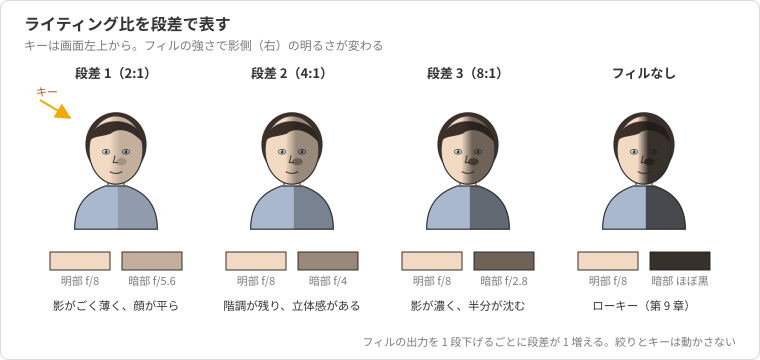
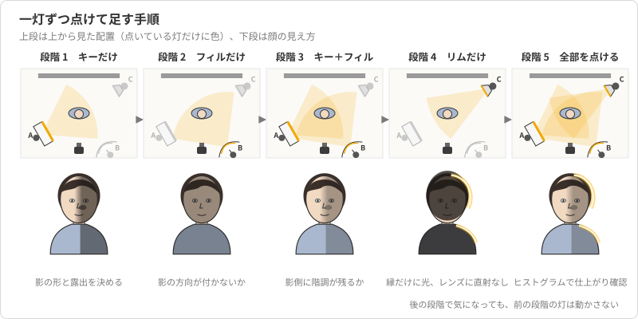
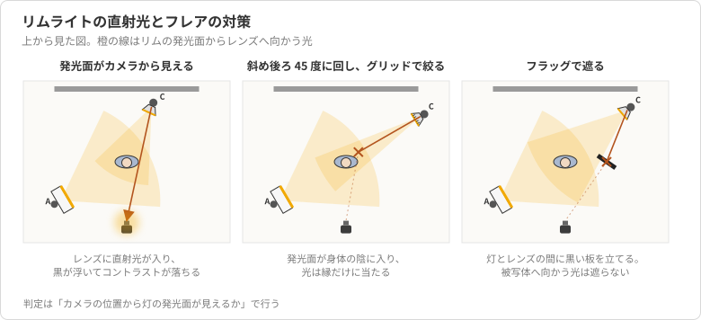
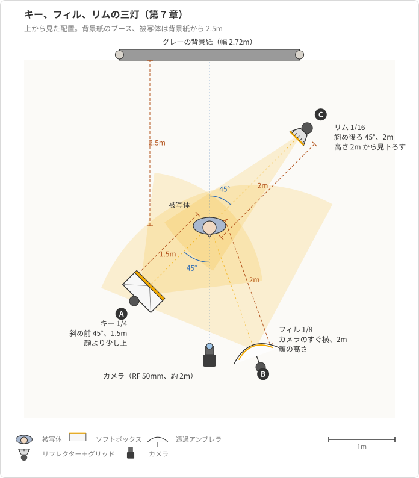

# 第7章 多灯ライティングの組み立て

第 6 章では、ソフトボックス一灯と白レフ板だけで友人の上半身を撮った。
一灯でも顔の陰影は作れるし、レフ板で影の濃さも変えられる。
それでも一灯では解けない問題が二つ残った。
黒い髪と黒っぽい服が暗い背景に溶けて、肩から上の輪郭が消えること。
そして、背景の明るさをキーライトの位置と出力の都合で決めるしかなく、顔の露出と背景の明るさを別々に選べないことである。

多灯ライティングは、灯を増やして絵を派手にする技法ではない。
一灯で解けない問題を一つ選び、その問題だけを担当する灯を一つ足す、という考え方である。
輪郭が溶けるなら輪郭に光を当てる灯を足し、背景を明るくしたいなら背景だけを照らす灯を足す。
灯ごとに役割を一つに絞ると、どの灯をどう動かせば何が変わるかが分かり、調整が迷わない。

本章では、まず灯の役割を四つに分け、灯同士の明るさの関係をライティング比として段差で表す。
次に、一灯ずつ点けて確認しながら足していく手順と、その手順をカメラ位置から進めるためのトリガーのグループ操作を示す。
後ろから当てる灯に付きもののフレアの対処と、フィルを下から入れるクラムシェルにも触れる。
具体例では、背景紙のブースで友人の上半身をキー、フィル、リムの三灯で組む。
背景ライトの実際は、白ホリの第 8 章と背景紙の第 9 章で扱う。

## 概念の解説

### 灯の四つの役割

多灯の灯は、当てる場所ではなく、担う役割で呼ぶ。
役割は四つあり、一つの灯には一つの役割だけを持たせる。

**キーライト**は被写体の形を決める灯である。
顔のどこに影が落ち、鼻の影がどちらを向くかはキーライトの位置で決まり、露出の基準もキーライトが作る。
第 6 章で使った一灯は、このキーライトである。

**フィルライト**は、キーライトが作った影を起こす灯である。
影を完全に消すのではなく、影の中に階調を残す程度に弱く当てる。
第 6 章の白レフ板もフィルの役割を担っていたが、レフ板の強さは被写体との距離でしか変えられない。
上半身なら 1m に置いた 1 枚で足りても、全身では 1 枚で顔から足まで起こしきれず、近づけると画面に写り込む。
フィルをストロボにすると、位置を変えずに出力で強さを決められる。
フィルが影の方向を作らないように、キーの反対側のカメラ寄りに、できるだけ大きな光源で当てる。

**リムライト**は、被写体の斜め後ろから当てて、髪や肩の縁に細い光を乗せる灯である。
ヘアライト、セパレーションライトとも呼ぶ[^rim-names]。
役割は被写体を背景から切り離すことで、暗い背景に黒髪が溶ける問題はこの灯が解く。
光を顔に回り込ませたくないので、標準リフレクターにグリッドを付けた狭い光を使う。

**背景ライト**は、背景だけを照らして、背景の明るさをキーライトから独立に決める灯である。
被写体には当てない。
白ホリを白く飛ばすときも、グレーの背景紙を好きな明るさに置くときも、この灯の出力で決める（第 8 章、第 9 章）。

一つの灯に二つの役割を求めると、調整が衝突する。
キーライトを背景も照らす位置に置けば、顔の露出を変えるたびに背景の明るさも動く。
リムライトで顔の側面まで明るくしようとすれば、輪郭に必要な出力と頬に許せる出力が合わない。
灯を足すかどうかは、「いま解きたい問題を担当している灯があるか」で決める。

### ライティング比を段差で表す

キーライトとフィルライトの明るさの関係を**ライティング比**と呼ぶ。
教科書では、明部（キーとフィルの両方が当たる面）と暗部（フィルだけが当たる面）の明るさの比を 2:1、4:1、8:1 のように書く。
本教材では、これをキーとフィルの**段差**で表す[^ratio-def]。
フィルがキーより 1 段暗ければ段差 1、2 段暗ければ段差 2 である。

段差で覚える理由は、ストロボの出力ダイヤルと一対一に対応するからである。
フィルの出力を 1 段下げれば段差は 1 増え、影はその分濃くなる。
比で覚えると、4:1 から 8:1 にするのに何段動かすかを毎回換算することになる。

段差と絵の印象の対応は、次の表と図 7-1 を目安にする。

| 段差 | 比 | 影の見え方 | 向く場面 |
| --- | --- | --- | --- |
| 1 | 2:1 | 影がごく薄く、顔が平らに見える | 証明写真、明るく柔らかい印象 |
| 2 | 4:1 | 影に階調が残り、立体感がある | プロフィール写真の標準 |
| 3 | 8:1 | 影が濃く、顔の半分が沈む | 陰影を強調した印象 |
| フィルなし | | 影がほぼ黒く落ちる | ローキー（第 9 章） |

<figure markdown="span">

<figcaption>図 7-1 ライティング比を段差で表したときの影の見え方</figcaption>
</figure>

リムライトの明るさは、キーと同じか 1 段上を目安にする。
黒髪は光を吸うので明るめに、明るい髪や白い服は縁が飛びやすいので控えめにする。
背景ライトの目安は第 8 章で述べる。

露出の基準はキーライトである。
カメラの絞りはキーライトで顔が適正になる値に固定し、フィルとリムはキーに対する段差で決める。
フィルを明るくしたいからといって絞りを開けると、キーの露出も動いてしまう。

### 一灯ずつ点けて足す手順

三灯を同時に点けて撮ると、影の濃さが足りないのがフィルの弱さのせいか、キーの位置のせいか、判断できない。
多灯は、一灯ずつ点けて確認しながら足していく。

1. キーライトだけを点け、第 6 章の手順で位置、出力、絞りを決める。ここで露出の基準が固まる。
2. キーを消してフィルライトだけを点け、フィルが顔をどれだけ照らしているかを見る。目標の段差に合わせて出力を決め、影の方向が付いていないことを確認する。
3. キーとフィルを点け、影側の頬に階調が出ているかを見る。段差が違えばフィルの出力だけを動かす。
4. キーとフィルを消してリムライトだけを点け、光が髪と肩の縁だけに乗っているか、レンズに直接入っていないかを見る。
5. 全部を点けて撮り、ヒストグラムとハイライト警告で仕上がりを確認する。

<figure markdown="span">

<figcaption>図 7-2 一灯ずつ点けて足す手順と、各段階で見るもの</figcaption>
</figure>

図 7-2 のとおり、各段階で見るものが違う。
段階 1 は影の形と露出、段階 2 と 3 は影の濃さ、段階 4 は輪郭とフレアである。
後の段階で気になることが出ても、前の段階の灯は動かさない。
キーを動かせば段階 2 以降がやり直しになる。

### トリガーのグループ操作

この手順は、灯ごとに点けたり消したり出力を変えたりを何度も繰り返す。
そのたびにストロボ本体まで歩いていては撮影が進まない。
XPro II-C は、グループごとにモードと出力をカメラ位置から変えられる。

準備として、三灯の受信チャンネルと ID をトリガーと揃え、キーをグループ A、フィルをグループ B、リムをグループ C に割り当てる（第 4 章）。
どの灯がどのグループかは、ライトスタンドにテープで書いておく。
撮影中は、トリガーのグループボタンで灯を選び、モードボタンで M と OFF を切り替え、ダイヤルで出力を変える。
グループを OFF にすれば、その灯は発光しないので、「キーだけ」「フィルだけ」の試し撮りがカメラ位置から済む。

モデリングランプは、灯ごとの効き方の見当をつけるのに使う。
出力に比例して明るさが変わる設定にしておけば、フィルを 1 段下げたときに影がどう変わるかを、撮る前に目で追える。
ただし定常光で見える明暗の差は、ストロボ光の差と厳密には一致しない。
段差の最終判断は試し撮りで行う。

### リムライトのフレア

リムライトは被写体の後ろにあるので、発光面がレンズに向いている。
発光面から出た光がレンズに直接入ると**フレア**が起き、画面全体のコントラストが落ちて黒が灰色に浮き、ときに光の形が写り込む（ゴースト）。
一灯の撮影では起きない、多灯に固有の失敗である。

判定は簡単で、カメラ位置から灯の発光面が見えるなら光はレンズに入っている。
対処は三つある（図 7-3）。

- 灯の位置を変える。被写体の真後ろではなく斜め後ろ 45 度に置き、発光面が被写体の身体で隠れる位置と高さを探す。
- グリッドで光の広がりを絞る。輪郭に当てる光は狭くてよいので、グリッドを付けても効きは落ちない。
- **フラッグ**（黒レフ板や黒い板）を灯とレンズの間に立て、レンズに向かう光だけを遮る。被写体に向かう光は遮らない。

<figure markdown="span">

<figcaption>図 7-3 リムライトの直射光がフレアになる位置関係と三つの対処</figcaption>
</figure>

もう一つの失敗は、リムが強すぎて輪郭が白く飛び、髪の質感が消えることである。
髪の縁が細い線として残る出力まで下げる。
SK400II の出力は 1/16 までしか下がらないので、それでも強ければ灯を遠ざけるか、リフレクターにディフューザーを掛けて減光する。

### クラムシェル

**クラムシェル**は、キーライトを顔の正面上から見下ろす位置（第 6 章のバタフライの位置）に置き、その真下にフィルを置いて、上下から顔を挟む配置である。
上下に開いた貝殻の形から名が付いた。
下からのフィルは白レフ板か、白アンブレラの弱い灯で作る。

顔の影は上下から埋まってほぼ消え、目には上下二つのキャッチライトが入る。
段差は 1 か 2 で、明るく整った印象になるので、美容系や証明写真寄りのプロフィールに向く。
灯の数で言えば一灯とレフ板でも組めるが、役割はキーとフィルであり、本章の考え方で扱う配置である。

## 具体例

友人の上半身を、背景紙のブースで三灯を使って撮る。
背景はグレーの背景紙で、被写体は背景紙から 2.5m 前に立つ。
第 6 章の一灯の絵を出発点にして、フィルとリムを足す。

### 配置と設定

上から見た配置を図 7-4 に示す。

<figure markdown="span">

<figcaption>図 7-4 キー、フィル、リムの三灯の配置（上から見た図）</figcaption>
</figure>

| 灯 | グループ | 用具 | 位置と距離 | 出力 | 被写体上の明るさ |
| --- | --- | --- | --- | --- | --- |
| キー | A | 60×90cm ソフトボックス | 斜め前 45 度、顔より少し上、1.5m | 1/4 | 顔が f/8 |
| フィル | B | 白アンブレラ | キーの反対側でカメラのすぐ横、顔の高さ、2m | 1/8 | 顔が f/4（段差 2） |
| リム | C | 標準リフレクター＋グリッド | 斜め後ろ 45 度、高さ 2m から見下ろす、2m | 1/16 | 髪が f/8〜f/11 |

カメラは ISO 100、1/200 秒、f/8、WB 5500K、RF 50mm F1.8 STM で、基準の設定から変えない。

### 一灯ずつ足していく

段階 1 では、トリガーでグループ B と C を OFF にして、キーだけで撮る。
第 6 章と同じく、鼻の影が頬に向かってループを描き、両目にキャッチライトが入り、顔の明るい側のヒストグラムが右寄りで飛んでいないことを確認する。
背景紙は被写体の 2.5m 後ろにあり、キーライトからは 4m 近く離れているので、f/8 では暗いグレーに落ちる。
この暗い背景に黒髪が溶けているのが、これから解く問題である。

段階 2 では、A を OFF、B を M にして、フィルだけで撮る。
顔は全体に f/4 相当で 2 段暗く写り、右も左もほぼ同じ明るさで、鼻の影が目立たなければよい。
鼻の横に影が付くなら、フィルの位置がカメラから離れすぎているので、カメラの真横まで寄せる。

段階 3 で A と B を点ける。
影側の頬が黒く沈まず、明るい側より暗いが皮膚の階調は残る、という見え方になる。
これが段差 2 の絵である。
もっと柔らかくしたければ B を 1/4 に上げて段差 1、もっと陰影を出したければ B を 1/16 に下げて段差 3 にする。
このときキーの出力と絞りは動かさない。

段階 4 では、A と B を OFF、C を M にして、リムだけで撮る。
髪の縁と肩の線だけが光り、頬や耳の側面まで明るくなっていなければよい。
撮る前に、カメラ位置からリムの発光面が見えていないかを確かめる。
見えているなら、灯を被写体の身体の陰に入る位置まで後ろに回し、それでも見えるなら灯とカメラの間に黒レフ板を立てる。
髪の縁が白く飛んでいる場合は、1/16 から下げられないので灯を 2.8m まで遠ざける（約 1 段減光）。

段階 5 で全部を点ける。
髪の輪郭が背景から浮き、影側の頬に階調が残り、キャッチライトが両目に入っていれば完成である。
ヒストグラムでは、髪の縁のハイライトが右端に少しかかる程度、顔の明部は右寄りで飛んでいない状態を確認する。

### よくある失敗と原因の切り分け

| 症状 | 疑う灯 | 確かめ方 | 対処 |
| --- | --- | --- | --- |
| 影側の頬が真っ黒 | フィル | B だけで撮って顔が写るか | B の出力を上げるか近づける |
| 顔が平らで立体感がない | フィル | 段差を数える | B を 1 段下げる |
| 画面全体が眠く黒が浮く | リム | カメラ位置から発光面が見えるか | 灯を後ろに回す、グリッド、フラッグ |
| 髪の縁が白く飛ぶ | リム | C だけで撮って髪の質感が残るか | 灯を遠ざける、ディフューザー |
| 耳や頬の側面まで明るい | リム | C だけで撮って光の範囲を見る | グリッドを付ける、角度を後ろに振る |
| 顔の露出が段階 1 と違う | キー以外 | A だけで撮り直す | 動かした灯を戻す |

どの症状も、まず疑う灯だけを点けて撮れば、原因の灯が特定できる。
三灯を点けたまま出力をあちこち動かすのは、原因を分からなくする操作である。

## 参考文献

- Christopher Grey, Master Lighting Guide for Portrait Photographers, 2nd ed., Amherst Media, 2014（キー、フィル、リム、背景の役割分担とライティング比）
- Fil Hunter, Steven Biver, Paul Fuqua, Light: Science and Magic, 5th ed., Routledge, 2015（光源の位置とレンズに入る直接光、フレアの扱い）
- Roberto Valenzuela, Picture Perfect Lighting, Rocky Nook, 2016（一灯から多灯へ足していく考え方とクラムシェル）
- Godox, XPro II-C 取扱説明書（グループごとのモードと出力の操作）

[^rim-names]: 髪に当てることを強調するとヘアライト、背景との分離を強調するとセパレーションライトと呼ぶ。同じ位置の同じ灯を指すことが多く、本教材ではリムライトで通す。
[^ratio-def]: 厳密には明部の明るさはキーとフィルの和なので、段差 1 のとき明部と暗部の比は 3:1 になる。段差 2 以上ではキーの値で読んでも実用上の差はなく、表では慣用の比を添えている。
