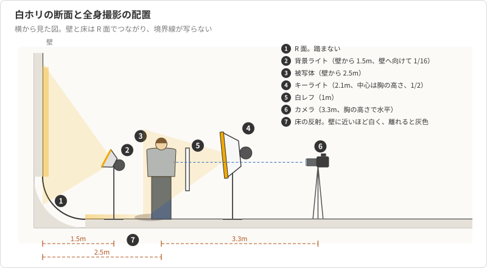
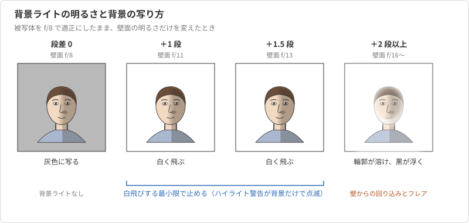
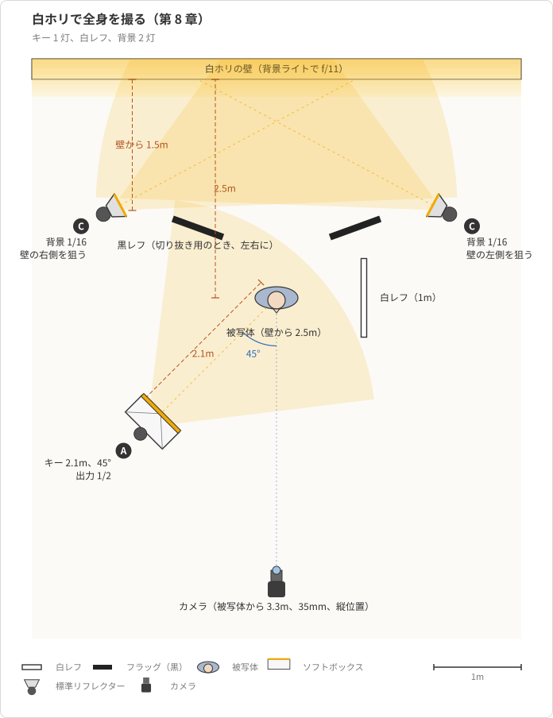

# 第8章 白ホリでの撮影

第 6 章と第 7 章では、友人の上半身を撮った。
そこでは背景の明るさを積極的には決めておらず、キーライトの光がどれだけ背景まで届くかで背景の調子が決まっていた。
プロフィール写真の残りの一枚は全身で、しかも背景を真っ白に抜きたい。
背景を白くするのは、背景に白い面を置くだけでは足りない。
白い壁も、光が当たらなければ灰色に写る。

本章では、白ホリで背景を意図した明るさにする方法を扱う。
背景を白く飛ばすために背景ライトをどれだけ明るくするか、なぜ明るすぎてはいけないか、被写体を壁からどれだけ離すか、床の反射をどう扱うか、全身を撮るときの焦点距離とカメラの高さ、切り抜き用の撮り方、そして背景ライトを使わずに白ホリを灰色に落とす方法である。
第 4 章の逆二乗則と第 7 章の「一灯ずつ点けて確認する」手順を、背景という新しい面に対して使う。
第 9 章では、同じ考え方を背景紙と色に広げる。

## 概念の解説

### 白ホリの構造

**白ホリ**は、壁と床を曲面でつないだ、継ぎ目のない白い面である[^horizont]。
壁と床の境界を曲面（**R 面**）にしてあるので、写真に壁と床の境界線が写らない。
通常の部屋を背景にすると、壁と床の角に影の線が入って奥行きが見えてしまうが、白ホリではその線がなく、被写体が白い空間に浮いたように写る。
壁と床のつながりと、本章で組む全身撮影の配置を横から見た図 8-1 に示す。

<figure markdown="span">

<figcaption>図 8-1 白ホリの断面と全身撮影の配置（横から見た図）</figcaption>
</figure>

ただし、境界線が消えるのは、その面が白く飛ぶまで光を当てたときに限る。
R 面に光が当たっていなければ、曲面に沿った陰影がなだらかな灰色のグラデーションとして写る。
これは白ホリの欠点ではなく、後述するように、背景ライトを使わずに灰色の背景を作る手段になる。

白ホリを使うときの物理的な注意は二つある。
R 面は石膏やパテで作った曲面で、踏むとひび割れや汚れが残るので、被写体もスタッフも R 面の手前で止まる。
床は白く塗ってあり、靴の跡がつくので、スタジオの指示に従って靴を脱ぐか、清掃用のモップを借りて撮影前に拭いておく。
床の汚れは切り抜きの手間になって返ってくる。

### 背景を白く飛ばす仕組み

写真の中で「真っ白」とは、その部分の画素が最大値に達していることを指す。
第 2 章で、ハイライトが最大値に達すると階調が失われる（白飛び）と学んだが、背景を抜くときはこの白飛びを意図的に起こす。
被写体を f/8 で適正に写す設定のまま、背景の壁面だけが f/8 より明るければ、壁面は白飛びして純白になる。

必要な明るさの差は、キーライトより 1 段から 1.5 段である。
壁面が f/11 から f/13 相当の明るさなら、f/8 で撮った画像で壁面は白飛びする[^white-point]。
ここで、明るければ明るいほど確実だと考えて 2 段以上明るくすると、別の問題が起きる。
壁面に当たった光は、壁で反射して被写体の背後から回り込む。
背景が明るすぎると、この回り込みが被写体の輪郭を明るく縁取り、髪の毛の細部が背景に溶ける。
壁面から強い光がレンズに入ることでフレアも起き、画像全体の黒が浮いてコントラストが下がる。
だから背景ライトの明るさは「白飛びする最小限」で止める。
確認には R10 のハイライト警告を使い、背景だけが点滅し、被写体の肌や服が点滅しない状態を目指す。
段差ごとの背景の写り方を図 8-2 に示す。

<figure markdown="span">

<figcaption>図 8-2 背景ライトの明るさと背景の写り方</figcaption>
</figure>

背景ライトは壁に向けて左右から 2 灯当てる。
1 灯を正面から当てると中央だけが明るいホットスポットになり、画面の端で白飛びしきれない灰色が残る。
左右の 2 灯を交差させる（左のライトは壁の右側、右のライトは壁の左側を狙う）と、壁面の明るさが均一になる。
壁面が均一に飛んでいるかは、被写体を外して背景だけを撮り、ヒストグラムが右端に張り付いているかで確かめる。

### 被写体と壁の距離

被写体は壁から 2.5m 以上離す。
理由は二つあり、どちらも逆二乗則（第 4 章）に基づく。

一つ目は、キーライトの光を壁に届かせないためである。
被写体から 1.5m のキーライトは、壁から 2.5m 離れた被写体の背後にある壁まで 4m の距離になる。
距離が 1.5m から 4m へ 2.7 倍になると、壁に届く光は約 2.8 段暗い。
壁の明るさをキーライトではなく背景ライトが決める状態にしたいので、キーライトの漏れは小さいほうがよい。

二つ目は、背景ライトの光を被写体に当てないためである。
背景ライトは壁から 1.5m の位置で壁に向いているので、被写体が壁から 2.5m 離れていれば、背景ライトは被写体の 1m 後ろにあり、光は被写体の背中側を通り過ぎる。
被写体が壁に近いと、背景ライトが被写体の横に並び、直射光が肩や髪に当たって、意図しないリムライトになる。

このため、白ホリの奥行きは全身撮影の制約になる。
教材のスタジオは奥行き 6m で、壁から被写体まで 2.5m、被写体からカメラまで 3m 強を取ると、ほぼ使い切る。
上半身なら被写体をもっと壁から離してよいが、全身ではカメラが後ろに下がれない分、被写体と壁の距離を詰めたくなる。
詰めるなら 2m を下限にし、背景ライトの向きを壁に対してより浅く（被写体から遠ざける向きに）振る。

### 床の反射と足元の影

床も白ホリの一部であり、背景ライトの光の一部は床に落ちる。
壁から遠い床は背景ライトから遠く、被写体の足元の床は壁ほど白く飛ばない。
全身写真では、足元の床が白から薄い灰色へ変わっていく様子と、キーライトが作る足元の影が写る。

この影は消さなくてよい。
白い空間に立っている人物には床があり、足元に影があるほうが自然に見える。
床まで白く飛ばそうとして床にもライトを当てると、下からの光が被写体のあごや鼻の下を照らし、フレアも増える。
背景の差し替えを前提にするなら、足元の影は後で切り抜きの段階で残すか消すかを選べる。

床の白さは、もう一つの効果を持つ。
床に落ちた光は上へ反射して、下からの弱いフィルになる。
全身では脚の影が少し薄まり、上半身ではあごの下がわずかに明るくなる。
白ホリで撮ると背景紙のブースより影が柔らかく写るのは、この床の反射のためである。
この反射を抑えたいときは、被写体の足元の手前に黒レフを寝かせて置く。

### 全身撮影の焦点距離とカメラの高さ

上半身では RF 50mm（フルサイズ換算 80mm）を使ったが、全身を 6m の白ホリで撮るには焦点距離が長すぎる。
換算 80mm で 1.7m の人物を縦位置に収めるには、被写体から約 5m 離れる必要がある。
全身には RF-S 18-150mm の 24mm から 35mm（換算 38mm から 56mm）を使う。
35mm なら被写体から約 3.3m で、縦位置に全身と上下の余白が入る。

広角側の 24mm は 2.3m まで近づけるが、近づくほど**パースペクティブ**（遠近感の誇張）が強くなる。
カメラに近い頭が大きく、遠い足が小さく写り、脚が短く見える。
奥行きに余裕があれば 35mm を選び、24mm は奥行きが足りないときの妥協にする。

カメラの高さは、被写体の腰から胸の高さに置き、レンズを水平に向ける。
立った姿勢のまま目の高さから見下ろすと、脚が短く写る。
逆に膝の高さから見上げると脚が長く見え、これはファッション写真で意図的に使われる。
プロフィール写真では、見た目を歪めない胸の高さを基準にする。

絞りは基準の f/8 のままでよい。
35mm、f/8、3.3m では被写界深度が前後 1m 以上あり、全身のどこにピントを合わせても全体が鮮明に写る。
AF は第 3 章の設定（被写体検出「人物」、瞳検出）のままで、全身でも瞳を検出する。
検出しないときは顔の枠に切り替わるので、そのまま撮ってよい。

### 切り抜きを前提にした撮り方

EC サイトや、後で背景を差し替えるプロフィール写真では、白ホリで撮った写真の被写体を切り抜く。
切り抜きの手間を決めるのは、背景の均一さと輪郭の状態である。

背景は純白で均一にする。
灰色のムラが残ると、自動選択が背景と被写体を区別しにくい。
輪郭には白い縁取りを作らない。
縁取りは背景の回り込みで生じるので、背景ライトは 1 段上に抑え、被写体の左右に黒レフを立てて、壁から戻ってくる光を遮る。
髪の毛の細部は、輪郭の中で最も溶けやすい部分で、ここが残っているかを拡大表示で確かめる。

同じ設定で、被写体がいない背景だけのカットも撮っておく。
床の影を消したいときや、被写体の一部が床の灰色と重なったときに、背景だけの画像が合成の材料になる。

### 背景ライトを使わずに灰色に落とす

白ホリは、背景ライトを消せば白ではなくなる。
壁に届く光はキーライトの漏れだけになり、その明るさは距離で決まる。
被写体が壁から 2.5m のとき、壁はキーライトから 4m で、被写体より約 2.8 段暗い。
f/8 の露出で 2.8 段暗い白い壁は、中間より少し暗い灰色に写る。

さらに被写体を壁から離すと、壁はもっと暗くなる。
壁から 5m なら、キーライトから 6.5m で約 4.2 段暗く、濃い灰色になる。
ソフトボックスの向きを被写体の手前側へ振る（**フェザリング**、第 5 章）と壁への漏れがさらに減り、黒に近づく。
白ホリ一つで、白から濃い灰色までの背景を、背景ライトの有無と距離で作れる。
第 9 章のグレーの背景紙は、この操作を背景紙で行う。

### ハイキー

白い背景に明るい服の被写体を、影の薄い柔らかい調子で撮る表現を**ハイキー**と呼ぶ。
白ホリの白背景はハイキーの前提になるが、背景を飛ばしただけではハイキーにはならない。
ハイキーの中身は、フィルを強めて顔の影を薄くすること（ライティング比を 1 段差まで詰める）と、顔の露出を基準より 3 分の 1 段から 3 分の 2 段明るめにすることである。

ハイキーは露出オーバーとは違う。
肌のハイライトが白飛びしたら、それは明るい写真ではなく階調のない写真である。
ハイライト警告で背景だけが点滅し、肌は点滅しない範囲で明るくする。

## 具体例

友人の全身を白ホリで撮る。
用意するのは、キーライト 1 灯（ソフトボックス）、白レフ、背景ライト 2 灯（標準リフレクター）である。
トリガーのグループは、キーを A、背景 2 灯をまとめて C に割り当てる。
背景 2 灯を同じグループにしておくと、壁面の明るさを一つの操作で上げ下げできる。

### 配置

上から見た配置を図 8-3 に示す。

<figure markdown="span">

<figcaption>図 8-3 白ホリで全身を撮る配置（上から見た図）</figcaption>
</figure>

まず立ち位置を決める。
壁から 2.5m の床にマスキングテープで印をつけ、友人にはこの印の上に立ってもらう。
カメラは印から 3.3m 離した位置に三脚で置き、レンズの高さを友人の胸の高さに合わせて水平に向ける。
18-150mm を 35mm にし、縦位置で全身と上下の余白が入ることを確かめる。

キーライトの位置は、上半身のときの 1.5m から 2.1m に離す。
全身では、顔に合わせたキーライトから足元までの距離が顔までの距離より長くなり、足元が暗くなる。
1.5m の位置でソフトボックスの中心を顔の高さより少し上に置くと、足元までは約 2.2m で、顔より 1 段以上暗い。
2.1m に離すと足元までは約 2.6m で、差は 0.6 段まで縮む。
離した分だけ暗くなるので、出力を 1/4 から 1/2 へ 1 段上げて、顔を f/8 に戻す。
ソフトボックスは縦長にし、中心を友人の胸の高さまで下げて、顔から膝まで均等に光が届くようにする。

### 一灯ずつ確認する

第 7 章の手順どおり、灯を一つずつ点けて確認する。

最初はキーライトだけを点ける。
トリガーでグループ C を OFF にし、A を 1/2 にして撮る。
顔がヒストグラムの中央より少し右にあり、白い壁が中間より暗い灰色に写っていれば、キーライトの漏れが壁を支配していないと分かる。
この段階の壁の灰色が、後述する「灰色の背景」そのものである。

次に背景ライトだけを点ける。
A を OFF、C を 1/16 にして、友人には画面の外へ出てもらい、壁だけを撮る。
標準リフレクターの 400Ws は 1/16 でも壁から 1.5m で f/11 相当になる。
ヒストグラムが右端に張り付き、ハイライト警告で壁面全体が点滅していれば、壁は均一に飛んでいる。
画面の端に点滅しない灰色が残るなら、2 灯の向きを交差させる角度を変えて、壁の端まで光を回す。

最後に両方を点け、友人に戻ってもらって撮る。
確認するのは三つで、顔の露出が変わっていないこと、ハイライト警告が背景だけで点滅していること、髪の輪郭を拡大表示して細部が残っていることである。
輪郭が溶けているなら背景が明るすぎるので、背景ライトを壁から 1.8m へ下げて半段落とす。
SK400II の出力は 1/16 が下限なので、これ以上暗くするには距離で調整する。

### 設定値

| 灯 | 用具 | 位置と距離 | 出力 | 被写体上の明るさ |
| --- | --- | --- | --- | --- |
| キー（A） | 60×90cm ソフトボックス（縦） | 被写体の斜め前 45 度、2.1m、中心は胸の高さ | 1/2 | 顔 f/8、足元 f/6.3 |
| フィル | 白レフ | キーの反対側、1m | なし | 影側 f/4（2 段差） |
| 背景（C） | 標準リフレクター ×2 | 壁から 1.5m、左右から壁へ交差 | 1/16 | 壁面 f/11（キーの 1 段上） |

カメラは M、ISO 100、1/200 秒、f/8、WB 5500K、RAW、シャッター方式はメカシャッターである。
ストロボを全部切って同じ設定で 1 枚撮り、真っ黒になることを最初に確かめておく（第 2 章）。
モデリングランプの光は 1/200 秒、f/8 では写らない。

### 切り抜き用のカット

オンラインショップの商品ページに友人の着用写真も載せる予定なので、切り抜きやすいカットを続けて撮る。
配置図の黒レフを被写体の左右、画面の外ぎりぎりに立てる。
壁から戻る光を黒レフが吸収し、肩と腕の輪郭に出る白い縁取りが消える。
背景の出力は変えない。
1 段上で白飛びしているなら、それ以上明るくする理由はない。

同じ設定のまま、友人に画面の外へ出てもらい、背景だけを 1 枚撮る。
このカットは、切り抜きの段階で床の影を消すときの材料になる。

### 背景ライトを切って灰色にする

同じ立ち位置のまま、グループ C を OFF にして撮ると、背景は中間より少し暗い灰色になる。
キーライトから壁まで 4.6m（キーライトから被写体まで 2.1m、被写体から壁まで 2.5m）で、被写体より約 2.3 段暗い。
もっと暗くしたければ友人に前へ出てもらい、壁からの距離を稼ぐ。
白ホリの奥行きが許す範囲で、壁から 4m まで離せば約 3 段差になり、濃い灰色になる。
一枚も設定を変えずに、白背景とグレー背景の両方が撮れる。

### ハイキーにする

プロフィール写真の一案として、ハイキーのカットも撮る。
白レフをキーの反対側 1m から 0.6m まで近づけると、影側は約 1 段差まで明るくなる。
キーの出力を 1/2 から 0.3 段上げ、顔を f/8 より少し明るく写す。
背景は変えない。
ハイライト警告が背景だけで点滅し、白いシャツの明るい部分が点滅し始めたら、そこがキーの上限である。

## 参考文献

- Fil Hunter, Steven Biver, Paul Fuqua, Light: Science and Magic, 5th ed., Routledge, 2015（背景の明るさの制御と、反射光の回り込み）
- Christopher Grey, Master Lighting Guide for Portrait Photographers, 2nd ed., Amherst Media, 2014（白背景と全身のライティング）
- Frank Doorhof, Mastering the Model Shoot, Peachpit Press, 2013（白背景でのフレア対策と全身の撮り方）
- Scott Kelby, The Digital Photography Book, Part 1, 2nd ed., Rocky Nook, 2020（白背景を飛ばす設定の実例）
- キヤノン, EOS R10 アドバンストユーザーガイド（Web 版）（ハイライト警告とヒストグラムの表示）

[^horizont]: ホリゾントは舞台の背景として使われた語で、写真スタジオでは壁と床を曲面でつないだ背景面を指す。白く塗ったものが白ホリ、黒く塗ったものが黒ホリである。海外ではサイクロラマ（cyclorama、cyc）と呼ぶ。
[^white-point]: RAW で撮って現像するなら、白飛びの手前の壁面も現像で白点を下げて純白にできる。ただし、その操作は肌の明るい部分も同時に持ち上げるので、撮影時に壁面だけが飛んでいる状態を作るほうが後の手間が少ない。
