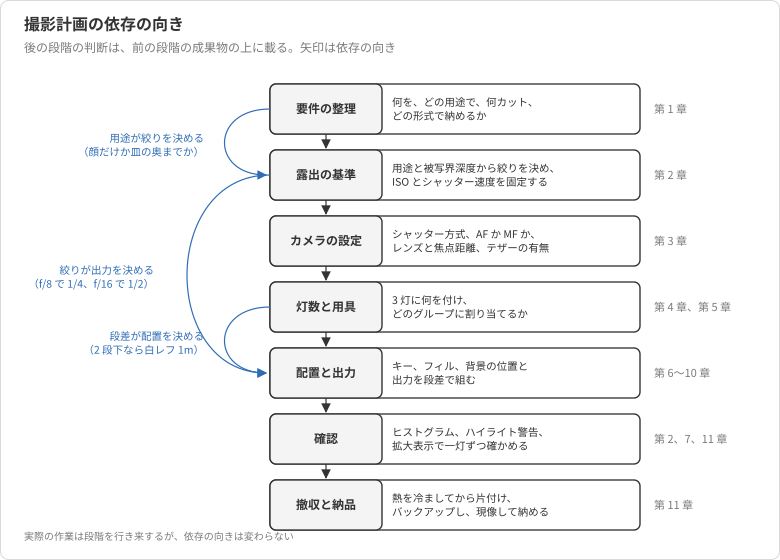
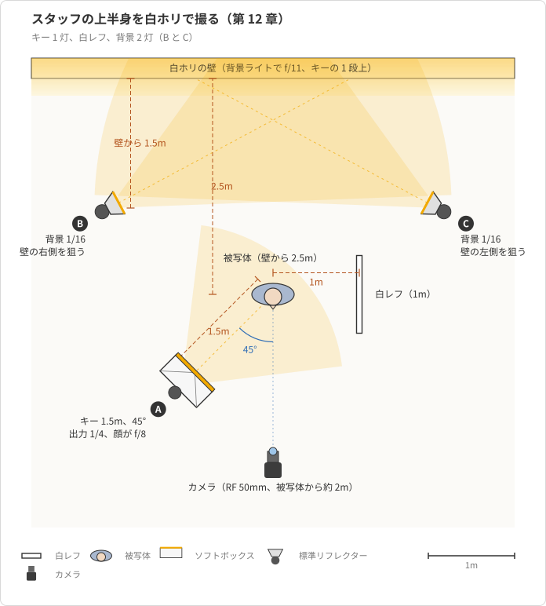
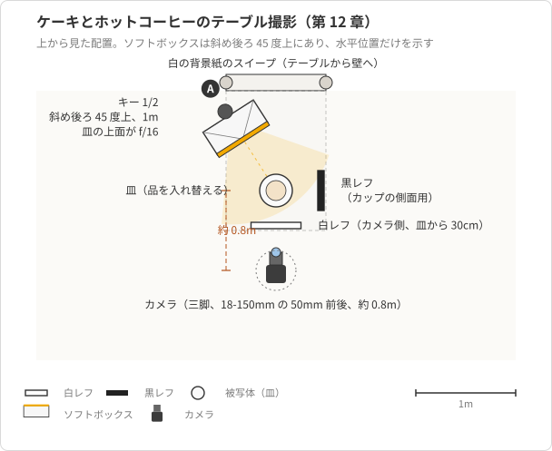
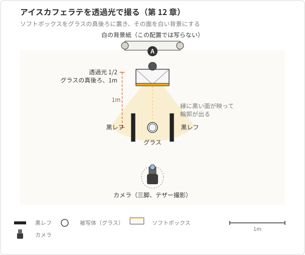
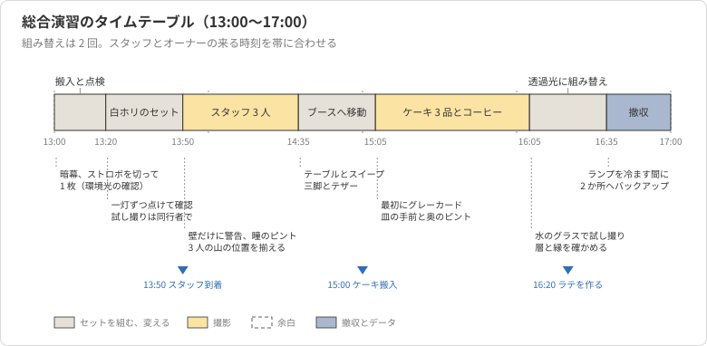

# 第12章 総合演習

第 11 章までで、露出とカメラの設定、ストロボとトリガーの扱い、光の質と方向、一灯と多灯のライティング、白ホリと背景紙、物撮り、当日の進め方まで、スタジオ撮影に使う道具は出そろった。
本章では、新しい道具を導入しない。
一つの撮影を依頼の受け取りから納品まで通しで計画し、各章の判断を一つの撮影の中で組み合わせて使う。

題材には、ここまでの友人のプロフィール写真とマグカップではなく、小さなカフェの Web サイトに載せるスタッフ 3 人の写真とメニュー 5 品の写真を選ぶ。
慣れた題材を手放すのは、各章の判断が友人やマグカップという被写体の性質にではなく、用途と被写体の形と借りられる機材に結びついていることを、別の依頼で確かめるためである。
スタジオは同じレンタルスタジオ（白ホリと背景紙のブース、Godox SK400II が 3 灯）を、同じ半日（4 時間）借りる。

撮影の発端は、カフェのオーナーから「サイトを作り直すので、スタッフの写真とメニューの写真を撮ってほしい」と頼まれたことにする。
撮影者はこの依頼を撮れる要件に分解し、灯と用具を配分し、時間割を組み、当日の確認点を決める。
本章の本体は具体例の節であり、概念の解説の節ではその手順を先に整理する。

## 概念の解説

### 撮影計画は要件から撤収へ一方向に依存する

各章は、道具を一つずつ、それが解く問題と対にして学んできた。
通しの撮影では、これらの判断が互いに依存し合いながら、おおむね決まった順序で現れる。

| 段階 | 決めること | 主に効く章 |
| --- | --- | --- |
| 要件の整理 | 何を、どの用途で、何カット撮り、どの形式で納めるか | 第 1 章 |
| 露出の基準 | 用途と被写界深度から絞りを決め、ISO とシャッター速度を固定する | 第 2 章 |
| カメラの設定 | シャッター方式、AF か MF か、レンズと焦点距離、テザーの有無 | 第 3 章 |
| 灯数と用具 | 3 灯に何を付け、どのグループに割り当てるか | 第 4 章、第 5 章 |
| 配置と出力 | キー、フィル、背景の位置と出力を段差で組む | 第 6 章から第 10 章 |
| 確認 | ヒストグラム、ハイライト警告、拡大表示で一灯ずつ確かめる | 第 2 章、第 7 章、第 11 章 |
| 撤収と納品 | 熱を冷ましてから片付け、バックアップし、現像して納める | 第 11 章 |

この表は工程表ではなく、依存の向きの整理である。
絞りを決めずにストロボの出力は決められない。
顔にピントが合えばよい写真と皿の手前から奥までピントが要る写真では絞りが 2 段違い、出力も 2 段違うからである（第 2 章、第 10 章）。
出力の段差を決めずに配置は決められない。
フィルをキーの 2 段下にすると決めて初めて、白レフを 1m に置くのか、アンブレラを 2m に置くのかが決まる（第 7 章）。
用途を決めずに絞りは決められない。
正方形にトリミングされる写真なら少し引いて撮る必要があり、その分だけ被写体との距離が変わって光の当たり方も変わる。
実際の作業は段階を行き来するが、後の段階の判断が前の段階の成果物に載っているという向きは変わらない。
この依存の向きを図 12-1 に示す。

<figure markdown="span">

<figcaption>図 12-1 撮影計画の依存の向き。後の段階の判断は前の段階の成果物の上に載る</figcaption>
</figure>

### 使わない灯も計画のうち

各章の後半には、決まってその道具の限界の節があった。
灯を増やすほど、レンズに入る余計な光と管理する出力が増える（第 7 章）。
背景をキーより 2 段以上明るくすると、回り込んだ光が輪郭を溶かす（第 8 章）。
環境光を混ぜると、色温度の違いが色かぶりになる（第 9 章）。
通しの撮影では、この条件の照合が灯の数だけ繰り返される。

だから出来上がった計画は、使う灯と用具の一覧であると同時に、使わない灯とその理由の一覧にもなる。
白ホリで背景を飛ばす撮影に、リムライトをわざわざ足す理由はない。
白い壁からの反射光が髪と肩の輪郭をすでに縁取っているからである（第 8 章）。
逆に、ガラスの飲み物には正面からのキーライトが役に立たず、背後からの透過光に切り替える（第 10 章）。
借りられる灯が 3 灯しかないという制約は、灯を増やして解くのではなく、被写体ごとにセットを組み替えて解く。

### 時間の配分はセットの組み替え回数で決まる

半日 4 時間という枠は、撮る枚数ではなく、セットを組み替える回数で消えていく。
ライトの位置と出力を決めて試し撮りで追い込む作業は、慣れていても 20 分から 30 分かかる（第 11 章）。
一方、セットが決まった後の 1 カットは、被写体を入れ替えて数枚撮るだけなので 10 分あまりで済む。

したがって計画の中心は、同じセットで撮れる被写体をまとめ、組み替えの回数を最小にすることにある。
スタッフ 3 人は同じ配置で撮り、人ごとに変えるのはキーライトの高さだけにする。
メニュー 5 品は、同じテーブルのセットで撮れる 4 品を先に撮り、セットの組み替えが要る 1 品を最後に回す。
以降の具体例が本章の本体であり、上の表の段階を頭から歩く。

## 具体例

### 題材と要件

カフェのオーナーからの依頼を、撮影者は次の要件に分解した。

| 被写体 | 用途 | カット数 | 仕上がりの条件 |
| --- | --- | --- | --- |
| スタッフ 3 人 | サイトのスタッフ紹介 | 各 1 カット（予備を含めて各 5 枚程度） | 白背景の上半身、正方形にトリミングされる、3 人で光と背景を揃える |
| ホットコーヒー（陶器のカップ） | サイトのメニュー | 1 カット | 白背景、カップの質感が分かる |
| アイスカフェラテ（ガラスのグラス） | サイトのメニュー | 1 カット | 白背景、ミルクとコーヒーの層が透けて見える |
| チーズケーキ、ガトーショコラ、フルーツタルト | サイトのメニュー | 各 1 カット | 白背景、断面と表面の質感が分かる、皿の手前から奥までピントが合う |

用途はサイトだが、オーナーは「後で印刷のメニュー表にも使うかもしれない」と言った。
だから記録は RAW にし、納品は長辺 2,000 ピクセルの JPEG と RAW の両方にする（第 3 章、第 11 章）。
白背景という条件は、スタッフとメニューで別の方法で満たす。
スタッフは白ホリで背景を白く飛ばし（第 8 章）、メニューは背景紙のブースで白い背景紙をテーブルから壁へ立ち上げるスイープにする（第 10 章）。

要件の段階で決めておくことがもう一つある。
ケーキと飲み物はスタジオで盛り付けるので、オーナーに皿とカップとグラスを 2 組ずつ持ってきてもらい、アイスカフェラテは撮る直前に作ってもらう。
氷が溶け、グラスに結露が付くのは 10 分あまりで、それがそのまま撮影に使える時間の上限になる。

### 露出の基準を用途から決める

第 2 章の順序どおり、絞りを用途から先に決める。
スタッフの上半身は顔にピントが合えばよく、耳から鼻先までが被写界深度に入る f/8 を基準にする。
メニューは皿の手前の縁から奥のフルーツまでピントが要るので、f/16 にする。
ISO は 100、シャッター速度は同調速度 1/250 秒に余裕を持たせた 1/200 秒で、どちらの被写体でも変えない。
シャッター速度はストロボ光の露出に効かず、環境光にしか効かないからである。

この基準から、ストロボの出力が導かれる。
教材の基準では、60×90cm のソフトボックスを 1.5m に置いて出力 1/4 にすると f/8 になる。
物撮りではソフトボックスを 1m まで近づけるので約 1 段明るくなり、出力 1/4 で f/11 になる（第 10 章）。
f/16 にするには、そこからもう 1 段要る。
出力を 1/2 に上げればよい。

環境光の扱いも基準の段階で決める。
窓は暗幕で塞ぎ、撮影の最初にストロボを切って ISO 100、1/200 秒、f/8 で 1 枚撮る。
真っ黒に写れば、以降の露出はストロボだけで決まると分かる（第 9 章）。

### カメラの設定

第 3 章の設定を、被写体ごとに次のように分ける。

| 項目 | スタッフ | メニュー |
| --- | --- | --- |
| 撮影モード | M、ISO 100、1/200 秒、f/8 | M、ISO 100、1/200 秒、f/16 |
| 記録画質 | RAW | RAW |
| ホワイトバランス | 5500K | 5500K（最初にグレーカードを 1 枚撮る） |
| シャッター方式 | メカシャッター | メカシャッター |
| 露出Simulation | しない | しない |
| レンズと焦点距離 | RF 50mm F1.8 STM（換算 80mm）、被写体から約 2m | RF-S 18-150mm の 50mm 前後（換算 80mm）、被写体から約 0.8m |
| ピント | ONE SHOT、被写体検出「人物」、瞳検出 | MF、拡大表示で皿の手前 3 分の 1 に合わせる |
| 保持 | 手持ち | 三脚、テザー撮影（EOS Utility） |

スタッフの写真は正方形にトリミングされるので、3:2 のフレームでは左右を切り落とされる。
胸から上をフレームの中央 3 分の 2 に収め、上下に少し余白を残して撮る。
手持ちで構わないのは、ストロボの閃光時間が 1/1000 秒前後で被写体の動きを止めるからである（第 2 章）。

メニューは構図を固定して品を入れ替えるので、三脚とテザー撮影にする。
テザー撮影にすると、皿の手前と奥のピントを PC の画面で拡大して確かめられる。
グレーカードを最初に 1 枚撮っておくのは、ケーキとコーヒーの色を現像で全カット同じ基準に揃えるためである（第 9 章）。

### 3 灯と用具の配分

灯は 3 灯しかなく、スタッフとメニューでは灯の役割が違う。
セットを二つに分け、灯とグループの割り当てを次のように決める。

| セット | グループ A | グループ B | グループ C | ストロボ以外の用具 |
| --- | --- | --- | --- | --- |
| スタッフ（白ホリ） | キー：60×90cm ソフトボックス | 背景：標準リフレクター | 背景：標準リフレクター | 白レフ（フィル）、サンドバッグ 3 個 |
| ケーキとホットコーヒー（背景紙のブース） | キー：60×90cm ソフトボックス | 使わない | 使わない | 白レフ、黒レフ、白の背景紙、テーブル、三脚 |
| アイスカフェラテ（背景紙のブース） | 透過光：60×90cm ソフトボックス | 使わない | 使わない | 黒レフ 2 枚、白の背景紙、テーブル、三脚 |

背景の 2 灯を同じグループにせず B と C に分けるのは、壁の左右で明るさが揃わないときに片方だけ出力を変えるためである（第 4 章、第 8 章）。
トリガーのチャンネルは 1、ID は 3 灯とも同じにする。

スタッフのセットにリムライトを置かない理由と、メニューのセットで 2 灯を使わない理由は、概念の解説で述べたとおりである。
背景の反射光が輪郭を作り、ケーキの質感は一灯とレフ板で足りる。
使わない 2 灯はメニューの撮影中に電源を切り、ブースの外に出しておく。
ブースの中で点いたままの灯は、意図しない反射を作る。

### スタッフ写真の配置と設定値

白ホリでの配置は、第 8 章の基準どおりに組む（図 12-2）。

<figure markdown="span">

<figcaption>図 12-2 スタッフの上半身を白ホリで撮る配置（上から見た図）</figcaption>
</figure>

| 灯 | 用具 | 位置と距離 | 出力 | 被写体上の明るさ |
| --- | --- | --- | --- | --- |
| A（キー） | 60×90cm ソフトボックス | 被写体の斜め前 45 度、顔より少し上、1.5m | 1/4 | 顔が f/8 |
| B、C（背景） | 標準リフレクター | 壁から 1.5m、左右から壁に向ける | 1/16 | 壁面が f/11（キーの 1 段上） |
| フィル | 白レフ | キーの反対側、1m | なし | 影側がキーの約 2 段下 |

被写体を壁から 2.5m 以上離すのは、キーの光を壁に届かせないためと、壁からの反射光が顔まで回り込んでコントラストを下げないためである。
背景はキーの 1 段上にとどめる。
2 段を超えると、白い壁からの光が髪の縁を溶かし、輪郭の黒い髪まで白く飛ぶ（第 8 章）。

確認は第 7 章の手順で一灯ずつ行う。
まずキーだけを点け、顔に f/8 が出ているかをヒストグラムで見る。
次に白レフを置き、影側の頬が真っ黒でないことを見る。
最後に背景の 2 灯を点け、ハイライト警告が壁だけに出て顔と髪には出ないことを見る。
この順序を守ると、背景を点けたあとに顔が明るくなったなら、その原因が背景の回り込みだと切り分けられる。

3 人を同じ条件で撮るために、床にテープで立ち位置を貼り、カメラの位置も三脚の脚の位置で印を付ける。
人ごとに変えるのはキーライトの高さだけである。
顔より少し上から見下ろす角度を保つために、身長に合わせてスタンドを上下し、ソフトボックスの向きを顔に向け直す。
出力と距離は変えない。
1 人あたり 12 分から 15 分で、表情を変えて 5 枚ほど撮る。

### メニュー写真の配置と設定値

背景紙のブースでは、テーブルに白の背景紙を敷き、後ろの壁に向けて立ち上げるスイープを作る。
ケーキとホットコーヒーは同じセットで撮る（図 12-3）。

<figure markdown="span">

<figcaption>図 12-3 ケーキとホットコーヒーのテーブル撮影の配置（上から見た図）</figcaption>
</figure>

| 灯 | 用具 | 位置と距離 | 出力 | 被写体上の明るさ |
| --- | --- | --- | --- | --- |
| A（キー） | 60×90cm ソフトボックス | 皿の上後方、やや斜め後ろ 45 度上、1m | 1/2 | 皿の上面が f/16 |
| フィル | 白レフ | カメラ側の手前、皿から 30cm | なし | 手前の影が起きる |
| 締め | 黒レフ | カップの側面の反射を切りたい側 | なし | 陶器の側面に暗い縁ができる |

キーを斜め後ろの上から当てるのは、ケーキの表面の凹凸に影を作り、質感を出すためである（第 5 章、第 10 章）。
正面から当てると、チーズケーキの表面は平らな白い面になる。
手前が暗く落ちすぎるので、白レフをカメラ側に立てて影を起こす。
ホットコーヒーの陶器のカップは、ソフトボックスの白い映り込みが側面に出る。
映り込みを消すのではなく、黒レフで側面に暗い縁を作って丸みを出す（第 10 章）。

背景紙のスイープは、キーの光が壁の部分まで届かないので、写真の上のほうが灰色に落ちる。
サイト用の白背景として仕上げるには、現像で背景を白に持ち上げるか、撮影時に背景へもう 1 灯当てる。
ここでは灯を増やさず、皿の周囲だけが白ければ切り抜きの手間が少ないと判断して、現像で持ち上げる。
灰色の背景が皿の影と接する部分は、切り抜き時の境界になるので、白レフで影を薄くしておく。

アイスカフェラテは、同じセットでは撮れない。
ガラスの中の層は、後ろから光を透過させないと見えないからである（図 12-4）。

<figure markdown="span">

<figcaption>図 12-4 アイスカフェラテを透過光で撮る配置（上から見た図）</figcaption>
</figure>

ソフトボックスをグラスの真後ろに置き、背景紙越しではなく直接、出力 1/2 で透過させる。
背景はこのままでは飛びすぎるが、ソフトボックスの面そのものが白い背景になるので、それで構わない。
グラスの輪郭は透過光の中に溶けるので、左右に黒レフを立て、縁に黒い反射を作って形を出す。
氷と結露の時間を考え、セットを組んで試し撮りを済ませてから、オーナーに作ってもらう。
試し撮りには、水を入れたグラスを使う。

### タイムテーブル

4 時間を、組み替えの回数から逆算して配分する（図 12-5）。

| 時刻 | 作業 | 目安 |
| --- | --- | --- |
| 13:00 | 搬入、機材の点検、暗幕、環境光の確認（ストロボを切って 1 枚） | 20 分 |
| 13:20 | 白ホリのセットを組み、撮影者自身か同行者で試し撮り | 30 分 |
| 13:50 | スタッフ 3 人を順に撮る | 45 分 |
| 14:35 | 白ホリを片付け、背景紙のブースへ移動、テーブルとスイープ、三脚とテザー | 30 分 |
| 15:05 | グレーカード、ケーキ 3 品、ホットコーヒー | 60 分 |
| 16:05 | 透過光のセットに組み替え、水のグラスで試し撮り、アイスカフェラテ | 30 分 |
| 16:35 | 撤収、モデリングランプの熱を冷ます、バックアップ | 25 分 |

<figure markdown="span">

<figcaption>図 12-5 総合演習のタイムテーブル。組み替えは 2 回で、来訪の時刻を帯に合わせる</figcaption>
</figure>

スタッフは 13:50 に来てもらえばよく、待たせない。
オーナーには 15:00 までにケーキを持ってきてもらい、アイスカフェラテは 16:20 頃に作ってもらう。
組み替えは 2 回で、それぞれ 30 分を見込む。
予定より早く進んだ時間はそのまま予備にし、遅れたときはスタッフの予備カットとケーキの構図の追加を削る。
削れない工程は、環境光の確認と、一灯ずつの確認と、バックアップである。

### 当日の確認点

撮影中の確認は、第 11 章の項目を被写体に合わせて絞る。

- スタッフ：ハイライト警告が壁だけに出ているか。瞳にピントが来ているか（拡大表示）。3 人のヒストグラムの山の位置が揃っているか。
- ケーキ：皿の手前の縁と奥の飾りの両方にピントが来ているか（テザーの画面で拡大）。表面に影の階調が残っているか。
- ホットコーヒー：カップの側面の映り込みが縦に一本の帯になっているか。液面の反射が飛んでいないか。
- アイスカフェラテ：層の境目が透けているか。グラスの縁が背景に溶けていないか。

トラブルは、起きたときに第 11 章の切り分けをそのまま使う。
発光しないならトリガーの電源、チャンネル、シャッター方式の順に見る。
写真の下に黒い帯が出るなら、シャッター速度が同調速度を超えている。
ファインダーが暗いなら、露出Simulation の設定が戻っている。

### 納品まで

撤収でモデリングランプを切り、灯が冷めるまでの時間でカードの中身を PC と外付けドライブの 2 か所に写す。
現像では、まずグレーカードのカットでホワイトバランスを取り、メニューの全カットに適用する。
スタッフは正方形にトリミングし、壁の部分が完全な白（RGB の 255）になるまで白レベルを上げる。
背景がキーの 1 段上で撮れていれば、この操作で顔の階調は変わらない。
メニューは背景紙の灰色の部分を白に持ち上げ、皿の影の境界だけを残す。
長辺 2,000 ピクセルの JPEG を書き出し、RAW と一緒に納める。

計画の全体を振り返ると、新しい道具は一つも使っていない。
絞りを用途から決め、出力を絞りから決め、配置を段差から決め、時間をセットの組み替えから決めた。
この順序は、被写体が友人からカフェのスタッフに変わっても、マグカップからケーキに変わっても変わらない。

## 参考文献

- Fil Hunter, Steven Biver, Paul Fuqua, Light: Science and Magic, 5th ed., Routledge, 2015（透過光でガラスを撮る配置と、黒レフで輪郭を作る考え方）
- Christopher Grey, Master Lighting Guide for Portrait Photographers, 2nd ed., Amherst Media, 2014（白背景のポートレートで背景とキーの段差を決める基準）
- Scott Kelby, The Digital Photography Book, Part 1, 2nd ed., Rocky Nook, 2020（三脚と手動ピントで構図を固定する物撮りの手順）
- キヤノン, EOS R10 アドバンストユーザーガイド（Web 版）（テザー撮影、露出Simulation、シャッター方式の設定項目）
- Godox, XPro II-C 取扱説明書（グループとチャンネル、ID の設定）
